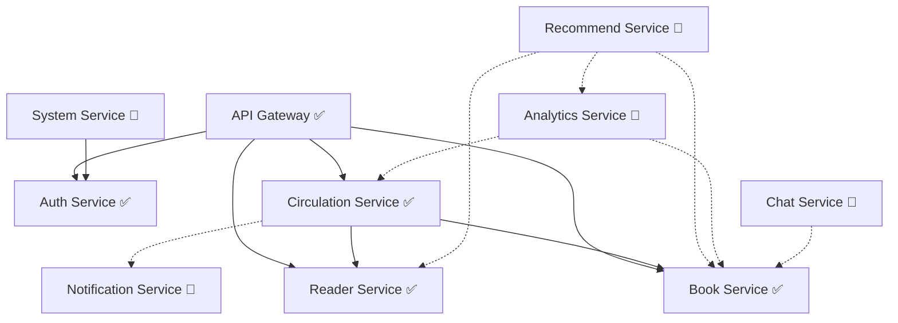

# 国创睿峰智能图书馆管理系统 - 架构设计文档

**版本**: v2.2
**日期**: 2025-12-24
**作者**: GCRF开发团队

---

## 开发进度总览

> **当前阶段**: Phase 1 - 核心功能开发完成，端到端集成测试通过 (Stage 16 - 70%)

| 模块                     | 状态                | 完成度 | 说明                                                      |
| ------------------------ | ------------------- | ------ | --------------------------------------------------------- |
| 公共模块 (common)        | ✅ 已完成           | 100%   | 5个子模块全部完成                                         |
| 网关服务 (gateway)       | ✅ 已完成           | 100%   | 路由、认证、限流、安全头                                  |
| 认证服务 (auth)          | ✅ 已完成           | 100%   | JWT认证、RBAC权限                                         |
| 图书服务 (book)          | ✅ **集成测试通过** | 100%   | 图书CRUD、分类、文件上传、库存盘点(E2E验证通过)、批量导入 |
| 流通服务 (circulation)   | ✅ 已完成           | 85%    | 借阅、归还、续借、罚款                                    |
| 读者服务 (reader)        | ✅ 已完成           | 85%    | 读者管理、读者类型                                        |
| 系统服务 (system)        | 🚧 基础完成         | 60%    | 用户、角色、部门管理                                      |
| 通知服务 (notification)  | 🚧 框架完成         | 40%    | 消息推送框架                                              |
| 分析服务 (analytics)     | 🚧 框架完成         | 30%    | 统计分析框架                                              |
| 推荐服务 (recommend)     | 🚧 框架完成         | 20%    | AI推荐框架                                                |
| 聊天服务 (chat)          | 🚧 框架完成         | 20%    | 智能问答框架                                              |
| 前端管理系统 (web-admin) | ✅ **集成测试通过** | 95%    | 10个页面模块，库存盘点E2E测试通过                         |
| 部署配置 (deployment)    | ✅ 已完成           | 80%    | Docker Compose + 监控                                     |

---

## 目录

1. [系统总体架构](#1-系统总体架构)
2. [微服务拆分说明](#2-微服务拆分说明)
3. [技术栈选型](#3-技术栈选型)
4. [数据库设计](#4-数据库设计)
5. [API设计规范](#5-api设计规范)
6. [安全架构设计](#6-安全架构设计)
7. [部署架构设计](#7-部署架构设计)
8. [服务治理](#8-服务治理)
9. [性能设计](#9-性能设计)
10. [监控与运维](#10-监控与运维)

---

## 1. 系统总体架构

### 1.1 架构概览

系统采用**微服务架构**设计，基于Spring Cloud Alibaba生态构建，实现服务的高可用、高性能、可扩展。

```
┌─────────────────────────────────────────────────────────────────┐
│                         前端应用层                                │
├─────────────────────────────────────────────────────────────────┤
│   Web管理端(Vue3) ✅    微信小程序(uni-app) ⏳   自助终端 ⏳      │
└─────────────────────────────────────────────────────────────────┘
                               ↕ HTTPS
┌─────────────────────────────────────────────────────────────────┐
│                          网关层 ✅                                │
├─────────────────────────────────────────────────────────────────┤
│                   Spring Cloud Gateway                           │
│         路由转发 | 认证鉴权 | 限流熔断 | 安全头 | CORS            │
└─────────────────────────────────────────────────────────────────┘
                               ↕
┌─────────────────────────────────────────────────────────────────┐
│                         微服务层                                  │
├─────────────────────────────────────────────────────────────────┤
│  ┌──────────┐ ┌──────────┐ ┌──────────┐ ┌──────────┐          │
│  │Auth ✅   │ │Book ✅   │ │Circulation│ │Reader ✅ │          │
│  │Service   │ │Service   │ │Service ✅ │ │Service   │          │
│  └──────────┘ └──────────┘ └──────────┘ └──────────┘          │
│  ┌──────────┐ ┌──────────┐ ┌──────────┐ ┌──────────┐          │
│  │System 🚧 │ │Recommend │ │Chat 🚧   │ │Analytics │          │
│  │Service   │ │Service 🚧│ │Service   │ │Service 🚧│          │
│  └──────────┘ └──────────┘ └──────────┘ └──────────┘          │
│  ┌──────────┐                                                   │
│  │Notifica- │  ✅ = 已完成   🚧 = 开发中   ⏳ = 计划中           │
│  │tion 🚧   │                                                   │
│  └──────────┘                                                   │
└─────────────────────────────────────────────────────────────────┘
                               ↕
┌─────────────────────────────────────────────────────────────────┐
│                         基础设施层 ✅                              │
├─────────────────────────────────────────────────────────────────┤
│  Nacos(配置/注册) ✅   Redis(缓存) ✅   RabbitMQ(消息) ✅         │
│  Prometheus(监控) ✅   Grafana(可视化) ✅   Loki(日志) 🚧         │
└─────────────────────────────────────────────────────────────────┘
                               ↕
┌─────────────────────────────────────────────────────────────────┐
│                         数据存储层 ✅                              │
├─────────────────────────────────────────────────────────────────┤
│  PostgreSQL 15 ✅     Redis 7.2 ✅       MinIO ✅                │
│  (业务数据)            (缓存/会话)        (对象存储)               │
└─────────────────────────────────────────────────────────────────┘
```

### 1.2 架构原则

1. **服务自治**: 每个微服务拥有独立的数据库，独立部署和扩展
2. **接口标准化**: 统一RESTful API规范，统一响应格式
3. **异步通信**: 使用消息队列解耦服务，提升系统响应速度
4. **容错设计**: 熔断、降级、限流、重试机制
5. **监控完备**: 全链路追踪、实时监控、日志聚合

### 1.3 与原设计的差异

| 原设计        | 实际实现          | 原因                                                  |
| ------------- | ----------------- | ----------------------------------------------------- |
| MySQL 8.0     | **PostgreSQL 15** | PostgreSQL支持更丰富的数据类型(JSONB)、更好的并发性能 |
| Java 17       | **Java 21**       | LTS版本，支持虚拟线程等新特性                         |
| 12个微服务    | **10个微服务**    | 合并了部分服务，NLP/Vision/File/Search服务暂缓        |
| Elasticsearch | 暂未实现          | 优先完成核心功能，搜索功能后续添加                    |
| MongoDB       | 暂未实现          | 行为日志功能后续添加                                  |

---

## 2. 微服务拆分说明

### 2.1 服务列表与开发状态

| 服务名称             | 端口 | 状态    | Controllers      | 核心功能                               |
| -------------------- | ---- | ------- | ---------------- | -------------------------------------- |
| gateway-service      | 8080 | ✅ 完成 | 0 (Filter-based) | 路由转发、JWT认证、限流、安全头、CORS  |
| auth-service         | 8081 | ✅ 完成 | 2                | 用户登录、JWT令牌、权限验证            |
| book-service         | 8082 | ✅ 完成 | 4                | 图书CRUD、分类管理、封面上传、库存盘点 |
| circulation-service  | 8083 | ✅ 完成 | 4                | 借阅、归还、续借、预约、罚款           |
| reader-service       | 8084 | ✅ 完成 | 2                | 读者信息、读者类型、读者证             |
| system-service       | 8085 | 🚧 基础 | 6                | 用户管理、角色权限、部门管理           |
| recommend-service    | 8086 | 🚧 框架 | 1                | AI图书推荐（框架已搭建）               |
| chat-service         | 8087 | 🚧 框架 | 1                | 智能问答（框架已搭建）                 |
| analytics-service    | 8089 | 🚧 框架 | 2                | 数据统计、报表（框架已搭建）           |
| notification-service | 8090 | 🚧 框架 | 6                | 消息推送（框架已搭建）                 |

### 2.2 公共模块 (common)

| 模块            | 状态    | 功能                             |
| --------------- | ------- | -------------------------------- |
| common-core     | ✅ 完成 | 统一响应Result、异常处理、工具类 |
| common-security | ✅ 完成 | JWT工具、Security配置            |
| common-mybatis  | ✅ 完成 | MyBatis-Plus配置、分页插件       |
| common-web      | ✅ 完成 | Web配置、拦截器、日志过滤器      |
| common-feign    | ✅ 完成 | Feign客户端配置                  |

### 2.3 服务依赖关系



### 2.4 暂缓实现的服务

以下服务在原设计中存在，但当前阶段暂缓实现：

| 服务           | 原端口 | 暂缓原因                     | 计划阶段 |
| -------------- | ------ | ---------------------------- | -------- |
| nlp-service    | 8087   | AI功能后续迭代               | Phase 3  |
| vision-service | 8088   | OCR/人脸识别后续迭代         | Phase 3  |
| file-service   | 8091   | 已集成到book-service (MinIO) | -        |
| search-service | 8092   | 需要Elasticsearch支持        | Phase 2  |

---

## 3. 技术栈选型

### 3.1 后端技术栈（实际使用）

| 技术类别       | 选型                      | 版本           | 状态 | 说明                  |
| -------------- | ------------------------- | -------------- | ---- | --------------------- |
| 开发语言       | Java                      | **21**         | ✅   | LTS版本，虚拟线程支持 |
| 基础框架       | Spring Boot               | **3.2.2**      | ✅   | 最新稳定版            |
| 微服务框架     | Spring Cloud              | **2023.0.0**   | ✅   | Greenwich版本         |
| 微服务框架     | Spring Cloud Alibaba      | **2023.0.1.0** | ✅   | 阿里巴巴生态          |
| 服务注册与配置 | Nacos                     | **2.3.0**      | ✅   | 注册中心、配置中心    |
| 服务网关       | Spring Cloud Gateway      | 4.1.x          | ✅   | 响应式网关            |
| 服务调用       | OpenFeign                 | 4.1.x          | ✅   | 声明式HTTP客户端      |
| 负载均衡       | Spring Cloud LoadBalancer | 4.1.x          | ✅   | 客户端负载均衡        |
| ORM框架        | MyBatis-Plus              | **3.5.9**      | ✅   | 增强MyBatis           |
| 数据库连接池   | HikariCP                  | 默认           | ✅   | Spring Boot默认       |
| 缓存           | Spring Cache + Redis      | -              | ✅   | 声明式缓存            |
| 消息队列       | RabbitMQ                  | 3.12           | ✅   | AMQP消息中间件        |
| 日志框架       | Logback + SLF4J           | -              | ✅   | Spring Boot默认       |
| API文档        | SpringDoc OpenAPI         | 2.x            | ✅   | Swagger 3.0           |
| 工具库         | Hutool                    | 5.8.x          | ✅   | 常用工具类            |
| JSON处理       | Jackson                   | -              | ✅   | Spring Boot默认       |

### 3.2 数据存储（实际使用）

| 存储类型   | 选型           | 版本    | 状态 | 用途                    |
| ---------- | -------------- | ------- | ---- | ----------------------- |
| 关系数据库 | **PostgreSQL** | **15**  | ✅   | 核心业务数据            |
| 缓存数据库 | Redis          | **7.2** | ✅   | 热点缓存、Session、令牌 |
| 对象存储   | MinIO          | latest  | ✅   | 图书封面、文件存储      |
| 搜索引擎   | Elasticsearch  | 8.x     | ⏳   | 全文检索（计划中）      |
| 文档数据库 | MongoDB        | 7.x     | ⏳   | 行为日志（计划中）      |

### 3.3 前端技术栈

| 技术         | 版本       | 状态 | 说明                 |
| ------------ | ---------- | ---- | -------------------- |
| Vue.js       | **3.4.0**  | ✅   | 渐进式JavaScript框架 |
| Vue Router   | **4.2.5**  | ✅   | 路由管理             |
| Pinia        | **2.1.7**  | ✅   | 状态管理             |
| Element Plus | **2.5.1**  | ✅   | UI组件库             |
| Axios        | **1.6.2**  | ✅   | HTTP客户端           |
| ECharts      | **5.4.3**  | ✅   | 图表库               |
| Vite         | **5.0.0**  | ✅   | 构建工具             |
| TailwindCSS  | **4.1.x**  | ✅   | 样式框架             |
| MSW          | **2.11.5** | ✅   | Mock Service Worker  |

### 3.4 运维与监控

| 功能     | 选型           | 状态 | 说明               |
| -------- | -------------- | ---- | ------------------ |
| 容器化   | Docker         | ✅   | 应用容器化部署     |
| 容器编排 | Docker Compose | ✅   | 开发/生产环境      |
| 指标监控 | Prometheus     | ✅   | 系统指标采集       |
| 可视化   | Grafana        | ✅   | 监控仪表盘         |
| 日志收集 | Loki           | 🚧   | 日志聚合（配置中） |
| 告警管理 | AlertManager   | 🚧   | 告警通知（配置中） |

---

## 4. 数据库设计

### 4.1 数据库选型说明

**PostgreSQL 15** 替代原设计的 MySQL 8.0，原因：

1. **JSONB支持**：更好的JSON数据存储和查询能力
2. **并发性能**：MVCC实现更优，高并发场景表现更好
3. **全文搜索**：内置中文全文搜索支持
4. **扩展性**：丰富的扩展生态（PostGIS、TimescaleDB等）

### 4.2 数据库规划（实际）

| 数据库           | 所属服务            | 状态 | 主要表                                                                                                                         |
| ---------------- | ------------------- | ---- | ------------------------------------------------------------------------------------------------------------------------------ |
| gcrf_auth        | auth-service        | ✅   | sys_user, sys_role, sys_permission, sys_user_role                                                                              |
| gcrf_book        | book-service        | ✅   | books, book_category, book_categories, book_copies, book_items, categories, inventory*, inventory_task*, inventory_task_item\* |
| gcrf_circulation | circulation-service | ✅   | borrow_record, reservation, fine                                                                                               |
| gcrf_reader      | reader-service      | ✅   | reader, reader_type                                                                                                            |
| gcrf_system      | system-service      | 🚧   | department, config, operation_log                                                                                              |

### 4.3 缓存策略（已实现）

1. **JWT Token缓存**
   - Key: `auth:token:{userId}`
   - TTL: 24小时
   - 用途: Token黑名单、刷新令牌

2. **用户权限缓存**
   - Key: `auth:permissions:{userId}`
   - TTL: 30分钟
   - 用途: 权限验证

3. **图书信息缓存**
   - Key: `book:info:{bookId}`
   - TTL: 1小时
   - 用途: 热门图书信息

---

## 5. API设计规范

### 5.1 RESTful规范（已实现）

#### 图书服务 API (book-service: 42个端点)

**图书管理 (BookController - 15个)**:

```
GET    /api/v1/books              # 获取图书列表（分页）
GET    /api/v1/books/{id}         # 获取图书详情
POST   /api/v1/books              # 创建图书
PUT    /api/v1/books/{id}         # 更新图书
DELETE /api/v1/books/{id}         # 删除图书
GET    /api/v1/books/search       # 高级搜索
GET    /api/v1/books/isbn/{isbn}  # ISBN查询
GET    /api/v1/books/barcode/{bc} # 条码查询
POST   /api/v1/books/batch        # 批量创建
DELETE /api/v1/books/batch        # 批量删除
PUT    /api/v1/books/{id}/status  # 更新状态
GET    /api/v1/books/statistics   # 统计信息
GET    /api/v1/books/export       # 导出Excel
POST   /api/v1/books/import       # 导入Excel
GET    /api/v1/books/barcode/gen  # 生成条码
```

**分类管理 (CategoryController - 5个)**:

```
GET    /api/v1/categories         # 分类列表
GET    /api/v1/categories/{id}    # 分类详情
POST   /api/v1/categories         # 创建分类
PUT    /api/v1/categories/{id}    # 更新分类
DELETE /api/v1/categories/{id}    # 删除分类
```

**文件管理 (BookFileController - 5个)**:

```
POST   /api/v1/books/{id}/cover   # 上传封面
GET    /api/v1/books/{id}/cover   # 获取封面
DELETE /api/v1/books/{id}/cover   # 删除封面
POST   /api/v1/books/{id}/pdf     # 上传PDF
GET    /api/v1/books/{id}/pdf     # 下载PDF
```

**库存管理 (InventoryController - 17个)**:

```
GET    /api/v1/inventory          # 库存列表
GET    /api/v1/inventory/{id}     # 库存详情
PUT    /api/v1/inventory/{id}     # 更新库存
GET    /api/v1/inventory/alerts   # 库存预警
GET    /api/v1/inventory/tasks    # 盘点任务列表
GET    /api/v1/inventory/tasks/{id}       # 盘点任务详情
POST   /api/v1/inventory/tasks            # 创建盘点任务
PUT    /api/v1/inventory/tasks/{id}       # 更新盘点任务
DELETE /api/v1/inventory/tasks/{id}       # 删除盘点任务
PUT    /api/v1/inventory/tasks/{id}/start # 开始盘点
PUT    /api/v1/inventory/tasks/{id}/stop  # 暂停盘点
PUT    /api/v1/inventory/tasks/{id}/complete # 完成盘点
GET    /api/v1/inventory/tasks/{id}/items # 盘点项列表
POST   /api/v1/inventory/tasks/{id}/items # 添加盘点项
PUT    /api/v1/inventory/tasks/{id}/items/{itemId} # 更新盘点项
DELETE /api/v1/inventory/tasks/{id}/items/{itemId} # 删除盘点项
GET    /api/v1/inventory/tasks/{id}/export # 导出盘点报告
```

#### 其他服务 API 示例

```
GET    /api/v1/readers            # 获取读者列表
POST   /api/v1/circulation/borrow # 借书
POST   /api/v1/circulation/return # 还书
```

### 5.2 统一响应格式（已实现）

```json
{
  "code": 200,
  "message": "success",
  "data": {
    "records": [],
    "total": 100,
    "pageNum": 1,
    "pageSize": 20
  }
}
```

### 5.3 错误码规范

| 错误码 | 说明             |
| ------ | ---------------- |
| 200    | 成功             |
| 400    | 请求参数错误     |
| 401    | 未授权/Token过期 |
| 403    | 权限不足         |
| 404    | 资源不存在       |
| 500    | 服务器内部错误   |

---

## 6. 安全架构设计

### 6.1 认证授权（已实现）

1. **JWT Token认证** ✅
   - Access Token有效期：24小时
   - 签名算法：HS256
   - 网关统一验证

2. **RBAC权限模型** ✅
   - 用户-角色-权限三层结构
   - 权限粒度：接口级别

### 6.2 网关安全（已实现）

1. **认证过滤器** ✅
   - JWT Token验证
   - 白名单路径放行

2. **限流过滤器** ✅
   - 基于Redis的滑动窗口限流
   - 可配置QPS限制

3. **安全头过滤器** ✅
   - X-Content-Type-Options
   - X-Frame-Options
   - X-XSS-Protection
   - Content-Security-Policy

4. **CORS配置** ✅
   - 可配置允许的域名
   - 支持预检请求

---

## 7. 部署架构设计

### 7.1 Docker Compose 部署（已实现）

**基础设施** (`docker-compose.infrastructure.yml`):

```yaml
services:
  postgres:
    image: postgres:15-alpine
    ports: ["5432:5432"]

  redis:
    image: redis:7.2-alpine
    ports: ["6379:6379"]

  nacos:
    image: nacos/nacos-server:v2.3.0
    ports: ["8848:8848", "9848:9848"]

  rabbitmq:
    image: rabbitmq:3.12-management-alpine
    ports: ["5672:5672", "15672:15672"]

  minio:
    image: minio/minio:latest
    ports: ["9000:9000", "9001:9001"]
```

**监控服务** (`docker-compose.monitoring.yml`):

```yaml
services:
  prometheus:
    image: prom/prometheus:latest
    ports: ["9090:9090"]

  grafana:
    image: grafana/grafana:latest
    ports: ["3000:3000"]
```

### 7.2 部署文件结构

```
deployment/
├── docker-compose.infrastructure.yml  # 基础设施
├── docker-compose.services.yml        # 业务服务
├── docker-compose.monitoring.yml      # 监控服务
├── docker-compose.override.yml        # 本地开发覆盖
├── config/                            # 配置文件
├── monitoring/                        # 监控配置
│   ├── prometheus/
│   └── grafana/
├── scripts/                           # 运维脚本
│   ├── backup-volumes.sh
│   ├── restore-volumes.sh
│   └── health-check.sh
└── docs/                              # 部署文档
```

---

## 8. 服务治理

### 8.1 服务注册与发现（已实现）

- 使用Nacos作为注册中心 ✅
- 服务健康检查：每5秒心跳 ✅
- 配置中心：支持动态配置更新 ✅

### 8.2 负载均衡（已实现）

- Spring Cloud LoadBalancer ✅
- 轮询策略（默认）✅

### 8.3 熔断降级（部分实现）

- 网关层限流 ✅
- Sentinel集成（计划中）⏳

---

## 9. 性能设计

### 9.1 性能目标

| 指标         | 目标值      | 当前状态 |
| ------------ | ----------- | -------- |
| 接口响应时间 | P99 < 200ms | 待测试   |
| 并发用户数   | 500+        | 待测试   |
| QPS          | 1000+       | 待测试   |
| 可用性       | 99.9%       | 待测试   |

### 9.2 已实施的优化

1. **数据库优化** ✅
   - MyBatis-Plus分页插件
   - 合理索引设计
   - PostgreSQL JSONB查询优化

2. **缓存优化** ✅
   - Redis缓存热点数据
   - JWT Token缓存

3. **连接池优化** ✅
   - HikariCP连接池
   - Redis连接池

---

## 10. 监控与运维

### 10.1 监控体系（已实现）

1. **指标监控** ✅
   - Prometheus采集JVM、HTTP、数据库指标
   - Spring Boot Actuator暴露指标

2. **可视化** ✅
   - Grafana仪表盘
   - JVM监控面板
   - 服务健康面板

3. **日志监控** 🚧
   - Loki配置中
   - 日志格式标准化

### 10.2 告警机制（配置中）

- AlertManager配置 🚧
- 告警规则定义 🚧

---

## 附录

### A. 端口规划（实际使用）

| 服务                 | 端口       | 状态 | 说明         |
| -------------------- | ---------- | ---- | ------------ |
| Gateway              | 8080       | ✅   | 网关入口     |
| Auth Service         | 8081       | ✅   | 认证服务     |
| Book Service         | 8082       | ✅   | 图书服务     |
| Circulation Service  | 8083       | ✅   | 流通服务     |
| Reader Service       | 8084       | ✅   | 读者服务     |
| System Service       | 8085       | 🚧   | 系统服务     |
| Recommend Service    | 8086       | 🚧   | 推荐服务     |
| Chat Service         | 8087       | 🚧   | 聊天服务     |
| Analytics Service    | 8089       | 🚧   | 分析服务     |
| Notification Service | 8090       | 🚧   | 通知服务     |
| Web Admin            | 3011       | ✅   | 前端管理系统 |
| PostgreSQL           | 5432       | ✅   | 数据库       |
| Redis                | 6379       | ✅   | 缓存         |
| Nacos                | 8848       | ✅   | 注册配置中心 |
| RabbitMQ             | 5672/15672 | ✅   | 消息队列     |
| MinIO                | 9000/9001  | ✅   | 对象存储     |
| Prometheus           | 9090       | ✅   | 指标监控     |
| Grafana              | 3000       | ✅   | 可视化       |

### B. 环境变量配置

```properties
# 数据库配置 (PostgreSQL)
DB_HOST=localhost
DB_PORT=5432
DB_NAME=gcrf_auth
DB_USERNAME=postgres
DB_PASSWORD=gcrf_secure_2024

# Redis配置
REDIS_HOST=localhost
REDIS_PORT=6379
REDIS_PASSWORD=gcrf_redis_2024

# Nacos配置
NACOS_SERVER=localhost:8848
NACOS_NAMESPACE=dev
NACOS_GROUP=LIBRARY_GROUP

# RabbitMQ配置
MQ_HOST=localhost
MQ_PORT=5672
MQ_USERNAME=admin
MQ_PASSWORD=admin

# MinIO配置
MINIO_ENDPOINT=http://localhost:9000
MINIO_ACCESS_KEY=minioadmin
MINIO_SECRET_KEY=minioadmin

# JWT配置
JWT_SECRET=your-256-bit-secret-key-here
JWT_EXPIRATION=86400000
```

### C. 前端页面模块

| 模块     | 路由            | 状态 | 功能                         |
| -------- | --------------- | ---- | ---------------------------- |
| 仪表盘   | /dashboard      | ✅   | 数据概览、统计图表           |
| 图书管理 | /books/\*       | ✅   | 图书列表、编目、典藏、盘点   |
| 读者管理 | /readers/\*     | ✅   | 学生读者、教师读者、读者证   |
| 流通管理 | /circulation/\* | ✅   | 借出、归还、记录、预约       |
| 系统管理 | /system/\*      | ✅   | 用户、角色、部门             |
| AI功能   | /ai/\*          | 🚧   | 智能推荐、智能问答、数据分析 |
| 个人中心 | /profile        | ✅   | 个人信息、修改密码           |
| 登录     | /login          | ✅   | 用户登录                     |

---

## 版本历史

| 版本 | 日期       | 更新内容                                                                               |
| ---- | ---------- | -------------------------------------------------------------------------------------- |
| v1.0 | 2025-10-11 | 初始架构设计                                                                           |
| v2.0 | 2025-12-19 | 更新实际开发完成情况，PostgreSQL替代MySQL                                              |
| v2.1 | 2025-12-24 | 更新图书服务开发进度：4个Controllers, 42个API端点, 95%完成                             |
| v2.2 | 2025-12-24 | **库存盘点功能E2E集成测试通过**：前端→API→数据库全链路验证，修复前后端数据格式匹配问题 |

---

**文档版本**: 2.2
**最后更新**: 2025-12-24
**维护人**: GCRF开发团队

### 最新集成测试成果 (2025-12-24)

**库存盘点功能端到端测试通过**:

- ✅ 创建盘点任务：前端表单 → POST API → PostgreSQL插入
- ✅ 任务状态流转：PENDING → IN_PROGRESS (开始盘点)
- ✅ 数据一致性：前端显示与数据库记录完全匹配
- ✅ UI交互：按钮根据任务状态正确显示/隐藏

**修复的前后端兼容性问题**:

- 前端`scope`字段从小写(`all`)转换为大写(`ALL`)
- 添加必填字段`taskType: 'FULL'`
- `remark`字段映射为`notes`
- 状态和范围映射支持大小写格式

> **注**: 库存管理相关表 (inventory, inventory_task, inventory_task_item) 已成功创建并通过E2E测试验证
