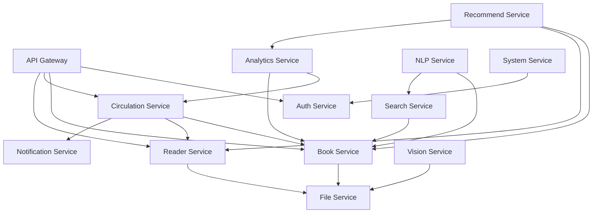

# 国创睿峰智能图书馆管理系统 - 架构设计文档

**版本**: v1.0
**日期**: 2025-10-11
**作者**: 张三（后端架构师）

---

## 目录

1. [系统总体架构](#1-系统总体架构)
2. [微服务拆分说明](#2-微服务拆分说明)
3. [技术栈选型](#3-技术栈选型)
4. [数据库设计原则](#4-数据库设计原则)
5. [API设计规范](#5-api设计规范)
6. [安全架构设计](#6-安全架构设计)
7. [部署架构设计](#7-部署架构设计)
8. [服务治理](#8-服务治理)
9. [性能设计](#9-性能设计)
10. [监控与运维](#10-监控与运维)

---

## 1. 系统总体架构

### 1.1 架构概览

系统采用**微服务架构**设计，基于Spring Cloud Alibaba生态构建，实现服务的高可用、高性能、可扩展。

```
┌─────────────────────────────────────────────────────────────────┐
│                         前端应用层                                │
├─────────────────────────────────────────────────────────────────┤
│   Web管理端(Vue3)    微信小程序(uni-app)    自助终端(React)        │
└─────────────────────────────────────────────────────────────────┘
                                ↕ HTTPS
┌─────────────────────────────────────────────────────────────────┐
│                          网关层                                   │
├─────────────────────────────────────────────────────────────────┤
│                   Spring Cloud Gateway                           │
│         路由转发 | 认证鉴权 | 限流熔断 | 请求日志                    │
└─────────────────────────────────────────────────────────────────┘
                                ↕
┌─────────────────────────────────────────────────────────────────┐
│                         微服务层                                  │
├─────────────────────────────────────────────────────────────────┤
│  ┌──────────┐ ┌──────────┐ ┌──────────┐ ┌──────────┐          │
│  │Auth      │ │Book      │ │Circulation│ │Reader    │          │
│  │Service   │ │Service   │ │Service    │ │Service   │          │
│  └──────────┘ └──────────┘ └──────────┘ └──────────┘          │
│  ┌──────────┐ ┌──────────┐ ┌──────────┐ ┌──────────┐          │
│  │System    │ │Recommend │ │NLP       │ │Vision    │          │
│  │Service   │ │Service   │ │Service   │ │Service   │          │
│  └──────────┘ └──────────┘ └──────────┘ └──────────┘          │
│  ┌──────────┐ ┌──────────┐ ┌──────────┐ ┌──────────┐          │
│  │Analytics │ │Notification│ │File      │ │Search    │          │
│  │Service   │ │Service     │ │Service   │ │Service   │          │
│  └──────────┘ └──────────┘ └──────────┘ └──────────┘          │
└─────────────────────────────────────────────────────────────────┘
                                ↕
┌─────────────────────────────────────────────────────────────────┐
│                         基础设施层                                 │
├─────────────────────────────────────────────────────────────────┤
│  Nacos(配置/注册)  Sentinel(流控)  Seata(分布式事务)              │
│  RabbitMQ(消息)   XXL-Job(调度)   SkyWalking(APM)               │
└─────────────────────────────────────────────────────────────────┘
                                ↕
┌─────────────────────────────────────────────────────────────────┐
│                         数据存储层                                 │
├─────────────────────────────────────────────────────────────────┤
│  MySQL 8.0        Redis 7.0        Elasticsearch 8.x            │
│  (业务数据)        (缓存)           (搜索引擎)                     │
│  MongoDB          MinIO            HBase                        │
│  (日志/行为)       (对象存储)        (大数据存储)                   │
└─────────────────────────────────────────────────────────────────┘
```

### 1.2 架构原则

1. **服务自治**: 每个微服务拥有独立的数据库，独立部署和扩展
2. **接口标准化**: 统一RESTful API规范，统一响应格式
3. **异步通信**: 使用消息队列解耦服务，提升系统响应速度
4. **容错设计**: 熔断、降级、限流、重试机制
5. **监控完备**: 全链路追踪、实时监控、日志聚合

---

## 2. 微服务拆分说明

### 2.1 服务列表与职责

| 服务名称 | 端口 | 职责描述 | 核心功能 |
|---------|------|---------|---------|
| gateway | 8080 | API网关服务 | 路由转发、认证、限流、日志 |
| auth-service | 8081 | 认证授权服务 | 用户认证、JWT令牌、权限管理 |
| book-service | 8082 | 图书管理服务 | 图书编目、典藏、盘点、剔旧 |
| circulation-service | 8083 | 流通管理服务 | 借阅、归还、续借、预约 |
| reader-service | 8084 | 读者管理服务 | 读者信息、读者证、人脸识别 |
| system-service | 8085 | 系统管理服务 | 用户管理、参数配置、备份 |
| recommend-service | 8086 | 推荐服务 | AI图书推荐、个性化推荐 |
| nlp-service | 8087 | 自然语言处理服务 | 智能问答、语义分析、摘要生成 |
| vision-service | 8088 | 计算机视觉服务 | OCR识别、人脸识别、图像处理 |
| analytics-service | 8089 | 数据分析服务 | 数据统计、报表生成、预测分析 |
| notification-service | 8090 | 通知服务 | 消息推送、邮件、短信、微信通知 |
| file-service | 8091 | 文件服务 | 文件上传、下载、图片处理 |
| search-service | 8092 | 搜索服务 | 全文检索、智能搜索、搜索建议 |

### 2.2 服务依赖关系



### 2.3 服务通信方式

1. **同步通信**（REST API）
   - 服务间调用使用OpenFeign
   - 超时设置：连接超时3s，读取超时10s
   - 重试机制：幂等接口重试3次

2. **异步通信**（消息队列）
   - 使用RabbitMQ进行异步解耦
   - 消息模式：发布订阅、路由模式
   - 主要场景：
     - 借阅成功后发送通知
     - 图书入库后更新搜索索引
     - 用户行为数据采集

---

## 3. 技术栈选型

### 3.1 后端技术栈

| 技术类别 | 选型 | 版本 | 说明 |
|---------|------|------|------|
| 开发语言 | Java | 17 | LTS版本，性能优异 |
| 基础框架 | Spring Boot | 3.2.0 | 最新稳定版 |
| 微服务框架 | Spring Cloud Alibaba | 2023.0.1.0 | 阿里巴巴微服务生态 |
| 服务注册与配置 | Nacos | 2.3.0 | 注册中心、配置中心 |
| 服务网关 | Spring Cloud Gateway | 4.1.0 | 响应式网关 |
| 服务调用 | OpenFeign | 4.1.0 | 声明式HTTP客户端 |
| 负载均衡 | Spring Cloud LoadBalancer | 4.1.0 | 客户端负载均衡 |
| 熔断降级 | Sentinel | 1.8.6 | 流量控制、熔断降级 |
| 分布式事务 | Seata | 1.8.0 | AT模式 |
| ORM框架 | MyBatis-Plus | 3.5.5 | 增强MyBatis |
| 数据库连接池 | Druid | 1.2.20 | 阿里巴巴数据库连接池 |
| 缓存 | Spring Cache + Redis | - | 声明式缓存 |
| 消息队列 | RabbitMQ | 3.12 | AMQP消息中间件 |
| 任务调度 | XXL-Job | 2.4.0 | 分布式任务调度 |
| 日志框架 | Logback | - | SLF4J实现 |
| API文档 | Knife4j | 4.3.0 | Swagger增强 |
| 工具库 | Hutool | 5.8.25 | 常用工具类 |
| JSON处理 | Jackson | - | Spring Boot默认 |

### 3.2 数据存储

| 存储类型 | 选型 | 版本 | 用途 |
|---------|------|------|------|
| 关系数据库 | MySQL | 8.0 | 核心业务数据 |
| 缓存数据库 | Redis | 7.0 | 热点数据缓存、Session存储 |
| 搜索引擎 | Elasticsearch | 8.11 | 全文检索、日志分析 |
| 文档数据库 | MongoDB | 7.0 | 用户行为日志、推荐数据 |
| 对象存储 | MinIO | - | 图片、文件存储 |

### 3.3 AI/ML技术栈

| 功能模块 | 技术选型 | 说明 |
|---------|---------|------|
| 推荐引擎 | TensorFlow Java API | 深度学习推荐模型 |
| NLP处理 | HanLP | 中文分词、NER |
| OCR识别 | Tesseract | 文字识别 |
| 人脸识别 | ArcFace | 人脸特征提取 |

### 3.4 运维与监控

| 功能 | 选型 | 说明 |
|------|------|------|
| 容器化 | Docker | 应用容器化部署 |
| 容器编排 | Docker Compose / K8s | 开发/生产环境 |
| APM监控 | SkyWalking | 分布式追踪 |
| 指标监控 | Prometheus + Grafana | 系统指标监控 |
| 日志收集 | ELK Stack | 日志聚合分析 |

---

## 4. 数据库设计原则

### 4.1 设计原则

1. **数据库分离**: 每个微服务拥有独立的数据库schema
2. **读写分离**: 主从复制，读多写少的场景使用从库
3. **分库分表**: 大表按业务维度水平拆分
4. **索引优化**: 合理创建索引，避免全表扫描
5. **数据归档**: 历史数据定期归档到HBase

### 4.2 数据库规划

| 数据库 | 所属服务 | 主要表 |
|--------|---------|--------|
| library_auth | auth-service | sys_user, sys_role, sys_permission |
| library_book | book-service | t_book, t_book_copy, t_category |
| library_circulation | circulation-service | t_circulation, t_reservation, t_renew |
| library_reader | reader-service | t_reader, t_reader_card, t_face |
| library_system | system-service | t_config, t_backup, t_log |
| library_recommend | recommend-service | t_recommendation, t_user_preference |
| library_analytics | analytics-service | t_stats_daily, t_stats_monthly |

### 4.3 缓存策略

1. **缓存层级**
   - L1缓存：本地缓存（Caffeine）
   - L2缓存：分布式缓存（Redis）

2. **缓存场景**
   - 热门图书信息：TTL 1小时
   - 用户权限信息：TTL 30分钟
   - 统计数据：TTL 5分钟
   - Session信息：TTL 2小时

---

## 5. API设计规范

### 5.1 RESTful规范

1. **URL设计**
   ```
   GET    /api/v1/books          # 获取图书列表
   GET    /api/v1/books/{id}     # 获取图书详情
   POST   /api/v1/books          # 创建图书
   PUT    /api/v1/books/{id}     # 更新图书
   DELETE /api/v1/books/{id}     # 删除图书
   ```

2. **HTTP状态码**
   - 200 OK：请求成功
   - 201 Created：创建成功
   - 400 Bad Request：请求参数错误
   - 401 Unauthorized：未授权
   - 403 Forbidden：无权限
   - 404 Not Found：资源不存在
   - 500 Internal Server Error：服务器错误

### 5.2 统一响应格式

```json
{
  "code": 200,
  "message": "success",
  "data": {
    // 业务数据
  },
  "timestamp": 1697001234567,
  "traceId": "550e8400-e29b-41d4-a716-446655440000"
}
```

### 5.3 分页查询规范

请求参数：
```json
{
  "pageNum": 1,
  "pageSize": 20,
  "orderBy": "create_time",
  "order": "desc"
}
```

响应格式：
```json
{
  "code": 200,
  "message": "success",
  "data": {
    "total": 100,
    "pageNum": 1,
    "pageSize": 20,
    "list": []
  }
}
```

### 5.4 API版本管理

- 版本号放在URL路径中：`/api/v1/`, `/api/v2/`
- 兼容性保证：新版本向下兼容
- 废弃策略：提前6个月通知，保留12个月

---

## 6. 安全架构设计

### 6.1 认证授权

1. **认证方式**
   - JWT Token认证
   - Token有效期：2小时
   - Refresh Token：7天

2. **权限模型**
   - RBAC（基于角色的访问控制）
   - 权限粒度：菜单级、按钮级、数据级

### 6.2 接口安全

1. **请求签名**
   - 关键接口使用签名验证
   - 签名算法：HMAC-SHA256

2. **防重放攻击**
   - 请求携带timestamp
   - 请求携带nonce（随机数）
   - 服务端校验5分钟内的请求

3. **限流策略**
   - 用户级别：100次/分钟
   - IP级别：1000次/分钟
   - 接口级别：自定义配置

### 6.3 数据安全

1. **传输安全**
   - HTTPS加密传输
   - TLS 1.2+

2. **存储安全**
   - 敏感数据加密存储（AES-256）
   - 数据库字段脱敏
   - 日志脱敏

3. **备份策略**
   - 每日增量备份
   - 每周全量备份
   - 异地容灾备份

---

## 7. 部署架构设计

### 7.1 开发环境

```yaml
# docker-compose.yml
services:
  mysql:
    image: mysql:8.0
    ports:
      - "3306:3306"

  redis:
    image: redis:7.0
    ports:
      - "6379:6379"

  rabbitmq:
    image: rabbitmq:3.12-management
    ports:
      - "5672:5672"
      - "15672:15672"

  nacos:
    image: nacos/nacos-server:2.3.0
    ports:
      - "8848:8848"

  elasticsearch:
    image: elasticsearch:8.11.0
    ports:
      - "9200:9200"
```

### 7.2 生产环境

#### 7.2.1 小型部署（1万册以下）

- 单机部署
- 4核8G服务器
- Docker Compose编排

#### 7.2.2 中型部署（1-10万册）

- 应用服务器：2台（8核16G）
- 数据库服务器：1主1从
- 缓存服务器：Redis哨兵模式
- 负载均衡：Nginx

#### 7.2.3 大型部署（10万册以上）

- Kubernetes集群部署
- 应用Pod：按需扩展
- 数据库：MySQL集群
- 缓存：Redis Cluster
- 消息队列：RabbitMQ集群

### 7.3 CI/CD流程


---

## 8. 服务治理

### 8.1 服务注册与发现

- 使用Nacos作为注册中心
- 服务健康检查：每5秒心跳
- 服务下线：优雅停机

### 8.2 负载均衡策略

- 轮询（默认）
- 加权轮询
- 最小连接数
- 一致性Hash（用于有状态服务）

### 8.3 熔断降级

1. **熔断规则**
   - 错误率超过50%触发熔断
   - 熔断时长：10秒
   - 半开状态：尝试放行部分请求

2. **降级策略**
   - 返回默认值
   - 返回缓存数据
   - 返回友好提示

### 8.4 分布式事务

- 使用Seata AT模式
- 场景：跨服务的数据一致性
- 例如：借书时更新图书状态+创建借阅记录

---

## 9. 性能设计

### 9.1 性能目标

| 指标 | 目标值 |
|------|--------|
| 接口响应时间 | P99 < 200ms |
| 并发用户数 | 500+ |
| QPS | 1000+ |
| 可用性 | 99.9% |

### 9.2 性能优化策略

1. **数据库优化**
   - 索引优化
   - SQL优化
   - 分页查询优化
   - 批量操作

2. **缓存优化**
   - 多级缓存
   - 缓存预热
   - 缓存更新策略

3. **异步处理**
   - 消息队列异步
   - 线程池异步
   - 响应式编程

4. **服务优化**
   - JVM调优
   - 连接池调优
   - 线程池调优

---

## 10. 监控与运维

### 10.1 监控体系

1. **应用监控**
   - SkyWalking：分布式追踪
   - Prometheus：指标采集
   - Grafana：可视化展示

2. **日志监控**
   - ELK Stack：日志收集分析
   - 日志级别动态调整
   - 关键业务日志告警

3. **业务监控**
   - 自定义业务指标
   - 实时大屏展示
   - 异常告警

### 10.2 告警机制

1. **告警级别**
   - P0：紧急（服务不可用）
   - P1：严重（功能异常）
   - P2：警告（性能下降）
   - P3：提示（需要关注）

2. **告警方式**
   - 邮件通知
   - 短信通知
   - 钉钉/企业微信

### 10.3 运维工具

- Jenkins：自动化部署
- Ansible：批量运维
- Arthas：在线诊断
- JMeter：性能测试

---

## 附录

### A. 端口规划

| 服务 | 端口 | 说明 |
|------|------|------|
| Gateway | 8080 | 网关入口 |
| Auth Service | 8081 | 认证服务 |
| Book Service | 8082 | 图书服务 |
| Circulation Service | 8083 | 流通服务 |
| Reader Service | 8084 | 读者服务 |
| System Service | 8085 | 系统服务 |
| Recommend Service | 8086 | 推荐服务 |
| NLP Service | 8087 | NLP服务 |
| Vision Service | 8088 | 视觉服务 |
| Analytics Service | 8089 | 分析服务 |
| Notification Service | 8090 | 通知服务 |
| File Service | 8091 | 文件服务 |
| Search Service | 8092 | 搜索服务 |
| Nacos | 8848 | 注册配置中心 |
| Sentinel Dashboard | 8858 | 流控控制台 |
| SkyWalking | 8080 | APM控制台 |
| XXL-Job | 8888 | 任务调度中心 |

### B. 环境变量配置

```properties
# 数据库配置
DB_HOST=localhost
DB_PORT=3306
DB_USERNAME=root
DB_PASSWORD=encrypted_password

# Redis配置
REDIS_HOST=localhost
REDIS_PORT=6379
REDIS_PASSWORD=encrypted_password

# Nacos配置
NACOS_SERVER=localhost:8848
NACOS_NAMESPACE=dev
NACOS_GROUP=LIBRARY_GROUP

# RabbitMQ配置
MQ_HOST=localhost
MQ_PORT=5672
MQ_USERNAME=admin
MQ_PASSWORD=encrypted_password

# MinIO配置
MINIO_ENDPOINT=http://localhost:9000
MINIO_ACCESS_KEY=minioadmin
MINIO_SECRET_KEY=encrypted_key
```

---

**文档版本**: 1.0
**最后更新**: 2025-10-11
**编写人**: 张三（后端架构师）