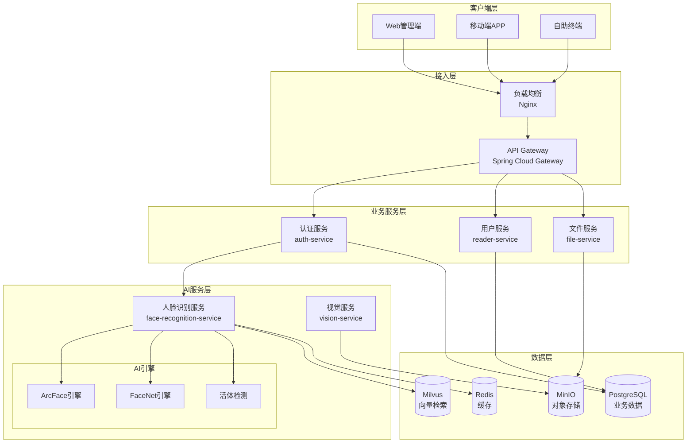
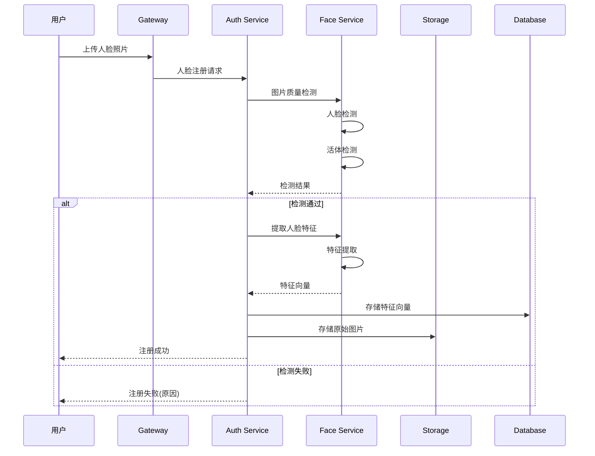
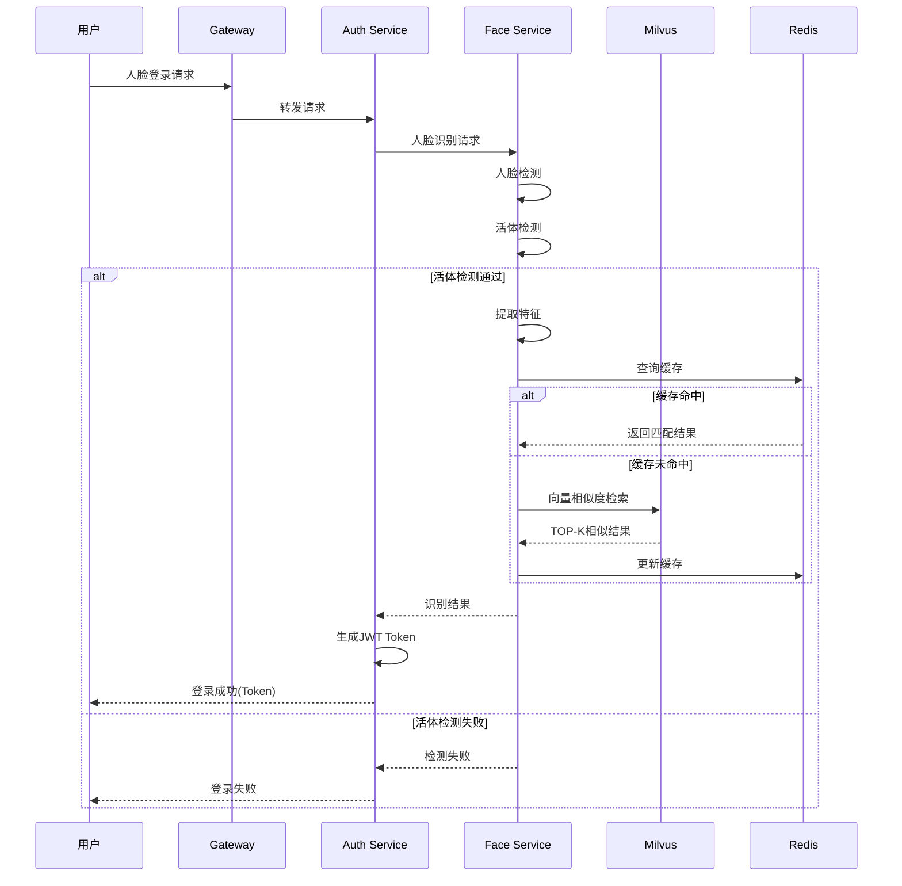

# 人脸识别登录系统架构设计

## 1. 概述

### 1.1 背景
国创睿峰智能图书馆管理系统需要提供人脸识别登录功能，为读者和管理员提供便捷、安全的身份认证方式。系统需要支持学生、教师头像管理、图书封面存储等图片管理功能。

### 1.2 目标
- 提供高精度、快速的人脸识别登录
- 支持多种用户类型（学生、教师、管理员）的人脸注册和识别
- 确保人脸数据的安全性和隐私保护
- 提供统一的图片存储和管理方案
- 支持高并发访问和横向扩展

### 1.3 设计原则
- **安全第一**: 人脸特征加密存储，传输过程加密
- **隐私保护**: 符合GDPR和个人信息保护法规
- **高性能**: 识别响应时间 < 500ms
- **高可用**: 系统可用性 ≥ 99.9%
- **可扩展**: 支持水平扩展和动态伸缩
- **解耦设计**: AI服务与业务系统松耦合

## 2. 技术选型

### 2.1 人脸识别技术栈

#### 2.1.1 人脸识别SDK
**选择: ArcFace (虹软人脸识别SDK) + FaceNet备选**

理由：
- ArcFace: 离线SDK，识别精度高(99.8%)，免费版支持，适合私有化部署
- FaceNet: 开源方案，基于深度学习，可自定义训练
- 双引擎策略：主用ArcFace，FaceNet作为备用和对比验证

#### 2.1.2 活体检测
**选择: Silent Liveness Detection (静默活体检测)**

- RGB单目活体检测
- 防照片、视频、面具攻击
- 检测时间 < 200ms

#### 2.1.3 图像处理
**选择: OpenCV + Pillow**

- OpenCV: 人脸检测、对齐、预处理
- Pillow: 图片格式转换、压缩、缩放

### 2.2 存储方案

#### 2.2.1 对象存储
**选择: MinIO (私有化) / 阿里云OSS (云服务)**

存储内容：
- 原始图片：头像原图、图书封面
- 处理后图片：缩略图、标准化人脸图
- 临时文件：注册过程中的临时图片

存储结构：
```
/library-storage/
  ├── avatars/           # 用户头像
  │   ├── students/      # 学生头像
  │   ├── teachers/      # 教师头像
  │   └── admins/        # 管理员头像
  ├── books/             # 图书封面
  │   └── covers/        # 封面图片
  └── temp/              # 临时文件
      └── face-register/ # 人脸注册临时文件
```

#### 2.2.2 特征存储
**选择: PostgreSQL + Redis**

- PostgreSQL: 持久化存储人脸特征向量
- Redis: 热点数据缓存，加速匹配

#### 2.2.3 向量检索
**选择: Milvus 向量数据库**

- 专门的向量相似度检索
- 支持亿级向量检索
- 毫秒级响应时间
- 支持多种索引类型(IVF, HNSW等)

### 2.3 服务框架

#### 2.3.1 AI服务框架
**选择: Python FastAPI**

- 异步高性能
- 自动API文档生成
- 类型安全
- 易于集成ML模型

#### 2.3.2 业务服务框架
**选择: Spring Boot (继承现有架构)**

- 与现有微服务架构一致
- 成熟稳定
- 丰富的生态系统

## 3. 架构设计

### 3.1 整体架构



### 3.2 服务拆分

#### 3.2.1 face-recognition-service (新增AI服务)
**职责**：
- 人脸检测与对齐
- 人脸特征提取
- 人脸特征匹配
- 活体检测
- 人脸质量评估

**技术栈**：
- Python 3.9+
- FastAPI
- ArcFace SDK
- OpenCV
- NumPy/Pandas

#### 3.2.2 auth-service (扩展)
**新增职责**：
- 人脸注册流程协调
- 人脸登录认证
- 多因素认证管理
- 登录日志记录

#### 3.2.3 file-service (扩展)
**新增职责**：
- 头像上传与管理
- 图片压缩与格式转换
- CDN分发管理
- 图片访问权限控制

### 3.3 核心流程设计

#### 3.3.1 人脸注册流程



#### 3.3.2 人脸登录流程



### 3.4 数据模型设计

#### 3.4.1 人脸特征表
```sql
-- 人脸特征主表
CREATE TABLE face_features (
    id BIGSERIAL PRIMARY KEY,
    user_id BIGINT NOT NULL,                 -- 用户ID
    user_type VARCHAR(20) NOT NULL,          -- 用户类型(student/teacher/admin)
    feature_vector BYTEA NOT NULL,           -- 特征向量(加密存储)
    feature_version VARCHAR(20),             -- 特征版本(SDK版本)
    face_image_url VARCHAR(500),             -- 人脸图片URL
    quality_score DECIMAL(5,2),              -- 质量分数
    is_primary BOOLEAN DEFAULT false,        -- 是否主人脸
    status VARCHAR(20) DEFAULT 'active',     -- 状态(active/inactive)
    created_at TIMESTAMP DEFAULT CURRENT_TIMESTAMP,
    updated_at TIMESTAMP DEFAULT CURRENT_TIMESTAMP
);

-- 人脸识别日志表
CREATE TABLE face_recognition_logs (
    id BIGSERIAL PRIMARY KEY,
    user_id BIGINT,                          -- 识别到的用户ID
    recognition_type VARCHAR(20),            -- 识别类型(login/verify)
    face_image_url VARCHAR(500),             -- 识别时的人脸图片
    similarity_score DECIMAL(5,4),           -- 相似度分数
    liveness_score DECIMAL(5,4),             -- 活体检测分数
    device_info JSONB,                       -- 设备信息
    location_info JSONB,                     -- 位置信息
    recognition_result VARCHAR(20),          -- 识别结果(success/failed)
    failure_reason VARCHAR(100),             -- 失败原因
    response_time INT,                       -- 响应时间(ms)
    created_at TIMESTAMP DEFAULT CURRENT_TIMESTAMP
);

-- 用户头像表
CREATE TABLE user_avatars (
    id BIGSERIAL PRIMARY KEY,
    user_id BIGINT NOT NULL,
    user_type VARCHAR(20) NOT NULL,
    avatar_url VARCHAR(500) NOT NULL,        -- 原图URL
    thumbnail_url VARCHAR(500),              -- 缩略图URL
    file_size BIGINT,                        -- 文件大小
    mime_type VARCHAR(50),                   -- MIME类型
    is_current BOOLEAN DEFAULT true,         -- 是否当前头像
    created_at TIMESTAMP DEFAULT CURRENT_TIMESTAMP
);

-- 创建索引
CREATE INDEX idx_face_features_user_id ON face_features(user_id);
CREATE INDEX idx_face_features_status ON face_features(status);
CREATE INDEX idx_recognition_logs_user_id ON face_recognition_logs(user_id);
CREATE INDEX idx_recognition_logs_created_at ON face_recognition_logs(created_at);
CREATE INDEX idx_user_avatars_user_id ON user_avatars(user_id);
```

#### 3.4.2 Redis缓存结构
```
# 用户特征缓存
face:feature:{user_id} -> {
    "feature_vector": "base64_encoded_vector",
    "quality_score": 0.95,
    "updated_at": "2025-10-10T10:00:00Z"
}
TTL: 1小时

# 热点用户池(最近活跃用户)
face:hot:users -> SET {user_id1, user_id2, ...}
TTL: 30分钟

# 识别失败计数器(防暴力破解)
face:fail:{client_ip} -> count
TTL: 5分钟
```

#### 3.4.3 Milvus向量索引
```python
# Collection Schema
face_collection = {
    "name": "face_features",
    "fields": [
        {"name": "id", "type": "INT64", "is_primary": True},
        {"name": "user_id", "type": "INT64"},
        {"name": "user_type", "type": "VARCHAR", "max_length": 20},
        {"name": "feature_vector", "type": "FLOAT_VECTOR", "dim": 512}
    ],
    "index": {
        "type": "IVF_FLAT",  # 索引类型
        "metric_type": "IP",   # 内积相似度
        "params": {"nlist": 1024}
    }
}
```

## 4. API设计

### 4.1 人脸注册API

```yaml
POST /api/v1/face/register
Content-Type: multipart/form-data

Request:
  - user_id: string (required)
  - user_type: string (required) [student|teacher|admin]
  - face_image: file (required)
  - is_primary: boolean (optional)

Response:
  {
    "code": 200,
    "message": "人脸注册成功",
    "data": {
      "face_id": "f_1234567890",
      "user_id": "u_001",
      "quality_score": 0.95,
      "face_image_url": "https://storage/avatars/..."
    }
  }

Errors:
  - 400: 图片质量不符合要求
  - 401: 活体检测失败
  - 409: 人脸已存在
```

### 4.2 人脸登录API

```yaml
POST /api/v1/face/login
Content-Type: multipart/form-data

Request:
  - face_image: file (required)
  - user_type: string (optional) [student|teacher|admin]
  - device_id: string (optional)

Response:
  {
    "code": 200,
    "message": "登录成功",
    "data": {
      "user_id": "u_001",
      "user_name": "张三",
      "user_type": "student",
      "access_token": "eyJ...",
      "refresh_token": "eyJ...",
      "expires_in": 7200
    }
  }

Errors:
  - 401: 人脸识别失败
  - 403: 账户已锁定
  - 429: 请求过于频繁
```

### 4.3 人脸更新API

```yaml
PUT /api/v1/face/update/{user_id}
Content-Type: multipart/form-data

Request:
  - face_image: file (required)
  - replace: boolean (optional, default: false)

Response:
  {
    "code": 200,
    "message": "人脸更新成功",
    "data": {
      "face_id": "f_1234567890",
      "quality_score": 0.96,
      "previous_face_id": "f_0987654321"
    }
  }
```

## 5. 安全设计

### 5.1 数据安全

#### 5.1.1 加密存储
- **特征向量加密**: AES-256-GCM加密
- **传输加密**: TLS 1.3
- **密钥管理**: HashiCorp Vault / AWS KMS

#### 5.1.2 访问控制
- **API认证**: JWT Token + API Key
- **权限控制**: RBAC基于角色的访问控制
- **审计日志**: 所有操作记录可追溯

### 5.2 隐私保护

#### 5.2.1 数据最小化
- 只存储必要的人脸特征
- 定期清理过期数据
- 用户可请求删除个人数据

#### 5.2.2 去标识化
- 特征向量与用户信息分离存储
- 使用UUID代替真实ID传输
- 图片添加水印防止滥用

### 5.3 防攻击措施

#### 5.3.1 防欺骗攻击
- **活体检测**: 防照片、视频攻击
- **3D检测**: 防面具攻击
- **多角度验证**: 要求用户转头等动作

#### 5.3.2 防暴力破解
- **频率限制**: 单IP 5分钟内最多10次尝试
- **账户锁定**: 连续失败5次锁定30分钟
- **验证码**: 多次失败后要求图形验证码

#### 5.3.3 防重放攻击
- **时间戳验证**: 请求包含时间戳，5分钟内有效
- **Nonce机制**: 一次性随机数防重放
- **签名验证**: HMAC-SHA256请求签名

### 5.4 合规性

#### 5.4.1 法规遵循
- **GDPR合规**: 用户同意、数据可删除
- **个人信息保护法**: 最小必要原则
- **生物特征信息保护**: 加密存储、访问审计

#### 5.4.2 用户授权
- 明确告知数据用途
- 获取用户明示同意
- 提供退出机制

## 6. 性能优化

### 6.1 识别性能优化

#### 6.1.1 特征缓存
- Redis缓存热点用户特征
- LRU淘汰策略
- 预热机制

#### 6.1.2 并行处理
- 多线程特征提取
- 异步处理非关键路径
- 批量处理优化

#### 6.1.3 模型优化
- 模型量化(INT8)
- TensorRT加速
- ONNX Runtime优化

### 6.2 存储优化

#### 6.2.1 图片优化
- WebP格式存储
- 多级缩略图
- CDN加速

#### 6.2.2 向量索引优化
- IVF索引加速检索
- 分片存储
- GPU加速(可选)

### 6.3 网络优化

#### 6.3.1 传输优化
- gRPC二进制协议
- HTTP/2多路复用
- 请求压缩

#### 6.3.2 就近访问
- 边缘节点部署
- 地理位置路由
- 本地缓存

## 7. 监控与运维

### 7.1 监控指标

#### 7.1.1 业务指标
- 识别成功率
- 平均响应时间
- 活体检测通过率
- 用户满意度

#### 7.1.2 技术指标
- API QPS/TPS
- 延迟P50/P95/P99
- 错误率
- 资源使用率

### 7.2 告警策略

```yaml
alerts:
  - name: 识别成功率低
    condition: success_rate < 95%
    duration: 5m
    severity: warning

  - name: 响应时间过长
    condition: p95_latency > 500ms
    duration: 3m
    severity: critical

  - name: 活体检测异常
    condition: liveness_pass_rate < 90%
    duration: 10m
    severity: warning
```

### 7.3 日志管理

#### 7.3.1 日志分类
- **访问日志**: API请求响应
- **业务日志**: 识别结果、用户行为
- **错误日志**: 异常堆栈、错误详情
- **审计日志**: 敏感操作记录

#### 7.3.2 日志存储
- ELK Stack集中存储
- 日志分级(DEBUG/INFO/WARN/ERROR)
- 保留期限(普通30天，审计180天)

## 8. 部署架构

### 8.1 容器化部署

```yaml
# docker-compose.yml
version: '3.8'

services:
  face-recognition-service:
    image: gcrf/face-recognition:1.0.0
    ports:
      - "8090:8090"
    environment:
      - ARCFACE_LICENSE_KEY=${ARCFACE_KEY}
      - MILVUS_HOST=milvus
      - REDIS_HOST=redis
    deploy:
      replicas: 3
      resources:
        limits:
          cpus: '2'
          memory: 4G
        reservations:
          cpus: '1'
          memory: 2G

  milvus:
    image: milvusdb/milvus:2.3.0
    ports:
      - "19530:19530"
    volumes:
      - milvus_data:/var/lib/milvus

  redis:
    image: redis:7-alpine
    ports:
      - "6379:6379"
    volumes:
      - redis_data:/data
```

### 8.2 Kubernetes部署

```yaml
# face-recognition-deployment.yaml
apiVersion: apps/v1
kind: Deployment
metadata:
  name: face-recognition-service
spec:
  replicas: 3
  selector:
    matchLabels:
      app: face-recognition
  template:
    metadata:
      labels:
        app: face-recognition
    spec:
      containers:
      - name: face-recognition
        image: gcrf/face-recognition:1.0.0
        ports:
        - containerPort: 8090
        resources:
          requests:
            memory: "2Gi"
            cpu: "1000m"
          limits:
            memory: "4Gi"
            cpu: "2000m"
        livenessProbe:
          httpGet:
            path: /health
            port: 8090
          initialDelaySeconds: 30
          periodSeconds: 10
        readinessProbe:
          httpGet:
            path: /ready
            port: 8090
          initialDelaySeconds: 5
          periodSeconds: 5
---
apiVersion: v1
kind: Service
metadata:
  name: face-recognition-service
spec:
  selector:
    app: face-recognition
  ports:
  - port: 8090
    targetPort: 8090
  type: LoadBalancer
```

### 8.3 扩展策略

#### 8.3.1 水平扩展
```yaml
# HPA配置
apiVersion: autoscaling/v2
kind: HorizontalPodAutoscaler
metadata:
  name: face-recognition-hpa
spec:
  scaleTargetRef:
    apiVersion: apps/v1
    kind: Deployment
    name: face-recognition-service
  minReplicas: 2
  maxReplicas: 10
  metrics:
  - type: Resource
    resource:
      name: cpu
      target:
        type: Utilization
        averageUtilization: 70
  - type: Resource
    resource:
      name: memory
      target:
        type: Utilization
        averageUtilization: 80
```

#### 8.3.2 垂直扩展
- GPU加速(NVIDIA T4/V100)
- 高性能CPU(Intel Xeon/AMD EPYC)
- NVMe SSD存储

## 9. 灾难恢复

### 9.1 备份策略

#### 9.1.1 数据备份
- **PostgreSQL**: 每日全量 + 小时增量
- **MinIO**: 跨区域复制
- **Milvus**: 定期快照

#### 9.1.2 备份保留
- 日备份保留7天
- 周备份保留4周
- 月备份保留6个月

### 9.2 故障恢复

#### 9.2.1 RTO/RPO目标
- RTO(恢复时间目标): < 1小时
- RPO(恢复点目标): < 15分钟

#### 9.2.2 故障切换
- 主备自动切换
- 多活部署
- 降级策略(密码登录)

## 10. 成本估算

### 10.1 硬件成本(私有化部署)

| 组件 | 规格 | 数量 | 单价 | 总价 |
|------|------|------|------|------|
| 应用服务器 | 8C16G | 3台 | ¥8,000 | ¥24,000 |
| GPU服务器 | T4 GPU | 1台 | ¥30,000 | ¥30,000 |
| 存储服务器 | 4TB SSD | 2台 | ¥10,000 | ¥20,000 |
| **总计** | - | - | - | **¥74,000** |

### 10.2 软件成本

| 组件 | 类型 | 费用 |
|------|------|------|
| ArcFace SDK | 商业授权 | ¥50,000/年 |
| Milvus | 开源免费 | ¥0 |
| MinIO | 开源免费 | ¥0 |
| **总计** | - | **¥50,000/年** |

### 10.3 云服务成本(按需)

| 服务 | 规格 | 月费用 |
|------|------|--------|
| ECS | 3台8C16G | ¥3,000 |
| GPU实例 | T4按需 | ¥2,000 |
| OSS存储 | 1TB | ¥100 |
| CDN流量 | 1TB | ¥200 |
| **月总计** | - | **¥5,300** |

## 11. 实施计划

### 11.1 第一阶段：基础功能(1-2周)
- 搭建开发环境
- 实现基础人脸识别API
- 完成单机版本测试

### 11.2 第二阶段：完整功能(2-3周)
- 集成活体检测
- 实现特征存储和检索
- 完成安全加固

### 11.3 第三阶段：优化部署(1-2周)
- 性能优化
- 容器化部署
- 监控告警配置

### 11.4 第四阶段：生产上线(1周)
- 生产环境部署
- 压力测试
- 正式上线

## 12. 风险评估

### 12.1 技术风险
| 风险 | 概率 | 影响 | 缓解措施 |
|------|------|------|----------|
| 识别准确率不足 | 中 | 高 | 双引擎验证、持续优化 |
| 性能瓶颈 | 中 | 中 | 缓存优化、水平扩展 |
| 安全漏洞 | 低 | 高 | 安全审计、渗透测试 |

### 12.2 业务风险
| 风险 | 概率 | 影响 | 缓解措施 |
|------|------|------|----------|
| 用户接受度低 | 中 | 中 | 保留密码登录选项 |
| 隐私合规问题 | 低 | 高 | 法务审核、用户协议 |
| 硬件故障 | 低 | 中 | 冗余部署、快速切换 |

## 13. 总结

本架构设计提供了一个完整的人脸识别登录系统解决方案，具有以下特点：

1. **高性能**: 识别响应 < 500ms，支持万级QPS
2. **高安全**: 多层安全防护，符合隐私法规
3. **高可用**: 99.9%可用性，自动故障切换
4. **可扩展**: 微服务架构，支持水平扩展
5. **易维护**: 完善的监控告警，自动化运维

该方案能够满足图书管理系统的人脸识别需求，为用户提供便捷、安全的身份认证服务。