# 国创睿峰智能图书馆管理系统 - 用例图

## 1. 管理员用例图

```mermaid
graph TB
    %% 定义样式
    classDef actorStyle fill:#E8F4F8,stroke:#2196F3,stroke-width:2px
    classDef usecaseStyle fill:#FFF3E0,stroke:#FF9800,stroke-width:2px
    classDef systemStyle fill:#F3E5F5,stroke:#9C27B0,stroke-width:3px

    %% 角色定义
    Admin[管理员]:::actorStyle

    %% 系统边界
    subgraph System[图书馆管理系统]
        direction TB

        %% 登录管理
        UC1[登录系统]:::usecaseStyle
        UC2[修改密码]:::usecaseStyle
        UC3[权限管理]:::usecaseStyle

        %% 图书管理
        UC4[图书编目]:::usecaseStyle
        UC5[图书典藏]:::usecaseStyle
        UC6[图书剔旧]:::usecaseStyle
        UC7[图书盘点]:::usecaseStyle
        UC8[打印条码]:::usecaseStyle
        UC9[批量导入图书]:::usecaseStyle
        UC10[云端数据检索]:::usecaseStyle

        %% 流通管理
        UC11[办理借书]:::usecaseStyle
        UC12[办理还书]:::usecaseStyle
        UC13[处理逾期]:::usecaseStyle
        UC14[管理预约]:::usecaseStyle
        UC15[续借处理]:::usecaseStyle

        %% 读者管理
        UC16[办理读者证]:::usecaseStyle
        UC17[注销读者]:::usecaseStyle
        UC18[读者信息维护]:::usecaseStyle
        UC19[人脸信息采集]:::usecaseStyle
        UC20[批量导入读者]:::usecaseStyle

        %% 系统管理
        UC21[用户管理]:::usecaseStyle
        UC22[数据备份]:::usecaseStyle
        UC23[系统参数设置]:::usecaseStyle
        UC24[生成统计报表]:::usecaseStyle

        %% 荐购捐赠
        UC25[处理荐购申请]:::usecaseStyle
        UC26[验收捐赠图书]:::usecaseStyle
    end

    %% AI系统
    AISystem[AI智能系统]:::systemStyle

    %% 连接关系
    Admin --> UC1
    Admin --> UC2
    Admin --> UC3
    Admin --> UC4
    Admin --> UC5
    Admin --> UC6
    Admin --> UC7
    Admin --> UC8
    Admin --> UC9
    Admin --> UC11
    Admin --> UC12
    Admin --> UC13
    Admin --> UC14
    Admin --> UC15
    Admin --> UC16
    Admin --> UC17
    Admin --> UC18
    Admin --> UC19
    Admin --> UC20
    Admin --> UC21
    Admin --> UC22
    Admin --> UC23
    Admin --> UC24
    Admin --> UC25
    Admin --> UC26

    %% 包含关系
    UC4 -.include.-> UC10
    UC16 -.include.-> UC19
    UC12 -.include.-> UC13

    %% 扩展关系
    UC9 -.extend.-> UC4
    UC20 -.extend.-> UC16
    UC15 -.extend.-> UC11

    %% 与AI系统交互
    UC4 -.-> AISystem
    UC7 -.-> AISystem
    UC25 -.-> AISystem
```



## 2. 读者用例图

```mermaid
graph TB
    %% 定义样式
    classDef actorStyle fill:#E8F4F8,stroke:#2196F3,stroke-width:2px
    classDef usecaseStyle fill:#E6FFE6,stroke:#4CAF50,stroke-width:2px
    classDef systemStyle fill:#F3E5F5,stroke:#9C27B0,stroke-width:3px

    %% 角色定义
    Reader[读者]:::actorStyle

    %% 系统边界
    subgraph ReaderSystem[读者服务系统]
        direction TB

        %% 账号管理
        RUC1[注册账号]:::usecaseStyle
        RUC2[登录系统]:::usecaseStyle
        RUC3[修改个人信息]:::usecaseStyle
        RUC4[绑定微信]:::usecaseStyle

        %% 图书查询
        RUC5[搜索图书]:::usecaseStyle
        RUC6[扫码查书]:::usecaseStyle
        RUC7[查看图书详情]:::usecaseStyle
        RUC8[查看馆藏位置]:::usecaseStyle

        %% 借阅服务
        RUC9[预约图书]:::usecaseStyle
        RUC10[续借图书]:::usecaseStyle
        RUC11[查看借阅历史]:::usecaseStyle
        RUC12[查看当前借阅]:::usecaseStyle
        RUC13[接收到期提醒]:::usecaseStyle

        %% 个性化服务
        RUC14[查看推荐图书]:::usecaseStyle
        RUC15[设置阅读偏好]:::usecaseStyle
        RUC16[制定阅读计划]:::usecaseStyle
        RUC17[查看阅读报告]:::usecaseStyle

        %% 互动功能
        RUC18[图书荐购]:::usecaseStyle
        RUC19[图书捐赠]:::usecaseStyle
        RUC20[评价图书]:::usecaseStyle
        RUC21[收藏图书]:::usecaseStyle

        %% 智能服务
        RUC22[智能问答]:::usecaseStyle
        RUC23[语音查询]:::usecaseStyle
        RUC24[刷脸借书]:::usecaseStyle
    end

    %% AI系统
    AIRecommend[AI推荐引擎]:::systemStyle
    AIAssistant[AI智能助手]:::systemStyle

    %% 连接关系
    Reader --> RUC1
    Reader --> RUC2
    Reader --> RUC3
    Reader --> RUC4
    Reader --> RUC5
    Reader --> RUC6
    Reader --> RUC7
    Reader --> RUC8
    Reader --> RUC9
    Reader --> RUC10
    Reader --> RUC11
    Reader --> RUC12
    Reader --> RUC13
    Reader --> RUC14
    Reader --> RUC15
    Reader --> RUC16
    Reader --> RUC17
    Reader --> RUC18
    Reader --> RUC19
    Reader --> RUC20
    Reader --> RUC21
    Reader --> RUC22
    Reader --> RUC23
    Reader --> RUC24

    %% 包含关系
    RUC5 -.include.-> RUC7
    RUC7 -.include.-> RUC8
    RUC2 -.include.-> RUC24

    %% 扩展关系
    RUC6 -.extend.-> RUC5
    RUC23 -.extend.-> RUC5
    RUC21 -.extend.-> RUC7

    %% 与AI系统交互
    RUC14 -.-> AIRecommend
    RUC15 -.-> AIRecommend
    RUC16 -.-> AIRecommend
    RUC22 -.-> AIAssistant
    RUC23 -.-> AIAssistant
```



## 3. 馆长用例图

```mermaid
graph TB
    %% 定义样式
    classDef actorStyle fill:#E8F4F8,stroke:#2196F3,stroke-width:2px
    classDef usecaseStyle fill:#FFE6E6,stroke:#F44336,stroke-width:2px
    classDef systemStyle fill:#F3E5F5,stroke:#9C27B0,stroke-width:3px

    %% 角色定义
    Director[馆长]:::actorStyle

    %% 系统边界
    subgraph DirectorSystem[决策支持系统]
        direction TB

        %% 数据分析
        DUC1[查看馆情概览]:::usecaseStyle
        DUC2[查看借阅统计]:::usecaseStyle
        DUC3[查看读者分析]:::usecaseStyle
        DUC4[查看图书利用率]:::usecaseStyle
        DUC5[查看零借阅分析]:::usecaseStyle

        %% 运营管理
        DUC6[制定借阅规则]:::usecaseStyle
        DUC7[审批荐购申请]:::usecaseStyle
        DUC8[制定采购计划]:::usecaseStyle
        DUC9[查看运营报告]:::usecaseStyle

        %% 决策支持
        DUC10[查看数据大屏]:::usecaseStyle
        DUC11[导出分析报表]:::usecaseStyle
        DUC12[对比历史数据]:::usecaseStyle
        DUC13[预测借阅趋势]:::usecaseStyle

        %% 资源管理
        DUC14[查看采购建议]:::usecaseStyle
        DUC15[查看剔旧建议]:::usecaseStyle
        DUC16[优化馆藏布局]:::usecaseStyle

        %% 服务优化
        DUC17[查看读者满意度]:::usecaseStyle
        DUC18[查看服务质量指标]:::usecaseStyle
        DUC19[制定服务改进计划]:::usecaseStyle

        %% 人员管理
        DUC20[查看员工绩效]:::usecaseStyle
        DUC21[分配工作权限]:::usecaseStyle
        DUC22[制定培训计划]:::usecaseStyle
    end

    %% AI分析系统
    AIAnalysis[AI数据分析引擎]:::systemStyle
    AIPrediction[AI预测引擎]:::systemStyle

    %% 连接关系
    Director --> DUC1
    Director --> DUC2
    Director --> DUC3
    Director --> DUC4
    Director --> DUC5
    Director --> DUC6
    Director --> DUC7
    Director --> DUC8
    Director --> DUC9
    Director --> DUC10
    Director --> DUC11
    Director --> DUC12
    Director --> DUC13
    Director --> DUC14
    Director --> DUC15
    Director --> DUC16
    Director --> DUC17
    Director --> DUC18
    Director --> DUC19
    Director --> DUC20
    Director --> DUC21
    Director --> DUC22

    %% 包含关系
    DUC10 -.include.-> DUC1
    DUC10 -.include.-> DUC2
    DUC9 -.include.-> DUC11

    %% 扩展关系
    DUC12 -.extend.-> DUC2
    DUC13 -.extend.-> DUC2

    %% 与AI系统交互
    DUC4 -.-> AIAnalysis
    DUC5 -.-> AIAnalysis
    DUC13 -.-> AIPrediction
    DUC14 -.-> AIPrediction
    DUC15 -.-> AIPrediction
```



## 4. AI系统用例图

```mermaid
graph TB
    %% 定义样式
    classDef actorStyle fill:#E8F4F8,stroke:#2196F3,stroke-width:2px
    classDef systemStyle fill:#F3E5F5,stroke:#9C27B0,stroke-width:3px
    classDef usecaseStyle fill:#FFF9C4,stroke:#FFC107,stroke-width:2px
    classDef subsystemStyle fill:#E1F5FE,stroke:#00BCD4,stroke-width:2px

    %% AI系统主体
    AICore[AI核心系统]:::systemStyle

    %% 子系统
    subgraph AISubsystems[AI智能子系统]
        direction TB

        %% 推荐系统
        subgraph RecommendSystem[推荐引擎]
            AUC1[生成个性化推荐]:::usecaseStyle
            AUC2[协同过滤计算]:::usecaseStyle
            AUC3[内容相似度计算]:::usecaseStyle
            AUC4[实时推荐更新]:::usecaseStyle
            AUC5[推荐效果评估]:::usecaseStyle
        end

        %% 问答系统
        subgraph QASystem[智能问答]
            AUC6[意图识别]:::usecaseStyle
            AUC7[实体抽取]:::usecaseStyle
            AUC8[知识检索]:::usecaseStyle
            AUC9[答案生成]:::usecaseStyle
            AUC10[多轮对话管理]:::usecaseStyle
        end

        %% 分析系统
        subgraph AnalysisSystem[数据分析]
            AUC11[用户画像构建]:::usecaseStyle
            AUC12[借阅趋势预测]:::usecaseStyle
            AUC13[采购需求预测]:::usecaseStyle
            AUC14[异常行为检测]:::usecaseStyle
            AUC15[资源优化建议]:::usecaseStyle
        end

        %% 识别系统
        subgraph RecognitionSystem[智能识别]
            AUC16[人脸识别]:::usecaseStyle
            AUC17[语音识别]:::usecaseStyle
            AUC18[OCR文字识别]:::usecaseStyle
            AUC19[图书封面识别]:::usecaseStyle
            AUC20[条码识别]:::usecaseStyle
        end

        %% 内容分析
        subgraph ContentSystem[内容分析]
            AUC21[图书摘要生成]:::usecaseStyle
            AUC22[关键词提取]:::usecaseStyle
            AUC23[知识图谱构建]:::usecaseStyle
            AUC24[语义检索]:::usecaseStyle
            AUC25[自动分类标签]:::usecaseStyle
        end
    end

    %% 外部角色
    Admin2[管理员]:::actorStyle
    Reader2[读者]:::actorStyle
    System2[业务系统]:::actorStyle

    %% AI核心系统功能
    AICore --> AUC1
    AICore --> AUC6
    AICore --> AUC11
    AICore --> AUC16
    AICore --> AUC21

    %% 功能依赖关系
    AUC1 -.depends.-> AUC2
    AUC1 -.depends.-> AUC3
    AUC1 -.depends.-> AUC11

    AUC9 -.depends.-> AUC6
    AUC9 -.depends.-> AUC7
    AUC9 -.depends.-> AUC8

    AUC12 -.depends.-> AUC11
    AUC13 -.depends.-> AUC11
    AUC13 -.depends.-> AUC12

    AUC24 -.depends.-> AUC22
    AUC24 -.depends.-> AUC23

    %% 外部交互
    Admin2 -.uses.-> AUC13
    Admin2 -.uses.-> AUC14
    Admin2 -.uses.-> AUC15

    Reader2 -.uses.-> AUC1
    Reader2 -.uses.-> AUC6
    Reader2 -.uses.-> AUC16
    Reader2 -.uses.-> AUC17

    System2 -.invokes.-> AICore
```



## 5. 系统整体用例图

```mermaid
graph TB
    %% 定义样式
    classDef actorStyle fill:#E8F4F8,stroke:#2196F3,stroke-width:2px
    classDef usecaseStyle fill:#FFF,stroke:#333,stroke-width:2px
    classDef systemBoundary fill:#F5F5F5,stroke:#666,stroke-width:3px,stroke-dasharray: 5 5

    %% 角色定义
    Admin[管理员]:::actorStyle
    Librarian[馆员]:::actorStyle
    Director[馆长]:::actorStyle
    Reader[读者]:::actorStyle
    Student[学生读者]:::actorStyle
    Teacher[教师读者]:::actorStyle
    AI[AI系统]:::actorStyle

    %% 系统边界
    subgraph LibrarySystem[国创睿峰智能图书馆管理系统]
        direction TB

        %% 核心业务模块
        subgraph CoreBusiness[核心业务]
            CB1[图书编目]:::usecaseStyle
            CB2[图书典藏]:::usecaseStyle
            CB3[图书借阅]:::usecaseStyle
            CB4[图书归还]:::usecaseStyle
            CB5[读者管理]:::usecaseStyle
            CB6[流通管理]:::usecaseStyle
        end

        %% 智能服务模块
        subgraph SmartService[智能服务]
            SS1[智能推荐]:::usecaseStyle
            SS2[智能问答]:::usecaseStyle
            SS3[人脸识别]:::usecaseStyle
            SS4[语音交互]:::usecaseStyle
            SS5[OCR识别]:::usecaseStyle
        end

        %% 数据分析模块
        subgraph DataAnalysis[数据分析]
            DA1[馆情分析]:::usecaseStyle
            DA2[借阅统计]:::usecaseStyle
            DA3[读者画像]:::usecaseStyle
            DA4[趋势预测]:::usecaseStyle
            DA5[决策支持]:::usecaseStyle
        end

        %% 增值服务模块
        subgraph ValueService[增值服务]
            VS1[图书荐购]:::usecaseStyle
            VS2[图书捐赠]:::usecaseStyle
            VS3[阅读计划]:::usecaseStyle
            VS4[阅读报告]:::usecaseStyle
            VS5[积分管理]:::usecaseStyle
        end
    end

    %% 继承关系
    Student --|> Reader
    Teacher --|> Reader
    Librarian --|> Admin

    %% 角色与用例关联
    Admin --> CB1
    Admin --> CB2
    Admin --> CB5
    Admin --> CB6

    Librarian --> CB3
    Librarian --> CB4

    Director --> DA1
    Director --> DA2
    Director --> DA3
    Director --> DA4
    Director --> DA5

    Reader --> CB3
    Reader --> CB4
    Reader --> SS1
    Reader --> SS2
    Reader --> VS1
    Reader --> VS2
    Reader --> VS3
    Reader --> VS4

    AI --> SS1
    AI --> SS2
    AI --> SS3
    AI --> SS4
    AI --> SS5
    AI --> DA3
    AI --> DA4

    %% 用例间关系
    CB3 -.include.-> SS3
    CB4 -.include.-> SS5
    SS2 -.extend.-> SS4
    DA4 -.depend.-> DA2
    VS3 -.depend.-> SS1
```

## 用例说明

### 1. 管理员用例说明

#### 核心用例
- **图书编目**：支持智能编目、批量导入、手工编目
- **图书典藏**：自动生成索书号、条码号，批量处理
- **图书盘点**：支持RFID批量盘点、差异分析
- **流通管理**：借阅、归还、预约、续借全流程管理
- **读者管理**：办证、注销、信息维护、人脸采集

#### 智能特性
- 与AI系统协作进行智能分类
- 利用云端数据库加速编目
- AI辅助的盘点异常分析

### 2. 读者用例说明

#### 核心用例
- **图书查询**：多方式搜索（文字、语音、扫码）
- **借阅服务**：预约、续借、查看历史
- **个性化服务**：推荐、阅读计划、阅读报告
- **互动功能**：荐购、捐赠、评价、收藏

#### 智能特性
- AI个性化推荐
- 智能问答助手
- 语音查询和刷脸借书

### 3. 馆长用例说明

#### 核心用例
- **数据分析**：全方位馆情分析和统计
- **决策支持**：采购建议、剔旧建议、趋势预测
- **运营管理**：规则制定、计划审批
- **服务优化**：满意度分析、质量改进

#### 智能特性
- AI驱动的预测分析
- 智能采购建议
- 数据可视化大屏

### 4. AI系统用例说明

#### 核心能力
- **推荐引擎**：多策略融合的个性化推荐
- **智能问答**：自然语言理解和多轮对话
- **数据分析**：用户画像、趋势预测、异常检测
- **智能识别**：人脸、语音、OCR、条码识别
- **内容分析**：摘要生成、知识图谱、语义检索

#### 系统集成
- 与业务系统深度集成
- 为各类用户提供智能服务
- 持续学习和优化