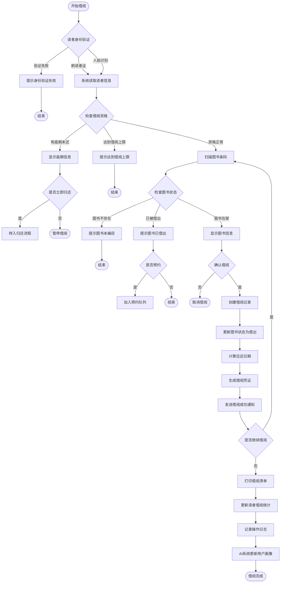
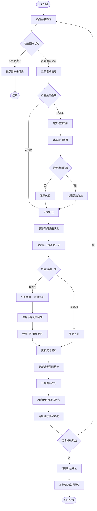
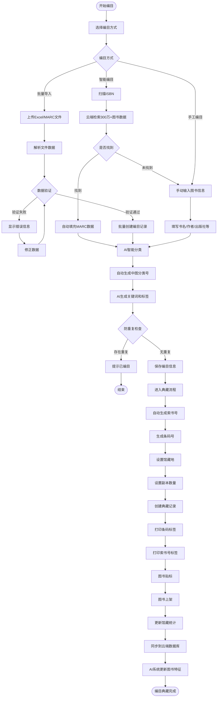
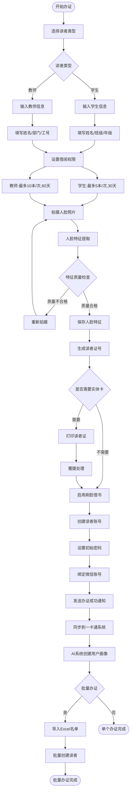
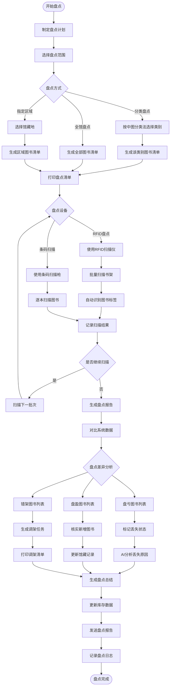
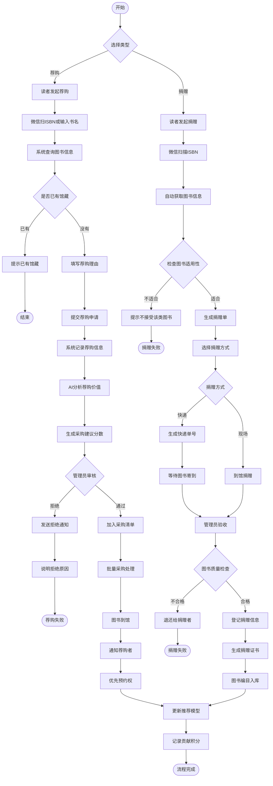
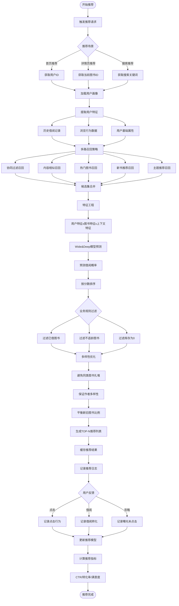
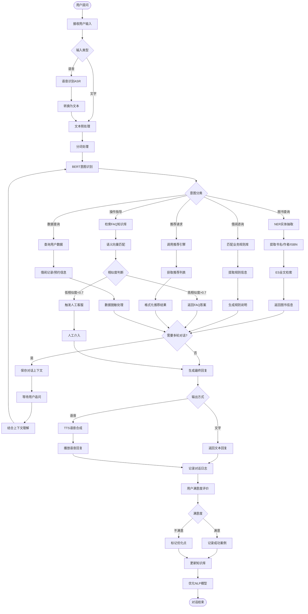

# 国创睿峰智能图书馆管理系统 - 业务流程图

## 1. 图书借阅完整流程

## 2. 图书归还完整流程

## 3. 图书编目与典藏流程

## 4. 读者证办理流程

## 5. 图书盘点流程

## 6. 图书荐购与捐赠流程

## 7. AI推荐生成流程

## 8. 智能问答处理流程

## 流程图说明

### 1. 图书借阅流程

- **核心节点**：身份验证、资格检查、图书状态检查、借阅确认
- **异常处理**：逾期处理、借阅上限、图书不可借
- **智能特性**：人脸识别、AI更新用户画像

### 2. 图书归还流程

- **核心节点**：图书验证、逾期检查、预约处理、积分计算
- **异常处理**：逾期罚款、图书未借出
- **智能特性**：AI记录阅读行为、更新推荐模型

### 3. 图书编目与典藏流程

- **核心节点**：多种编目方式、防重复检查、自动生成编号
- **智能特性**：云端数据检索、AI智能分类、自动生成标签

### 4. 读者证办理流程

- **核心节点**：读者类型选择、权限设置、人脸采集
- **异常处理**：人脸质量检查、重新拍摄
- **智能特性**：人脸特征提取、刷脸借书

### 5. 图书盘点流程

- **核心节点**：盘点计划、扫描方式、差异分析、结果处理
- **智能特性**：RFID批量扫描、AI分析丢失原因

### 6. 图书荐购与捐赠流程

- **核心节点**：申请提交、审核流程、采购/验收、通知反馈
- **智能特性**：AI分析荐购价值、自动获取图书信息

### 7. AI推荐生成流程

- **核心节点**：用户画像、多路召回、模型预测、业务过滤
- **智能特性**：Wide&Deep模型、多样性优化、实时反馈更新

### 8. 智能问答处理流程

- **核心节点**：意图识别、实体抽取、知识检索、回复生成
- **智能特性**：BERT模型、语音识别/合成、多轮对话
