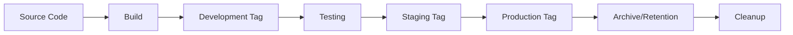

# Docker Image Tagging and Version Strategy

**Document Version**: 1.0.0
**Last Updated**: 2025-01-01
**System**: GCRF Library Management System
**Scope**: Production-grade Docker image tagging, versioning, and rollback strategies

---

## Table of Contents

1. [Tagging Philosophy](#1-tagging-philosophy)
2. [Semantic Versioning](#2-semantic-versioning)
3. [Environment Tags](#3-environment-tags)
4. [Git-based Tags](#4-git-based-tags)
5. [Special Tags](#5-special-tags)
6. [Tag Examples](#6-tag-examples)
7. [Rollback Procedures](#7-rollback-procedures)
8. [Tag Management](#8-tag-management)
9. [CI/CD Integration](#9-cicd-integration)
10. [Best Practices](#10-best-practices)

---

## 1. Tagging Philosophy

### Why Tagging Matters

Image tagging is critical for:
- **Traceability**: Link deployments to specific code versions
- **Rollback Capability**: Quick recovery from failed deployments
- **Environment Isolation**: Separate development, staging, and production
- **Audit Compliance**: Track what version runs where and when
- **Deployment Confidence**: Clear understanding of what's being deployed

### Core Principles

1. **Immutability**: Production tags are never overwritten
2. **Clarity**: Tags must be self-descriptive and meaningful
3. **Consistency**: Follow conventions across all services
4. **Automation**: Tags are generated programmatically, not manually
5. **Traceability**: Every tag traces back to source code

### Tag Naming Conventions

- **Lowercase only**: Docker best practice (e.g., `v1.0.0` not `V1.0.0`)
- **No spaces**: Use hyphens or underscores (e.g., `dev-latest` not `dev latest`)
- **Maximum 128 characters**: Docker registry limitation
- **Alphanumeric + separators**: Only `a-z`, `0-9`, `-`, `_`, `.`
- **Semantic naming**: Tags should convey meaning without documentation

### Tag Lifecycle



---

## 2. Semantic Versioning

### Version Format

We follow [Semantic Versioning 2.0.0](https://semver.org/):

```
MAJOR.MINOR.PATCH[-PRERELEASE][+BUILDMETA]
```

#### Components:
- **MAJOR**: Breaking changes (1.0.0 → 2.0.0)
- **MINOR**: New features, backward compatible (1.0.0 → 1.1.0)
- **PATCH**: Bug fixes, backward compatible (1.0.0 → 1.0.1)
- **PRERELEASE**: Optional pre-release version (1.0.0-alpha.1)
- **BUILDMETA**: Optional build metadata (1.0.0+20250101)

### Pre-release Tags

Pre-release versions for testing and validation:

| Stage | Format | Example | Purpose |
|-------|---------|---------|----------|
| Alpha | `X.Y.Z-alpha.N` | `1.0.0-alpha.1` | Internal testing |
| Beta | `X.Y.Z-beta.N` | `1.0.0-beta.2` | External testing |
| Release Candidate | `X.Y.Z-rc.N` | `1.0.0-rc.1` | Production validation |

### Build Metadata

Build metadata for traceability:

```
1.0.0+20250101.a1b2c3d
      └─date─┘ └─SHA─┘
```

### Version Increment Guidelines

| Change Type | Version Change | Example |
|-------------|---------------|---------|
| Breaking API change | Major | 1.2.3 → 2.0.0 |
| New feature | Minor | 1.2.3 → 1.3.0 |
| Bug fix | Patch | 1.2.3 → 1.2.4 |
| Documentation only | No change | 1.2.3 → 1.2.3 |
| Security patch | Patch/Minor | 1.2.3 → 1.2.4 or 1.3.0 |

---

## 3. Environment Tags

### Development Environment

| Tag Pattern | Example | Purpose | Retention |
|-------------|---------|---------|-----------|
| `dev` | `dev` | Latest development build | Always current |
| `dev-latest` | `dev-latest` | Alias for `dev` | Always current |
| `dev-<branch>` | `dev-feature-auth` | Branch-specific build | 7 days |
| `dev-<date>` | `dev-20250101` | Daily snapshot | 30 days |
| `dev-<username>` | `dev-johndoe` | Developer-specific | 3 days |

### Staging Environment

| Tag Pattern | Example | Purpose | Retention |
|-------------|---------|---------|-----------|
| `staging` | `staging` | Current staging version | Always current |
| `staging-<version>` | `staging-1.2.0` | Version in staging | 90 days |
| `staging-candidate` | `staging-candidate` | Next staging deploy | Until deployed |
| `staging-<date>` | `staging-20250101` | Staging snapshot | 60 days |

### Production Environment

| Tag Pattern | Example | Purpose | Retention |
|-------------|---------|---------|-----------|
| `prod` | `prod` | Current production | Always current |
| `prod-<version>` | `prod-1.2.0` | Production version | Forever |
| `prod-stable` | `prod-stable` | Stable production | Always current |
| `v<version>` | `v1.2.0` | Release version | Forever |

### Testing Environment

| Tag Pattern | Example | Purpose | Retention |
|-------------|---------|---------|-----------|
| `test` | `test` | Latest test build | Always current |
| `test-<feature>` | `test-oauth` | Feature testing | 14 days |
| `test-integration` | `test-integration` | Integration tests | 7 days |
| `test-performance` | `test-performance` | Performance tests | 7 days |

---

## 4. Git-based Tags

### Commit SHA Tags

| Tag Pattern | Example | Purpose | Retention |
|-------------|---------|---------|-----------|
| `git-<short-sha>` | `git-a1b2c3d` | 7-char SHA | 60 days |
| `git-<full-sha>` | `git-a1b2c3d4e5f6...` | Full SHA | 30 days |
| `sha-<short>` | `sha-a1b2c3d` | Alternative format | 60 days |

### Branch Tags

| Tag Pattern | Example | Purpose | Retention |
|-------------|---------|---------|-----------|
| `branch-<name>` | `branch-main` | Branch build | 30 days |
| `feature-<name>` | `feature-auth` | Feature branch | 14 days |
| `bugfix-<name>` | `bugfix-cors` | Bugfix branch | 14 days |
| `hotfix-<name>` | `hotfix-security` | Hotfix branch | 30 days |

### Pull Request Tags

| Tag Pattern | Example | Purpose | Retention |
|-------------|---------|---------|-----------|
| `pr-<number>` | `pr-123` | Pull request build | 14 days |
| `pr-<number>-<sha>` | `pr-123-a1b2c3d` | PR with commit | 14 days |

---

## 5. Special Tags

### System Tags

| Tag | Purpose | Mutable | Notes |
|-----|---------|---------|-------|
| `latest` | Latest successful build | Yes | Dev environment only |
| `stable` | Latest production-validated | Yes | Points to current prod |
| `canary` | Canary deployment candidate | Yes | For gradual rollout |
| `rollback` | Previous production version | Yes | Quick recovery |
| `nightly` | Nightly build | Yes | Automated daily build |
| `edge` | Bleeding edge development | Yes | Continuous deployment |

### Emergency Tags

| Tag | Purpose | Usage |
|-----|---------|-------|
| `rollback-immediate` | Emergency rollback target | Critical incidents |
| `last-known-good` | Last stable deployment | Recovery baseline |
| `disaster-recovery` | DR validated version | Business continuity |

---

## 6. Tag Examples

### Real-world Tagging Scenarios

#### Scenario 1: Production Release

```bash
# Version 1.2.0 release on 2025-01-01, commit a1b2c3d
# Service: gateway-service

# Semantic version tags
docker tag gcrf-library/gateway-service:build \
  gcrf-library/gateway-service:1.2.0

docker tag gcrf-library/gateway-service:build \
  gcrf-library/gateway-service:1.2

docker tag gcrf-library/gateway-service:build \
  gcrf-library/gateway-service:1

docker tag gcrf-library/gateway-service:build \
  gcrf-library/gateway-service:v1.2.0

# Environment tags
docker tag gcrf-library/gateway-service:build \
  gcrf-library/gateway-service:prod

docker tag gcrf-library/gateway-service:build \
  gcrf-library/gateway-service:prod-1.2.0

docker tag gcrf-library/gateway-service:build \
  gcrf-library/gateway-service:prod-stable

# Git tags
docker tag gcrf-library/gateway-service:build \
  gcrf-library/gateway-service:git-a1b2c3d

# Rollback preparation
docker tag gcrf-library/gateway-service:build \
  gcrf-library/gateway-service:rollback-20250101-120000
```

#### Scenario 2: Feature Branch Development

```bash
# Feature branch: feature/oauth-integration
# Developer: johndoe
# Date: 2025-01-01

docker tag gcrf-library/auth-service:build \
  gcrf-library/auth-service:dev-feature-oauth

docker tag gcrf-library/auth-service:build \
  gcrf-library/auth-service:dev-johndoe

docker tag gcrf-library/auth-service:build \
  gcrf-library/auth-service:git-b2c3d4e

docker tag gcrf-library/auth-service:build \
  gcrf-library/auth-service:pr-456
```

#### Scenario 3: Hotfix Deployment

```bash
# Hotfix for critical security issue
# Version: 1.2.1 (from 1.2.0)

docker tag gcrf-library/auth-service:build \
  gcrf-library/auth-service:1.2.1

docker tag gcrf-library/auth-service:build \
  gcrf-library/auth-service:v1.2.1

docker tag gcrf-library/auth-service:build \
  gcrf-library/auth-service:hotfix-cve-2025-001

docker tag gcrf-library/auth-service:build \
  gcrf-library/auth-service:prod-1.2.1

# Update stable and rollback tags
docker tag gcrf-library/auth-service:1.2.0 \
  gcrf-library/auth-service:rollback

docker tag gcrf-library/auth-service:build \
  gcrf-library/auth-service:prod-stable
```

### Multi-tag Strategy

One image should have multiple tags for different purposes:

```yaml
# Example: Single build with multiple tags
Image: gcrf-library/gateway-service@sha256:abc123...
Tags:
  - 1.2.0                    # Exact version
  - 1.2                      # Minor version
  - 1                        # Major version
  - v1.2.0                   # Version with 'v' prefix
  - prod-1.2.0               # Production environment
  - prod-stable              # Current stable
  - git-a1b2c3d              # Git commit
  - build-20250101-001       # Build identifier
```

---

## 7. Rollback Procedures

### Emergency Rollback (< 5 minutes)

#### Prerequisites
- Access to container registry
- Deployment permissions
- Previous version identified

#### Step 1: Identify Target Version

```bash
# List available versions
docker images gcrf-library/gateway-service --format "table {{.Tag}}\t{{.CreatedAt}}"

# Or check rollback tag
docker pull gcrf-library/gateway-service:rollback
```

#### Step 2: Execute Rollback

##### Option A: Kubernetes Deployment

```bash
# Immediate rollback to previous version
kubectl rollout undo deployment/gateway-service

# Or rollback to specific version
kubectl set image deployment/gateway-service \
  gateway=gcrf-library/gateway-service:v1.1.0

# Verify rollback
kubectl rollout status deployment/gateway-service
```

##### Option B: Docker Compose

```bash
# Update docker-compose.yml or use environment variable
export GATEWAY_VERSION=v1.1.0
docker-compose up -d gateway-service

# Verify
docker-compose ps gateway-service
```

##### Option C: Docker Swarm

```bash
# Update service with previous version
docker service update \
  --image gcrf-library/gateway-service:v1.1.0 \
  gateway-service

# Verify
docker service ps gateway-service
```

#### Step 3: Verify Rollback

```bash
# Check service health
curl http://gateway-service:8080/health

# Check logs
docker logs gateway-service --tail 100

# Run smoke tests
./scripts/smoke-test.sh gateway-service
```

### Partial Rollback (Single Service)

```bash
#!/bin/bash
# rollback-service.sh

SERVICE=$1
VERSION=$2

echo "Rolling back $SERVICE to version $VERSION..."

# Pull the target version
docker pull gcrf-library/$SERVICE:$VERSION

# Tag as rollback target
docker tag gcrf-library/$SERVICE:$VERSION \
  gcrf-library/$SERVICE:rollback-target

# Deploy based on orchestrator
if [[ -f "docker-compose.yml" ]]; then
  docker-compose up -d $SERVICE
elif command -v kubectl &> /dev/null; then
  kubectl set image deployment/$SERVICE \
    $SERVICE=gcrf-library/$SERVICE:$VERSION
else
  docker service update \
    --image gcrf-library/$SERVICE:$VERSION \
    $SERVICE
fi

# Verify
sleep 10
curl http://$SERVICE:8080/health || exit 1
echo "Rollback completed successfully"
```

### Full System Rollback

```bash
#!/bin/bash
# rollback-all.sh

VERSION=$1
SERVICES="gateway-service auth-service book-service circulation-service reader-service"

echo "Rolling back all services to version $VERSION..."

for SERVICE in $SERVICES; do
  echo "Rolling back $SERVICE..."
  docker pull gcrf-library/$SERVICE:$VERSION
  kubectl set image deployment/$SERVICE \
    $SERVICE=gcrf-library/$SERVICE:$VERSION
done

# Wait for rollouts
for SERVICE in $SERVICES; do
  kubectl rollout status deployment/$SERVICE
done

echo "Full rollback completed"
```

### Rollback Decision Matrix

| Scenario | Severity | Rollback Type | Target Version | Time Limit |
|----------|----------|---------------|----------------|------------|
| Service crash | Critical | Immediate | `rollback` tag | 5 min |
| Performance degradation | High | Planned | Previous stable | 15 min |
| Feature bug | Medium | Selective | Last working | 30 min |
| Security issue | Critical | Immediate | Last secure | 5 min |
| Data corruption | Critical | Full system | Last backup point | 10 min |

---

## 8. Tag Management

### Automated Tagging Scripts

See [`/deployment/scripts/tag-image.sh`](#tag-imagesh) for the full implementation.

```bash
#!/bin/bash
# tag-image.sh - Automated image tagging

# Extract version from Git
VERSION=$(git describe --tags --abbrev=0 2>/dev/null || echo "0.0.0")
COMMIT=$(git rev-parse --short HEAD)
BRANCH=$(git rev-parse --abbrev-ref HEAD)
DATE=$(date +%Y%m%d)
TIMESTAMP=$(date +%Y%m%d-%H%M%S)

# Apply tags based on branch
if [[ "$BRANCH" == "main" ]]; then
  # Production tags
  docker tag $IMAGE:build $IMAGE:$VERSION
  docker tag $IMAGE:build $IMAGE:v$VERSION
  docker tag $IMAGE:build $IMAGE:prod-$VERSION
  docker tag $IMAGE:build $IMAGE:prod-stable
  docker tag $IMAGE:build $IMAGE:git-$COMMIT
elif [[ "$BRANCH" == "develop" ]]; then
  # Development tags
  docker tag $IMAGE:build $IMAGE:dev
  docker tag $IMAGE:build $IMAGE:dev-latest
  docker tag $IMAGE:build $IMAGE:dev-$DATE
  docker tag $IMAGE:build $IMAGE:git-$COMMIT
else
  # Feature branch tags
  SAFE_BRANCH=$(echo $BRANCH | sed 's/\//-/g')
  docker tag $IMAGE:build $IMAGE:dev-$SAFE_BRANCH
  docker tag $IMAGE:build $IMAGE:git-$COMMIT
fi
```

### Tag Cleanup Policies

#### Retention Rules

| Environment | Tag Pattern | Retention Period | Protected |
|-------------|------------|------------------|-----------|
| Production | `v*`, `prod-*` | Forever | Yes |
| Staging | `staging-*` | 90 days | No |
| Development | `dev-*` | 30 days | No |
| Feature | `feature-*` | 14 days | No |
| Pull Request | `pr-*` | 14 days | No |
| Git SHA | `git-*` | 60 days | No |
| Nightly | `nightly-*` | 7 days | No |

#### Cleanup Script

```bash
#!/bin/bash
# cleanup-tags.sh - Remove old tags based on retention policy

# Development tags older than 30 days
docker images --format "{{.Repository}}:{{.Tag}}" | \
  grep "dev-" | \
  while read IMAGE; do
    CREATED=$(docker inspect -f '{{.Created}}' $IMAGE)
    if [[ $(date -d "$CREATED" +%s) -lt $(date -d "30 days ago" +%s) ]]; then
      docker rmi $IMAGE
    fi
  done

# Feature branches older than 14 days
docker images --format "{{.Repository}}:{{.Tag}}" | \
  grep -E "(feature|bugfix)-" | \
  while read IMAGE; do
    CREATED=$(docker inspect -f '{{.Created}}' $IMAGE)
    if [[ $(date -d "$CREATED" +%s) -lt $(date -d "14 days ago" +%s) ]]; then
      docker rmi $IMAGE
    fi
  done
```

### Tag Validation

```bash
#!/bin/bash
# validate-tag.sh - Validate tag format

TAG=$1

# Check for valid characters
if [[ ! "$TAG" =~ ^[a-z0-9][a-z0-9._-]*$ ]]; then
  echo "Error: Tag contains invalid characters"
  exit 1
fi

# Check length
if [[ ${#TAG} -gt 128 ]]; then
  echo "Error: Tag exceeds 128 characters"
  exit 1
fi

# Check for reserved tags in production
if [[ "$ENV" == "production" ]] && [[ "$TAG" =~ ^(latest|dev|test)$ ]]; then
  echo "Error: Cannot use development tags in production"
  exit 1
fi

echo "Tag $TAG is valid"
```

### Registry Synchronization

```bash
#!/bin/bash
# sync-registry.sh - Sync tags between registries

SOURCE_REGISTRY="docker.io/gcrf-library"
TARGET_REGISTRY="registry.gcrf.local"
SERVICES="gateway-service auth-service book-service"

for SERVICE in $SERVICES; do
  # List tags from source
  TAGS=$(skopeo list-tags docker://$SOURCE_REGISTRY/$SERVICE | jq -r '.Tags[]')

  for TAG in $TAGS; do
    # Copy to target registry
    skopeo copy \
      docker://$SOURCE_REGISTRY/$SERVICE:$TAG \
      docker://$TARGET_REGISTRY/$SERVICE:$TAG
  done
done
```

---

## 9. CI/CD Integration

### GitHub Actions

```yaml
name: Build and Tag

on:
  push:
    branches: [main, develop]
    tags: ['v*']
  pull_request:
    branches: [main]

env:
  REGISTRY: gcrf-library

jobs:
  build-and-tag:
    runs-on: ubuntu-latest
    steps:
      - uses: actions/checkout@v3

      - name: Generate tags
        id: tags
        run: |
          # Version from git tag or package.json
          if [[ "$GITHUB_REF" == refs/tags/* ]]; then
            VERSION=${GITHUB_REF#refs/tags/}
          else
            VERSION=$(jq -r .version package.json)
          fi

          # Commit SHA
          SHA=$(git rev-parse --short HEAD)

          # Branch name
          BRANCH=${GITHUB_REF#refs/heads/}
          SAFE_BRANCH=$(echo $BRANCH | sed 's/\//-/g')

          # Generate tag list
          TAGS=""

          if [[ "$BRANCH" == "main" ]]; then
            TAGS="$VERSION,v$VERSION,prod-$VERSION,prod-stable,git-$SHA"
          elif [[ "$BRANCH" == "develop" ]]; then
            TAGS="dev,dev-latest,dev-$(date +%Y%m%d),git-$SHA"
          elif [[ "$GITHUB_EVENT_NAME" == "pull_request" ]]; then
            PR_NUMBER=${{ github.event.pull_request.number }}
            TAGS="pr-$PR_NUMBER,pr-$PR_NUMBER-$SHA"
          else
            TAGS="dev-$SAFE_BRANCH,git-$SHA"
          fi

          echo "tags=$TAGS" >> $GITHUB_OUTPUT

      - name: Build and push Docker image
        uses: docker/build-push-action@v4
        with:
          context: .
          push: true
          tags: |
            ${{ env.REGISTRY }}/${{ matrix.service }}:${{ steps.tags.outputs.tags }}
```

### GitLab CI

```yaml
# .gitlab-ci.yml
variables:
  REGISTRY: "registry.gitlab.com/gcrf-library"

stages:
  - build
  - tag
  - deploy

.tag-template:
  stage: tag
  script:
    - |
      # Extract version
      VERSION=$(cat package.json | jq -r .version)
      SHA=$(git rev-parse --short HEAD)

      # Apply tags based on branch
      if [[ "$CI_COMMIT_BRANCH" == "main" ]]; then
        docker tag $IMAGE:$SHA $IMAGE:$VERSION
        docker tag $IMAGE:$SHA $IMAGE:v$VERSION
        docker tag $IMAGE:$SHA $IMAGE:prod-stable
        docker push $IMAGE:$VERSION
        docker push $IMAGE:v$VERSION
        docker push $IMAGE:prod-stable
      elif [[ "$CI_COMMIT_BRANCH" == "develop" ]]; then
        docker tag $IMAGE:$SHA $IMAGE:dev
        docker tag $IMAGE:$SHA $IMAGE:dev-latest
        docker push $IMAGE:dev
        docker push $IMAGE:dev-latest
      fi

tag-gateway:
  extends: .tag-template
  variables:
    IMAGE: $REGISTRY/gateway-service
```

### Jenkins Pipeline

```groovy
pipeline {
    agent any

    environment {
        REGISTRY = 'gcrf-library'
        VERSION = readJSON(file: 'package.json').version
        GIT_SHA = sh(returnStdout: true, script: 'git rev-parse --short HEAD').trim()
    }

    stages {
        stage('Generate Tags') {
            steps {
                script {
                    def tags = []

                    if (env.BRANCH_NAME == 'main') {
                        tags = [
                            "${VERSION}",
                            "v${VERSION}",
                            "prod-${VERSION}",
                            "prod-stable",
                            "git-${GIT_SHA}"
                        ]
                    } else if (env.BRANCH_NAME == 'develop') {
                        tags = [
                            "dev",
                            "dev-latest",
                            "dev-${new Date().format('yyyyMMdd')}",
                            "git-${GIT_SHA}"
                        ]
                    } else if (env.CHANGE_ID) {
                        tags = [
                            "pr-${env.CHANGE_ID}",
                            "pr-${env.CHANGE_ID}-${GIT_SHA}"
                        ]
                    } else {
                        def safeBranch = env.BRANCH_NAME.replaceAll('/', '-')
                        tags = [
                            "dev-${safeBranch}",
                            "git-${GIT_SHA}"
                        ]
                    }

                    env.DOCKER_TAGS = tags.join(',')
                }
            }
        }

        stage('Build and Tag') {
            steps {
                script {
                    def image = docker.build("${REGISTRY}/${SERVICE_NAME}")

                    env.DOCKER_TAGS.split(',').each { tag ->
                        image.tag(tag)
                        image.push(tag)
                    }
                }
            }
        }
    }
}
```

---

## 10. Best Practices

### Immutable Production Tags

**Rule**: Production tags must NEVER be overwritten.

```bash
# WRONG - Overwriting production tag
docker tag new-build:latest gcrf-library/gateway:v1.2.0  # DON'T DO THIS

# CORRECT - New version gets new tag
docker tag new-build:latest gcrf-library/gateway:v1.2.1  # Do this instead
```

### Tag Documentation Requirements

Every production release must document:

```yaml
# release-notes/v1.2.0.yaml
version: 1.2.0
date: 2025-01-01
git_sha: a1b2c3d4e5f6
branch: main
services:
  gateway-service:
    image: gcrf-library/gateway-service:v1.2.0
    digest: sha256:abc123...
  auth-service:
    image: gcrf-library/auth-service:v1.2.0
    digest: sha256:def456...
changes:
  - Feature: OAuth 2.0 support
  - Fix: CORS configuration
  - Security: Updated dependencies
```

### Tag Security

#### Signed Tags (Docker Content Trust)

```bash
# Enable Docker Content Trust
export DOCKER_CONTENT_TRUST=1

# Sign image when pushing
docker push gcrf-library/gateway-service:v1.2.0

# Verify signature when pulling
docker pull gcrf-library/gateway-service:v1.2.0
```

#### Image Scanning

```bash
# Scan before tagging production
trivy image gcrf-library/gateway-service:build

# Only tag if scan passes
if [ $? -eq 0 ]; then
  docker tag gcrf-library/gateway-service:build \
    gcrf-library/gateway-service:v1.2.0
fi
```

### Tag Auditing and Compliance

#### Audit Log Format

```json
{
  "timestamp": "2025-01-01T12:00:00Z",
  "action": "TAG_CREATED",
  "image": "gcrf-library/gateway-service",
  "tag": "v1.2.0",
  "digest": "sha256:abc123...",
  "user": "ci-pipeline",
  "source": {
    "git_sha": "a1b2c3d",
    "branch": "main",
    "pipeline_id": "12345"
  },
  "environment": "production"
}
```

#### Compliance Checklist

- [ ] Tag follows naming convention
- [ ] Version increment is correct
- [ ] Image has been scanned for vulnerabilities
- [ ] Image is signed (if required)
- [ ] Rollback tag has been updated
- [ ] Documentation is complete
- [ ] Audit log entry created
- [ ] Retention policy configured

### Multi-Registry Strategy

```bash
# Primary registry
docker tag service:build docker.io/gcrf-library/service:v1.2.0

# Backup registry
docker tag service:build backup.gcrf.local/library/service:v1.2.0

# Geographic distribution
docker tag service:build eu.gcrf.io/library/service:v1.2.0
docker tag service:build us.gcrf.io/library/service:v1.2.0
docker tag service:build asia.gcrf.io/library/service:v1.2.0
```

### Performance Considerations

1. **Layer Caching**: Use consistent base images across tags
2. **Registry Mirroring**: Set up local registry mirrors
3. **Pull Through Cache**: Configure registry as pull-through cache
4. **Parallel Pulls**: Enable parallel layer pulling
5. **Image Size**: Optimize image size before tagging

### Troubleshooting Common Issues

| Issue | Cause | Solution |
|-------|-------|----------|
| Tag already exists | Attempting to overwrite | Use new tag or force push |
| Tag not found | Typo or not pushed | Verify tag name and push status |
| Permission denied | Insufficient registry permissions | Check authentication |
| Tag too long | Exceeds 128 characters | Shorten tag name |
| Invalid character | Special characters in tag | Use only allowed characters |
| Digest mismatch | Image corruption | Re-build and re-push |

---

## Appendices

### A. Quick Reference

#### Essential Commands

```bash
# List all tags for an image
docker images gcrf-library/gateway-service

# Tag an image
docker tag SOURCE:TAG TARGET:NEW_TAG

# Push tagged image
docker push IMAGE:TAG

# Pull specific tag
docker pull IMAGE:TAG

# Remove tag (local)
docker rmi IMAGE:TAG

# Inspect image with tag
docker inspect IMAGE:TAG
```

#### Tag Patterns Cheat Sheet

```
Production:  v1.2.3, prod-1.2.3, prod-stable
Staging:     staging-1.2.3, staging-latest
Development: dev, dev-latest, dev-20250101
Feature:     feature-oauth, dev-feature-oauth
Hotfix:      hotfix-cve-2025-001
Git:         git-a1b2c3d, sha-a1b2c3d
PR:          pr-123, pr-123-a1b2c3d
```

### B. Glossary

| Term | Definition |
|------|------------|
| **Tag** | Human-readable alias for an image ID |
| **Digest** | Unique SHA256 hash of image content |
| **Registry** | Storage and distribution system for images |
| **Repository** | Collection of related images with tags |
| **Manifest** | JSON document describing image layers |
| **Semver** | Semantic Versioning specification |
| **Immutable** | Cannot be changed after creation |
| **Rollback** | Revert to previous version |
| **Canary** | Gradual rollout to subset of users |

### C. References

- [Docker Documentation - Image Tags](https://docs.docker.com/engine/reference/commandline/tag/)
- [Semantic Versioning 2.0.0](https://semver.org/)
- [OCI Image Specification](https://github.com/opencontainers/image-spec)
- [Docker Content Trust](https://docs.docker.com/engine/security/trust/)
- [Kubernetes Deployment Strategies](https://kubernetes.io/docs/concepts/workloads/controllers/deployment/)

---

## Version History

| Version | Date | Author | Changes |
|---------|------|--------|---------|
| 1.0.0 | 2025-01-01 | GCRF Team | Initial version |

---

**END OF DOCUMENT**