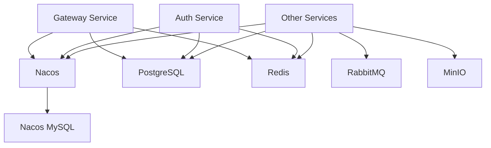

# GCRF Library Management System - Infrastructure Deployment

## Overview

This directory contains Docker Compose configurations for orchestrating all infrastructure services required by the GCRF Library Management System. The infrastructure stack includes:

- **PostgreSQL 15**: Primary relational database
- **Redis 7.2**: Cache and session storage
- **Nacos 2.3.0**: Service discovery and configuration management
- **RabbitMQ 3.12**: Message broker for async communication
- **MinIO**: S3-compatible object storage

## Quick Start

### Prerequisites

- Docker 24.0+ and Docker Compose 2.20+
- Minimum 8GB RAM available
- 50GB free disk space
- Unix-like operating system (Linux/macOS)

### Setup Steps

1. **Configure Environment Variables**

```bash
# Copy the example environment files
cp ../.env.prod.example ../.env
cp .env.infrastructure.example .env.infrastructure

# Edit the files and set all required values
# IMPORTANT: Generate strong passwords for all services!
```

2. **Start Infrastructure**

```bash
# Start all infrastructure services
./scripts/start-infrastructure.sh

# Check service status
docker-compose -f docker-compose.infrastructure.yml ps
```

3. **Access Management UIs**

After successful startup, you can access:

- **Nacos Console**: http://localhost:8848/nacos
  - Username: From `NACOS_USERNAME` in .env
  - Password: From `NACOS_PASSWORD` in .env

- **RabbitMQ Management**: http://localhost:15672
  - Username: From `RABBITMQ_USERNAME` in .env
  - Password: From `RABBITMQ_PASSWORD` in .env

- **MinIO Console**: http://localhost:9001
  - Username: From `MINIO_ROOT_USER` in .env
  - Password: From `MINIO_ROOT_PASSWORD` in .env

## Architecture

### Network Topology

```
┌──────────────────────────────────────────┐
│    gcrf-infrastructure-network           │
│                                          │
│  ┌────────────┐    ┌──────────────┐    │
│  │ PostgreSQL │    │    Redis     │    │
│  │   :5432    │    │    :6379     │    │
│  └────────────┘    └──────────────┘    │
│                                          │
│  ┌────────────┐    ┌──────────────┐    │
│  │   Nacos    │    │   RabbitMQ   │    │
│  │   :8848    │    │    :5672     │    │
│  └────────────┘    └──────────────┘    │
│                                          │
│  ┌────────────┐    ┌──────────────┐    │
│  │Nacos MySQL │    │    MinIO     │    │
│  │   :3306    │    │    :9000     │    │
│  └────────────┘    └──────────────┘    │
└──────────────────────────────────────────┘
```

### Service Dependencies



## Service Configuration

### PostgreSQL

- **Version**: 15-alpine
- **Databases Created**:
  - gcrf_auth
  - gcrf_book
  - gcrf_circulation
  - gcrf_reader
  - gcrf_system
  - gcrf_notification
- **Init Scripts**: Located in `postgresql/init-scripts/`
- **Data Volume**: `gcrf-postgres-primary-data`

### Redis

- **Version**: 7.2-alpine
- **Persistence**: AOF enabled with per-second fsync
- **Memory Policy**: allkeys-lru with 512MB limit
- **Data Volume**: `gcrf-redis-master-data`

### Nacos

- **Version**: 2.3.0
- **Mode**: Standalone (can be upgraded to cluster)
- **Backend**: MySQL 8.0
- **Ports**: 8848 (HTTP), 9848 (gRPC)
- **Authentication**: Enabled with token-based security

### RabbitMQ

- **Version**: 3.12-management-alpine
- **Ports**: 5672 (AMQP), 15672 (Management UI)
- **Virtual Host**: gcrf
- **Data Volume**: `gcrf-rabbitmq-data`

### MinIO

- **Version**: Latest
- **Ports**: 9000 (S3 API), 9001 (Console)
- **Data Volume**: `gcrf-minio-data`

## Operations

### Starting Services

```bash
# Start all infrastructure
./scripts/start-infrastructure.sh

# Start specific service
docker-compose -f docker-compose.infrastructure.yml up -d postgres-primary

# View logs
docker-compose -f docker-compose.infrastructure.yml logs -f [service-name]
```

### Stopping Services

```bash
# Graceful shutdown (preserves data)
./scripts/stop-infrastructure.sh

# Force stop
./scripts/stop-infrastructure.sh --force

# Stop and remove volumes (DELETES ALL DATA!)
./scripts/stop-infrastructure.sh --remove-volumes
```

### Health Checks

All services have built-in health checks. You can verify:

```bash
# Check individual service health
docker inspect gcrf-postgres-primary --format='{{.State.Health.Status}}'

# Check all services
docker ps --format "table {{.Names}}\t{{.Status}}"
```

### Backup and Recovery

```bash
# Backup PostgreSQL
docker exec gcrf-postgres-primary pg_dumpall -U postgres > backup.sql

# Backup Redis
docker exec gcrf-redis-master redis-cli BGSAVE

# Backup volumes
docker run --rm -v gcrf-postgres-primary-data:/data \
  -v $(pwd)/backups:/backup alpine tar czf /backup/postgres-data.tar.gz -C /data .
```

## Troubleshooting

### Service Won't Start

1. Check logs: `docker-compose logs [service-name]`
2. Verify environment variables are set
3. Ensure ports are not already in use
4. Check Docker resource limits

### Connection Issues

1. Verify network: `docker network ls`
2. Check service discovery in Nacos UI
3. Test connectivity: `docker exec [container] ping [target-container]`

### Performance Issues

1. Check resource usage: `docker stats`
2. Review PostgreSQL slow query logs
3. Monitor Redis memory usage
4. Check RabbitMQ queue depths

## Security Considerations

### Production Deployment

1. **Never use default passwords** - Generate strong, unique passwords
2. **Restrict port exposure** - Only expose necessary ports to localhost
3. **Enable SSL/TLS** - Configure SSL for all services in production
4. **Regular backups** - Implement automated backup strategy
5. **Monitor logs** - Set up centralized logging and monitoring
6. **Update regularly** - Keep all images updated with security patches

### Secret Management

For production, consider using:
- Docker Secrets (Swarm mode)
- HashiCorp Vault
- AWS Secrets Manager
- Azure Key Vault
- Kubernetes Secrets

## Scaling Considerations

### PostgreSQL Clustering

For high availability, consider:
- Streaming replication with hot standby
- Connection pooling with PgBouncer
- Load balancing read queries

### Redis Clustering

Options for scaling:
- Redis Sentinel for HA
- Redis Cluster for sharding
- Read replicas for read scaling

### Nacos Clustering

To enable cluster mode:
1. Switch MODE from `standalone` to `cluster`
2. Configure cluster.conf with node addresses
3. Use shared MySQL or embedded Derby

## Maintenance

### Regular Tasks

- **Daily**: Check service health and logs
- **Weekly**: Review resource usage and performance
- **Monthly**: Update container images, rotate logs
- **Quarterly**: Review and rotate credentials

### Monitoring

Consider adding:
- Prometheus for metrics collection
- Grafana for visualization
- ELK stack for log aggregation
- AlertManager for alerting

## Support

For issues or questions:
1. Check service logs first
2. Review this README and troubleshooting section
3. Consult service-specific documentation
4. Contact system administrators

## Version History

- **1.0.0** (2025-11-01): Initial infrastructure setup
  - PostgreSQL 15, Redis 7.2, Nacos 2.3.0, RabbitMQ 3.12, MinIO latest
  - Standalone configuration (no clustering)
  - Basic health checks and monitoring

## Future Enhancements

- [ ] Add PostgreSQL streaming replication
- [ ] Implement Redis Sentinel for HA
- [ ] Configure Nacos cluster mode
- [ ] Add Prometheus/Grafana monitoring stack
- [ ] Implement automated backup strategy
- [ ] Add SSL/TLS configuration
- [ ] Create Kubernetes deployment manifests