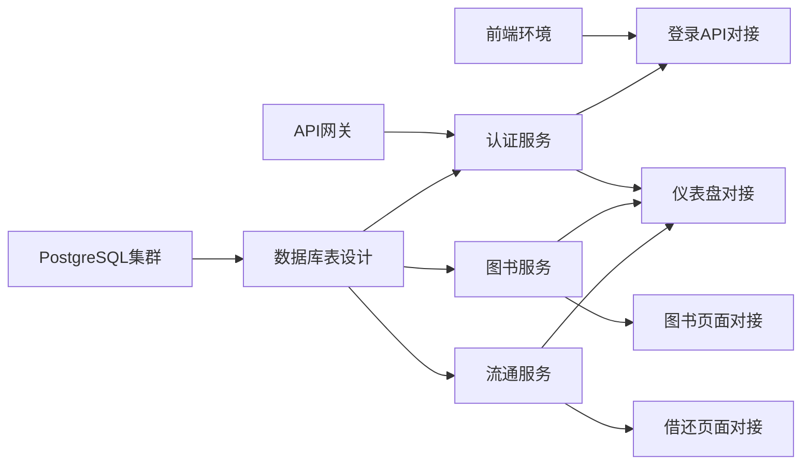

# Sprint 2 开发看板 - 国创睿峰智能图书馆管理系统

## Sprint 概况
- **Sprint 名称**: Sprint 2 - MVP核心功能实现
- **Sprint 时长**: 2周（2025-01-13 至 2025-01-26）
- **Sprint 目标**: 完成MVP核心功能的前后端连接，实现基础图书借还流程
- **团队规模**: 3-4人（1前端 + 2后端 + 1全栈）
- **总Story Points**: 55点

## Sprint 2 目标定义

### 主要目标
1. **完成基础设施部署**：修复PostgreSQL从库问题，完成连接池配置
2. **实现核心微服务**：完成认证服务、图书服务、流通服务的基础功能
3. **前后端集成**：替换Mock数据，实现真实API调用
4. **完成MVP功能闭环**：实现登录→图书查询→借阅→归还的完整流程

### 成功标准
- PostgreSQL主从集群完全运行正常
- 至少3个核心微服务可以正常调用
- 前端可以通过真实API完成基础操作
- 通过端到端测试的核心业务流程

## 用户故事列表（User Stories）

### Epic 1: 基础设施完善（13 SP）

#### US-1.1: PostgreSQL集群完善
**As a** 系统管理员
**I want** 完成PostgreSQL主从集群的配置和验证
**So that** 系统具有高可用的数据库支撑
**验收标准**:
- 主从复制正常工作
- PgBouncer连接池可用
- 性能测试达标（写入QPS>1000）
**Story Points**: 5
**分配**: 后端开发

#### US-1.2: 前端项目环境准备
**As a** 前端开发者
**I want** 完成前端项目的依赖安装和启动验证
**So that** 可以进行后续的开发和集成工作
**验收标准**:
- npm依赖全部安装成功
- 项目可以正常启动
- 新UI主题效果验证通过
**Story Points**: 3
**分配**: 前端开发

#### US-1.3: API网关搭建
**As a** 系统架构师
**I want** 搭建Spring Cloud Gateway作为统一API入口
**So that** 所有微服务可以通过统一网关访问
**验收标准**:
- Gateway服务启动成功
- 路由配置完成
- 与Nacos集成正常
**Story Points**: 5
**分配**: 后端开发

### Epic 2: 核心微服务实现（26 SP）

#### US-2.1: 认证服务（auth-service）
**As a** 系统用户
**I want** 能够通过用户名密码登录系统
**So that** 获得访问系统的权限
**验收标准**:
- JWT token生成和验证
- 用户登录/登出API
- 权限校验中间件
**Story Points**: 8
**分配**: 后端开发

#### US-2.2: 图书服务（book-service）
**As a** 图书管理员
**I want** 能够管理图书信息
**So that** 维护图书馆的图书数据
**验收标准**:
- 图书CRUD接口
- 图书查询和筛选
- 库存状态管理
**Story Points**: 8
**分配**: 后端开发

#### US-2.3: 流通服务（circulation-service）
**As a** 读者
**I want** 能够借阅和归还图书
**So that** 使用图书馆的核心服务
**验收标准**:
- 借书API实现
- 还书API实现
- 借阅记录查询
- 逾期计算逻辑
**Story Points**: 8
**分配**: 后端开发

#### US-2.4: 数据库表结构设计
**As a** 开发团队
**I want** 设计并创建核心业务的数据库表
**So that** 微服务有数据存储基础
**验收标准**:
- 用户表、角色表、权限表
- 图书表、分类表、位置表
- 借阅记录表、预约表
- 初始化脚本和测试数据
**Story Points**: 2
**分配**: 全栈开发

### Epic 3: 前后端集成（16 SP）

#### US-3.1: 登录页面API对接
**As a** 前端用户
**I want** 使用真实的登录API
**So that** 能够通过后端认证进入系统
**验收标准**:
- 替换Mock登录为真实API
- Token存储和管理
- 登录状态保持
**Story Points**: 3
**分配**: 全栈开发

#### US-3.2: 图书管理页面API对接
**As a** 图书管理员
**I want** 在前端页面操作真实的图书数据
**So that** 完成图书管理工作
**验收标准**:
- 图书列表API对接
- 图书新增/编辑API对接
- 图书删除API对接
**Story Points**: 5
**分配**: 前端开发

#### US-3.3: 借还书页面API对接
**As a** 图书管理员
**I want** 在前端完成借还书操作
**So that** 为读者提供借阅服务
**验收标准**:
- 借书扫码/输入功能
- 借书API调用
- 还书API调用
- 实时状态更新
**Story Points**: 5
**分配**: 前端开发

#### US-3.4: 仪表盘数据API对接
**As a** 系统管理员
**I want** 在仪表盘看到真实的统计数据
**So that** 了解系统运行状况
**验收标准**:
- 统计数据API实现
- 图表数据实时更新
- 数据缓存优化
**Story Points**: 3
**分配**: 全栈开发

## 任务分解（Task Breakdown）

### US-1.1: PostgreSQL集群完善（5 SP）
1. **修复从库启动脚本**（1h）
   - 修复bash命令分号语法问题
   - 测试从库启动
2. **更换PgBouncer镜像**（2h）
   - 寻找可用的ARM64镜像
   - 配置连接池参数
3. **执行性能基准测试**（2h）
   - 使用pgbench进行测试
   - 调优配置参数
4. **验证主从复制**（1h）
   - 测试数据同步
   - 测试故障切换

### US-2.1: 认证服务实现（8 SP）
1. **项目初始化**（2h）
   - Spring Boot项目创建
   - 依赖配置
2. **数据模型设计**（2h）
   - 用户实体类
   - 角色权限模型
3. **JWT工具类开发**（3h）
   - Token生成
   - Token验证
   - 刷新机制
4. **API接口实现**（4h）
   - 登录接口
   - 登出接口
   - Token刷新接口
5. **权限拦截器**（3h）
   - 请求拦截
   - 权限验证
6. **单元测试**（2h）
   - 接口测试
   - 集成测试

### US-2.2: 图书服务实现（8 SP）
1. **项目初始化**（1h）
2. **数据模型设计**（2h）
   - 图书实体
   - 分类实体
   - 库存模型
3. **Repository层开发**（2h）
   - MyBatis映射
   - 数据访问接口
4. **Service层开发**（3h）
   - 业务逻辑实现
   - 事务管理
5. **Controller层开发**（3h）
   - RESTful API
   - 参数验证
6. **API文档和测试**（3h）
   - Swagger配置
   - 接口测试

### US-3.1: 登录页面API对接（3 SP）
1. **API服务配置**（1h）
   - axios配置
   - 请求拦截器
2. **登录逻辑重构**（2h）
   - 替换Mock调用
   - Token处理
3. **错误处理**（1h）
   - 异常捕获
   - 用户提示
4. **测试验证**（1h）
   - 功能测试
   - 边界测试

## 任务分配建议

### 前端开发（小王）- 16 SP
- US-1.2: 前端项目环境准备（3 SP）
- US-3.2: 图书管理页面API对接（5 SP）
- US-3.3: 借还书页面API对接（5 SP）
- US-1.3: API网关搭建（协助）（3 SP）

### 后端开发A（小李）- 18 SP
- US-1.1: PostgreSQL集群完善（5 SP）
- US-2.1: 认证服务实现（8 SP）
- US-1.3: API网关搭建（5 SP）

### 后端开发B（小张）- 16 SP
- US-2.2: 图书服务实现（8 SP）
- US-2.3: 流通服务实现（8 SP）

### 全栈开发（小陈）- 8 SP
- US-2.4: 数据库表结构设计（2 SP）
- US-3.1: 登录页面API对接（3 SP）
- US-3.4: 仪表盘数据API对接（3 SP）

## Sprint看板结构

### TODO（待开始）
| Story ID | 任务名称 | 负责人 | SP | 优先级 |
|----------|---------|--------|-----|--------|
| US-1.1 | PostgreSQL集群完善 | 小李 | 5 | P0 |
| US-1.2 | 前端项目环境准备 | 小王 | 3 | P0 |
| US-2.4 | 数据库表结构设计 | 小陈 | 2 | P0 |
| US-1.3 | API网关搭建 | 小李 | 5 | P1 |
| US-2.1 | 认证服务实现 | 小李 | 8 | P1 |
| US-2.2 | 图书服务实现 | 小张 | 8 | P1 |
| US-2.3 | 流通服务实现 | 小张 | 8 | P1 |
| US-3.1 | 登录页面API对接 | 小陈 | 3 | P1 |
| US-3.2 | 图书管理页面API对接 | 小王 | 5 | P1 |
| US-3.3 | 借还书页面API对接 | 小王 | 5 | P1 |
| US-3.4 | 仪表盘数据API对接 | 小陈 | 3 | P2 |

### In Progress（进行中）
| Story ID | 任务名称 | 负责人 | SP | 进度 |
|----------|---------|--------|-----|------|
| - | - | - | - | - |

### Testing（测试中）
| Story ID | 任务名称 | 负责人 | SP | 测试类型 |
|----------|---------|--------|-----|----------|
| - | - | - | - | - |

### Done（已完成）
| Story ID | 任务名称 | 负责人 | SP | 完成日期 |
|----------|---------|--------|-----|----------|
| - | - | - | - | - |

## 燃尽图配置

### 初始设置
- **总Story Points**: 55点
- **Sprint天数**: 10个工作日
- **理想燃尽率**: 5.5 SP/天

### 每日目标
| 日期 | 工作日 | 理想剩余SP | 实际剩余SP | 完成任务 |
|------|--------|-----------|------------|----------|
| 01-13 | Day 1 | 49.5 | - | - |
| 01-14 | Day 2 | 44.0 | - | - |
| 01-15 | Day 3 | 38.5 | - | - |
| 01-16 | Day 4 | 33.0 | - | - |
| 01-17 | Day 5 | 27.5 | - | - |
| 01-20 | Day 6 | 22.0 | - | - |
| 01-21 | Day 7 | 16.5 | - | - |
| 01-22 | Day 8 | 11.0 | - | - |
| 01-23 | Day 9 | 5.5 | - | - |
| 01-24 | Day 10 | 0.0 | - | - |

## 依赖关系图

## 风险和缓解措施

### 技术风险
1. **PostgreSQL从库配置问题**
   - 风险等级：高
   - 缓解措施：准备降级方案，先使用单机PostgreSQL

2. **微服务间通信问题**
   - 风险等级：中
   - 缓解措施：先使用HTTP直连，后期再优化为服务发现

3. **前后端联调问题**
   - 风险等级：中
   - 缓解措施：提前定义好API接口文档，使用Swagger

### 资源风险
1. **人员技能不足**
   - 风险等级：低
   - 缓解措施：团队内部技术分享，结对编程

2. **时间估算偏差**
   - 风险等级：中
   - 缓解措施：预留20%的buffer时间，每日站会跟踪进度

## Definition of Done (DoD)

一个用户故事被认为完成需要满足：
1. ✅ 代码已提交到Git仓库
2. ✅ 通过代码评审
3. ✅ 单元测试覆盖率>80%
4. ✅ 接口文档已更新
5. ✅ 通过集成测试
6. ✅ 部署到开发环境
7. ✅ 产品负责人验收通过

## Sprint回顾模板

### Sprint结束时需要回顾
1. **完成了什么**
   - 完成的Story Points
   - 交付的功能

2. **什么做得好**
   - 成功经验
   - 最佳实践

3. **什么需要改进**
   - 遇到的问题
   - 改进建议

4. **下个Sprint计划**
   - 优先级调整
   - 资源调整

## 每日站会模板

### 每日需要同步（15分钟）
1. **昨天完成了什么**
2. **今天计划做什么**
3. **遇到什么阻碍**
4. **需要什么帮助**

## 关键里程碑

### Week 1 里程碑（01-17）
- ✓ 基础设施全部就绪
- ✓ 核心微服务框架搭建完成
- ✓ 数据库表结构设计完成

### Week 2 里程碑（01-24）
- ✓ 核心微服务API开发完成
- ✓ 前后端集成完成
- ✓ MVP功能闭环测试通过

## 成功指标

### 技术指标
- API响应时间 < 500ms (P95)
- 系统可用性 > 99%
- 测试覆盖率 > 80%

### 业务指标
- 完成登录功能
- 完成图书查询功能
- 完成借阅流程
- 完成归还流程

---

*Sprint 2 看板创建时间：2025-01-12*
*下次更新时间：Sprint启动时（2025-01-13）*