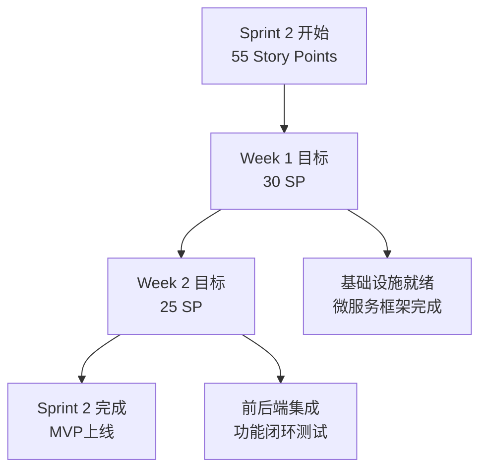
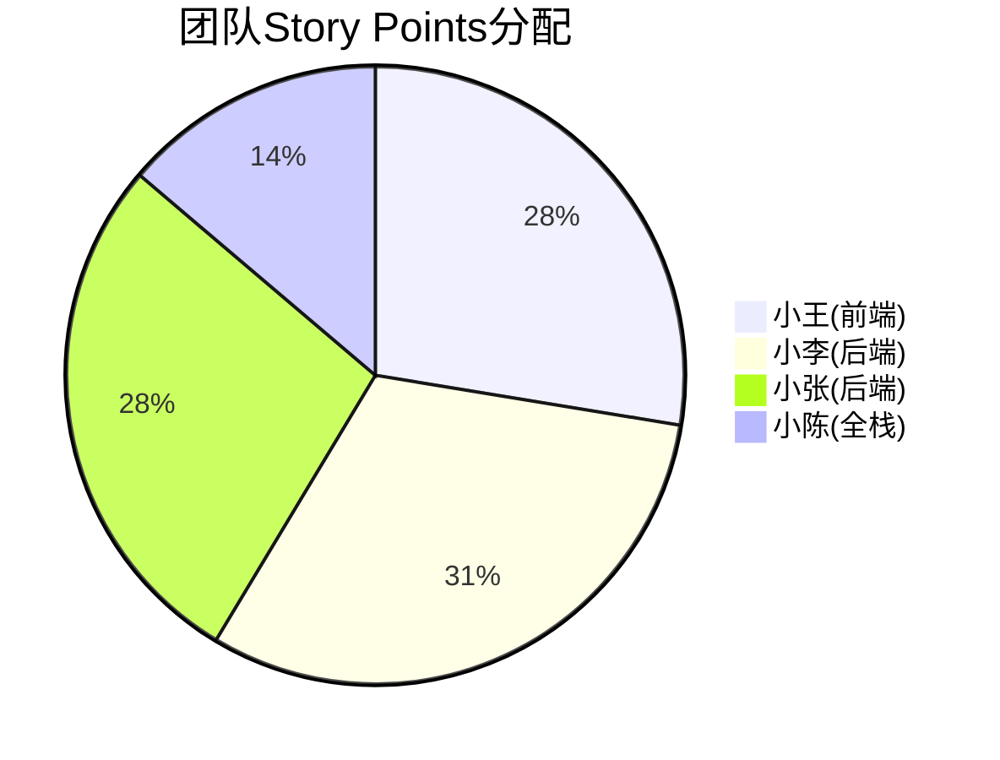
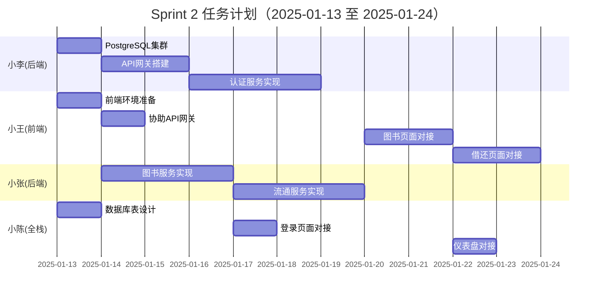
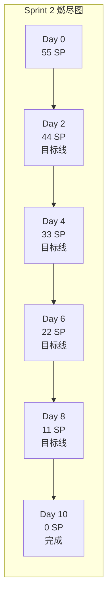
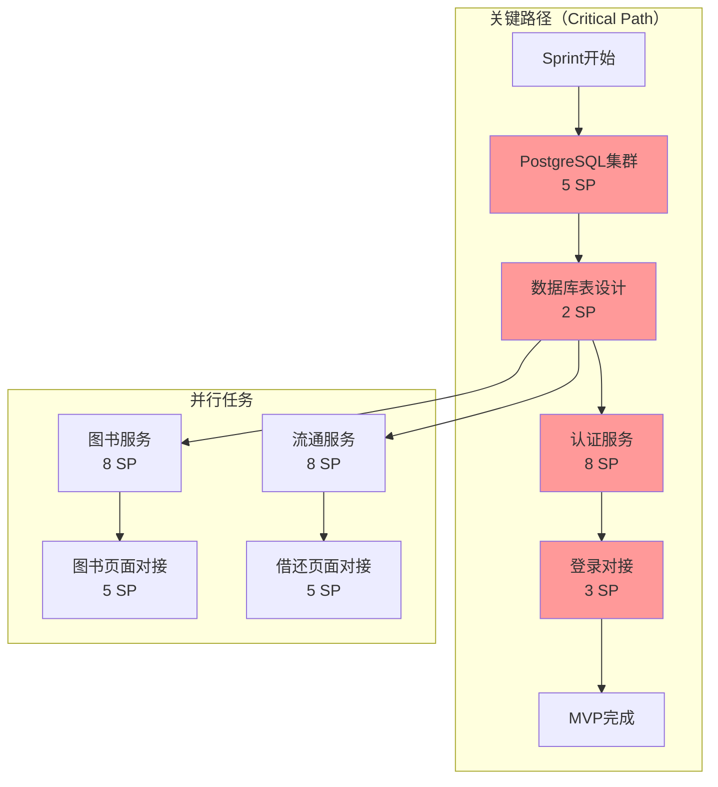

# Sprint 2 可视化看板

## 📊 Sprint 2 Dashboard

### 🎯 Sprint 目标
> **实现MVP核心功能闭环：登录 → 图书查询 → 借阅 → 归还**

### 📈 进度概览
```
总体进度: ▓▓▓▓▓▓▓▓▓▓░░░░░░░░░░ 0/55 SP (0%)
时间进度: ░░░░░░░░░░░░░░░░░░░░ 0/10 天 (0%)
```

## 🏃‍♂️ Sprint Velocity



## 📋 任务看板（Kanban Board）

### 🔴 紧急任务（P0 - 必须Day 1-2完成）
| 编号 | 任务 | 负责人 | SP | 状态 | 阻塞 |
|------|------|--------|-----|------|------|
| US-1.1 | 🗄️ PostgreSQL集群完善 | 小李 | 5 | 🔵 TODO | - |
| US-1.2 | 💻 前端项目环境准备 | 小王 | 3 | 🔵 TODO | - |
| US-2.4 | 📊 数据库表结构设计 | 小陈 | 2 | 🔵 TODO | - |

### 🟡 重要任务（P1 - Week 1完成）
| 编号 | 任务 | 负责人 | SP | 状态 | 依赖 |
|------|------|--------|-----|------|------|
| US-1.3 | 🌐 API网关搭建 | 小李 | 5 | 🔵 TODO | US-1.1 |
| US-2.1 | 🔐 认证服务实现 | 小李 | 8 | 🔵 TODO | US-2.4 |
| US-2.2 | 📚 图书服务实现 | 小张 | 8 | 🔵 TODO | US-2.4 |
| US-2.3 | 🔄 流通服务实现 | 小张 | 8 | 🔵 TODO | US-2.4 |

### 🟢 常规任务（P1/P2 - Week 2完成）
| 编号 | 任务 | 负责人 | SP | 状态 | 依赖 |
|------|------|--------|-----|------|------|
| US-3.1 | 🔑 登录页面API对接 | 小陈 | 3 | 🔵 TODO | US-2.1 |
| US-3.2 | 📖 图书管理页面API对接 | 小王 | 5 | 🔵 TODO | US-2.2 |
| US-3.3 | 📤 借还书页面API对接 | 小王 | 5 | 🔵 TODO | US-2.3 |
| US-3.4 | 📊 仪表盘数据API对接 | 小陈 | 3 | 🔵 TODO | US-2.1,2.2,2.3 |

### 图例说明
- 🔵 TODO - 待开始
- 🟡 IN PROGRESS - 进行中
- 🟣 TESTING - 测试中
- 🟢 DONE - 已完成
- 🔴 BLOCKED - 被阻塞

## 👥 团队工作负载



### 个人任务甘特图



## 📊 燃尽图（Burndown Chart）



### 每日燃尽数据追踪
| 日期 | 剩余SP(理想) | 剩余SP(实际) | 差异 | 完成SP | 备注 |
|------|-------------|-------------|------|--------|------|
| Day 0 | 55 | 55 | 0 | 0 | Sprint开始 |
| Day 1 | 49.5 | - | - | - | - |
| Day 2 | 44 | - | - | - | - |
| Day 3 | 38.5 | - | - | - | - |
| Day 4 | 33 | - | - | - | 第一周检查点 |
| Day 5 | 27.5 | - | - | - | - |
| Day 6 | 22 | - | - | - | - |
| Day 7 | 16.5 | - | - | - | - |
| Day 8 | 11 | - | - | - | 第二周检查点 |
| Day 9 | 5.5 | - | - | - | - |
| Day 10 | 0 | - | - | - | Sprint结束 |

## 🔄 依赖关系和关键路径



## 🚦 健康度指标

### Sprint健康度评分
| 指标 | 目标 | 当前 | 状态 | 评分 |
|------|------|------|------|------|
| 进度偏差 | <10% | 0% | 🟢 正常 | 100/100 |
| 阻塞任务 | <2个 | 0个 | 🟢 正常 | 100/100 |
| 技术债务 | <5% | 0% | 🟢 正常 | 100/100 |
| 团队士气 | >80% | - | 🔵 待评估 | -/100 |
| 代码质量 | >80% | - | 🔵 待开始 | -/100 |

### 风险雷达图
```
        技术风险
            ▲
           /│\
          / │ \
         /  │  \
        /   │   \
       /    │    \
资源风险 ────┼──── 进度风险
       \    │    /
        \   │   /
         \  │  /
          \ │ /
           \│/
            ▼
        质量风险

当前风险等级：
● 技术风险：🟡 中
● 进度风险：🟢 低
● 资源风险：🟢 低
● 质量风险：🟡 中
```

## 📝 每日站会记录模板

### Day X - 日期：2025-01-XX
**参会人员**：小王、小李、小张、小陈

#### 🎯 昨日完成
- [ ] 任务1...
- [ ] 任务2...

#### 📋 今日计划
- [ ] 任务1...
- [ ] 任务2...

#### 🚧 阻塞问题
- 问题1：描述...
  - 负责人：
  - 解决方案：

#### 💡 改进建议
- 建议1...

---

## 🏆 Sprint 2 成功标准检查清单

### Week 1 检查点（01-17）
- [ ] PostgreSQL主从集群运行正常
- [ ] 数据库表结构创建完成
- [ ] API网关服务启动成功
- [ ] 认证服务框架搭建完成
- [ ] 图书服务框架搭建完成
- [ ] 流通服务框架搭建完成

### Week 2 检查点（01-24）
- [ ] 登录功能前后端联通
- [ ] 图书查询功能可用
- [ ] 借书流程完整实现
- [ ] 还书流程完整实现
- [ ] 仪表盘数据实时展示
- [ ] 端到端测试通过

### Sprint完成标准
- [ ] 所有P0任务完成
- [ ] 80%以上P1任务完成
- [ ] 代码评审通过
- [ ] 集成测试通过
- [ ] 产品验收通过
- [ ] 部署到开发环境

## 📈 度量和报告

### 关键绩效指标（KPI）
| 指标 | 目标值 | 实际值 | 达成率 |
|------|--------|--------|--------|
| Story Points完成 | 55 | - | - |
| 缺陷密度 | <5/KLOC | - | - |
| 代码覆盖率 | >80% | - | - |
| API响应时间 | <500ms | - | - |
| 团队生产力 | 14 SP/人周 | - | - |

### Sprint速度趋势
```
Sprint 1: ████████████ 45 SP (参考值)
Sprint 2: ░░░░░░░░░░░░ 55 SP (计划)
Sprint 3: ░░░░░░░░░░░░ TBD
```

---

*最后更新时间：2025-01-12*
*下次更新：每日站会后*