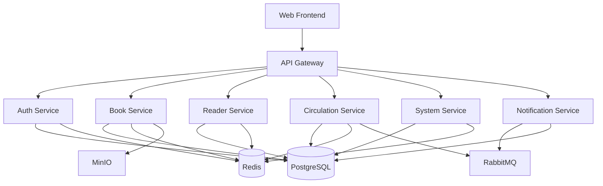

# GCRF Library Management System - Docker Compose Deployment Guide

**Version**: 1.0.0
**Last Updated**: 2025-11-01
**Architecture**: Microservices with Docker Compose Orchestration
**Target Audience**: DevOps Engineers, System Administrators, Developers

---

## Table of Contents

1. [Quick Start Guide](#quick-start-guide)
2. [Architecture Overview](#architecture-overview)
3. [Installation & Setup](#installation--setup)
4. [Common Operations](#common-operations)
5. [Configuration Management](#configuration-management)
6. [Service Management](#service-management)
7. [Troubleshooting Guide](#troubleshooting-guide)
8. [Backup and Recovery](#backup-and-recovery)
9. [Performance Tuning](#performance-tuning)
10. [Security Checklist](#security-checklist)
11. [Monitoring & Observability](#monitoring--observability)
12. [Development Workflow](#development-workflow)
13. [Production Deployment](#production-deployment)
14. [Migration Guide](#migration-guide)
15. [Disaster Recovery](#disaster-recovery)
16. [Reference Documentation](#reference-documentation)
17. [Appendices](#appendices)

---

## Quick Start Guide

### Prerequisites

Before deploying GCRF Library Management System, ensure your environment meets these requirements:

#### System Requirements

```yaml
Minimum Requirements:
  CPU: 4 cores @ 2.0GHz
  RAM: 8GB
  Storage: 50GB SSD
  OS: Linux (Ubuntu 20.04+ / CentOS 8+) or macOS 12+

Recommended Requirements:
  CPU: 8 cores @ 2.5GHz+
  RAM: 16GB
  Storage: 100GB SSD
  OS: Linux (Ubuntu 22.04 LTS)
  Network: 100Mbps+ bandwidth
```

#### Software Requirements

```bash
# Docker Engine
Docker: 24.0.0 or higher
$ docker --version
Docker version 24.0.7, build afdd53b

# Docker Compose
Docker Compose: 2.20.0 or higher
$ docker-compose --version
Docker Compose version v2.23.3

# Additional Tools (optional but recommended)
- git: 2.30+
- curl: 7.68+
- jq: 1.6+ (for JSON processing)
- htop: 3.0+ (for resource monitoring)
```

#### Network Requirements

Ensure the following ports are available:

| Service | Port | Purpose | External Access |
|---------|------|---------|-----------------|
| Nginx (Frontend) | 80 | Web UI | Yes |
| API Gateway | 8080 | REST API | Yes |
| Nacos | 8848 | Service Registry UI | Admin only |
| RabbitMQ | 15672 | Management UI | Admin only |
| MinIO | 9001 | Object Storage Console | Admin only |
| PostgreSQL | 5432 | Database (primary) | No |
| PostgreSQL | 5433 | Database (replica) | No |
| Redis | 6379 | Cache (master) | No |
| Redis | 6380 | Cache (slave) | No |

### 30-Second Deployment

For experienced users who want to get started immediately:

```bash
# Clone repository
git clone https://github.com/gcrf/library-management-system.git
cd library-management-system

# Quick setup with defaults (development mode)
./deployment/scripts/quick-start.sh

# Access the application
open http://localhost:3011  # Frontend
open http://localhost:8080  # API Gateway
```

### Step-by-Step First-Time Setup

#### Step 1: Clone and Prepare

```bash
# Clone the repository
git clone https://github.com/gcrf/library-management-system.git
cd library-management-system

# Create required directories
mkdir -p deployment/data/{postgres-primary,postgres-replica,redis,rabbitmq,minio,nacos}
mkdir -p deployment/logs/{services,infrastructure}
mkdir -p deployment/backup

# Set proper permissions
chmod -R 755 deployment/scripts/
chmod 600 deployment/.env.* 2>/dev/null || true
```

#### Step 2: Configure Environment

```bash
# Copy environment templates
cp deployment/.env.infrastructure.example deployment/.env.infrastructure
cp deployment/.env.services.example deployment/.env.services
cp .env.prod.example .env

# Generate secure passwords
./deployment/scripts/generate-passwords.sh > .passwords.generated

# Edit configuration files
nano deployment/.env.infrastructure
# Update: DB_PASSWORD, REDIS_PASSWORD, RABBITMQ_PASSWORD, MINIO_ROOT_PASSWORD

nano deployment/.env.services
# Update: Service-specific settings

nano .env
# Update: Production settings
```

#### Step 3: Validate Configuration

```bash
# Run configuration validator
./deployment/scripts/validate-config.sh prod

# Expected output:
✓ Docker version check passed
✓ Docker Compose version check passed
✓ Port availability check passed
✓ Disk space check passed (50GB+ available)
✓ Environment variables validated
✓ Network configuration validated
```

#### Step 4: Start Infrastructure Services

```bash
# Navigate to deployment directory
cd deployment

# Start infrastructure tier
docker-compose -f docker-compose.infrastructure.yml up -d

# Monitor startup (wait ~2-3 minutes)
./scripts/wait-for-healthy.sh \
  gcrf-postgres-primary \
  gcrf-nacos \
  gcrf-redis-master \
  gcrf-rabbitmq \
  gcrf-minio

# Verify infrastructure health
docker-compose -f docker-compose.infrastructure.yml ps
```

#### Step 5: Initialize Databases

```bash
# Initialize database schemas
./scripts/init-database.sh

# Load initial data (optional)
./scripts/load-initial-data.sh

# Verify database initialization
docker exec gcrf-postgres-primary psql -U postgres -c "\l"
```

#### Step 6: Start Application Services

```bash
# Start all microservices
docker-compose -f docker-compose.services.yml up -d

# Monitor startup (wait ~3-5 minutes)
./scripts/wait-for-services.sh

# Verify all services are healthy
docker-compose -f docker-compose.services.yml ps
```

#### Step 7: Start Frontend

```bash
# Start web frontend
docker-compose -f docker-compose.frontend.yml up -d

# Verify frontend is accessible
curl -I http://localhost:3011
```

#### Step 8: Verification

```bash
# Run comprehensive health check
./scripts/health-check-all.sh

# Expected output:
✓ PostgreSQL Primary: Healthy
✓ PostgreSQL Replica: Healthy
✓ Redis Master: Healthy
✓ Redis Slave: Healthy
✓ RabbitMQ: Healthy
✓ MinIO: Healthy
✓ Nacos: Healthy
✓ Gateway Service: Healthy
✓ Auth Service: Healthy
✓ Book Service: Healthy
✓ Reader Service: Healthy
✓ Circulation Service: Healthy
✓ System Service: Healthy
✓ Notification Service: Healthy
✓ Web Frontend: Healthy
```

### Access Points

After successful deployment, access the system through:

| Component | URL | Default Credentials | Purpose |
|-----------|-----|-------------------|---------|
| **Web Application** | http://localhost:3011 | admin/Admin@123 | Main user interface |
| **API Gateway** | http://localhost:8080/swagger-ui.html | - | API documentation |
| **Nacos Dashboard** | http://localhost:8848/nacos | nacos/nacos | Service registry |
| **RabbitMQ Management** | http://localhost:15672 | admin/configured_password | Message queue monitoring |
| **MinIO Console** | http://localhost:9001 | minioadmin/configured_password | Object storage management |

---

## Architecture Overview

### System Architecture Diagram

```
┌─────────────────────────────────────────────────────────────────────────┐
│                            External Users                                │
└─────────────────────────┬───────────────────────────────────────────────┘
                          │
                          ▼
                    ┌──────────┐
                    │  Nginx   │ Port 80/443
                    │ Frontend │ (Vue.js SPA)
                    └────┬─────┘
                         │
                         ▼
              ┌─────────────────────┐
              │   API Gateway       │ Port 8080
              │   (Spring Cloud)    │ Rate Limiting, Auth, Routing
              └──────────┬──────────┘
                         │
         ┌───────────────┼───────────────┬──────────────┬────────────────┐
         │               │               │              │                │
         ▼               ▼               ▼              ▼                ▼
   ┌──────────┐    ┌──────────┐   ┌──────────┐  ┌──────────┐    ┌──────────┐
   │   Auth   │    │   Book   │   │  Reader  │  │Circulation│   │  System  │
   │ Service  │    │ Service  │   │ Service  │  │  Service │   │ Service  │
   │  :8081   │    │  :8082   │   │  :8083   │  │   :8084  │   │  :8085   │
   └──────────┘    └──────────┘   └──────────┘  └──────────┘   └──────────┘
         │               │               │              │                │
         └───────────────┴───────────────┴──────────────┴────────────────┘
                                         │
                    ┌────────────────────┼────────────────────┐
                    │                    │                    │
                    ▼                    ▼                    ▼
            ┌──────────────┐    ┌──────────────┐    ┌──────────────┐
            │  PostgreSQL  │    │    Redis     │    │   RabbitMQ   │
            │   Primary    │    │   Cluster    │    │             │
            │    :5432     │    │  6379/6380   │    │    :5672     │
            └──────┬───────┘    └──────────────┘    └──────────────┘
                   │
            ┌──────▼───────┐
            │  PostgreSQL  │
            │   Replica    │
            │    :5433     │
            └──────────────┘
```

### Network Architecture

The system uses a 3-tier network architecture with isolated networks:

```yaml
Networks:
  gcrf-frontend-network:     # Frontend tier (DMZ)
    - Nginx
    - API Gateway

  gcrf-backend-network:       # Application tier
    - All microservices
    - Service mesh communication

  gcrf-infrastructure-network: # Data tier
    - PostgreSQL cluster
    - Redis cluster
    - RabbitMQ
    - MinIO
    - Nacos
```

### Volume Mappings

```yaml
Persistent Volumes:
  Database:
    - ./data/postgres-primary:/var/lib/postgresql/data
    - ./data/postgres-replica:/var/lib/postgresql/data

  Cache:
    - ./data/redis:/data

  Message Queue:
    - ./data/rabbitmq:/var/lib/rabbitmq

  Object Storage:
    - ./data/minio:/data

  Service Registry:
    - ./data/nacos:/home/nacos/data

  Logs:
    - ./logs:/var/log/gcrf

  Configuration:
    - ./config:/etc/gcrf
```

### Port Allocation Table

| Service | Container Port | Host Port | Protocol | Network | Purpose |
|---------|---------------|-----------|----------|---------|---------|
| Nginx | 80 | 80 | HTTP | frontend | Web traffic |
| Nginx | 443 | 443 | HTTPS | frontend | Secure web traffic |
| API Gateway | 8080 | 8080 | HTTP | backend | API endpoint |
| Auth Service | 8081 | - | HTTP | backend | Internal only |
| Book Service | 8082 | - | HTTP | backend | Internal only |
| Reader Service | 8083 | - | HTTP | backend | Internal only |
| Circulation Service | 8084 | - | HTTP | backend | Internal only |
| System Service | 8085 | - | HTTP | backend | Internal only |
| Notification Service | 8086 | - | HTTP | backend | Internal only |
| PostgreSQL Primary | 5432 | 5432 | TCP | infrastructure | Database |
| PostgreSQL Replica | 5432 | 5433 | TCP | infrastructure | Read replica |
| Redis Master | 6379 | 6379 | TCP | infrastructure | Cache writes |
| Redis Slave | 6379 | 6380 | TCP | infrastructure | Cache reads |
| RabbitMQ | 5672 | 5672 | AMQP | infrastructure | Messaging |
| RabbitMQ Management | 15672 | 15672 | HTTP | infrastructure | Admin UI |
| MinIO API | 9000 | 9000 | HTTP | infrastructure | S3 API |
| MinIO Console | 9001 | 9001 | HTTP | infrastructure | Admin UI |
| Nacos | 8848 | 8848 | HTTP | infrastructure | Service registry |

### Data Flow Diagram

```
User Request Flow:
┌──────┐
│ User │
└──┬───┘
   │ HTTPS Request
   ▼
┌────────┐
│ Nginx  │ ← Static Assets (Vue.js)
└──┬─────┘
   │ /api/*
   ▼
┌─────────────┐
│ API Gateway │ ← JWT Validation
└──┬──────────┘
   │ Route to Service
   ▼
┌─────────────┐
│Microservice │ ← Business Logic
└──┬──────────┘
   │ Data Operations
   ├──► PostgreSQL (Transactional Data)
   ├──► Redis (Cache/Session)
   ├──► RabbitMQ (Async Messages)
   └──► MinIO (File Storage)
```

---

## Common Operations

### Starting and Stopping the Stack

#### Start Everything

```bash
# Start in correct order
cd deployment

# 1. Infrastructure first
docker-compose -f docker-compose.infrastructure.yml up -d

# 2. Wait for infrastructure
./scripts/wait-for-healthy.sh gcrf-postgres-primary gcrf-nacos

# 3. Services next
docker-compose -f docker-compose.services.yml up -d

# 4. Frontend last
docker-compose -f docker-compose.frontend.yml up -d
```

#### Stop Everything

```bash
# Stop in reverse order
cd deployment

# 1. Frontend first
docker-compose -f docker-compose.frontend.yml down

# 2. Services next
docker-compose -f docker-compose.services.yml down

# 3. Infrastructure last (preserves data)
docker-compose -f docker-compose.infrastructure.yml down

# To also remove volumes (CAUTION: Data loss!)
docker-compose -f docker-compose.infrastructure.yml down -v
```

#### Restart Individual Service

```bash
# Restart a specific service
docker-compose -f docker-compose.services.yml restart gcrf-book-service

# Restart with updated image
docker-compose -f docker-compose.services.yml pull gcrf-book-service
docker-compose -f docker-compose.services.yml up -d gcrf-book-service
```

### Viewing Logs

#### Real-time Logs

```bash
# All services
docker-compose -f docker-compose.services.yml logs -f

# Specific service
docker-compose -f docker-compose.services.yml logs -f gcrf-auth-service

# Last 100 lines
docker-compose -f docker-compose.services.yml logs --tail=100 gcrf-auth-service

# Since timestamp
docker-compose -f docker-compose.services.yml logs --since="2024-01-01T00:00:00"
```

#### Log Aggregation

```bash
# Aggregate logs from all services
./scripts/aggregate-logs.sh

# Filter by log level
./scripts/aggregate-logs.sh | grep ERROR

# Save to file
./scripts/aggregate-logs.sh > logs/aggregate_$(date +%Y%m%d).log
```

### Executing Commands in Containers

#### Database Operations

```bash
# PostgreSQL interactive shell
docker exec -it gcrf-postgres-primary psql -U postgres

# Execute SQL file
docker exec -i gcrf-postgres-primary psql -U postgres < backup.sql

# Database backup
docker exec gcrf-postgres-primary pg_dump -U postgres gcrf_library > backup.sql
```

#### Redis Operations

```bash
# Redis CLI
docker exec -it gcrf-redis-master redis-cli

# Redis commands
docker exec gcrf-redis-master redis-cli INFO
docker exec gcrf-redis-master redis-cli KEYS "*"
docker exec gcrf-redis-master redis-cli FLUSHALL
```

#### Application Shell

```bash
# Java application shell
docker exec -it gcrf-auth-service /bin/bash

# Check application logs
docker exec gcrf-auth-service tail -f /var/log/gcrf/auth-service.log

# Thread dump
docker exec gcrf-auth-service jstack 1 > thread-dump.txt
```

### Accessing Management UIs

#### Service Discovery (Nacos)

```bash
# Access Nacos dashboard
open http://localhost:8848/nacos

# Default credentials
Username: nacos
Password: nacos

# View registered services
Services → Service List

# View configuration
Configuration Management → Configurations
```

#### Message Queue (RabbitMQ)

```bash
# Access RabbitMQ management
open http://localhost:15672

# View queues
Queues → All Queues

# Monitor messages
Queues → [Queue Name] → Get Messages
```

#### Object Storage (MinIO)

```bash
# Access MinIO console
open http://localhost:9001

# Create bucket
Buckets → Create Bucket

# Upload files
Buckets → [Bucket Name] → Upload
```

### Scaling Services

#### Manual Scaling

```bash
# Scale a service to 3 instances
docker-compose -f docker-compose.services.yml up -d --scale gcrf-book-service=3

# Verify scaling
docker-compose -f docker-compose.services.yml ps | grep book-service
```

#### Configuration-based Scaling

```yaml
# docker-compose.services.yml
services:
  gcrf-book-service:
    deploy:
      replicas: 3
      resources:
        limits:
          cpus: '0.5'
          memory: 512M
```

### Updating Service Images

#### Pull Latest Images

```bash
# Pull all latest images
docker-compose -f docker-compose.services.yml pull

# Pull specific service
docker-compose -f docker-compose.services.yml pull gcrf-auth-service
```

#### Rolling Update

```bash
# Perform rolling update
./scripts/rolling-update.sh gcrf-auth-service

# The script performs:
# 1. Pull new image
# 2. Stop old container
# 3. Start new container
# 4. Health check
# 5. Remove old image
```

#### Blue-Green Deployment

```bash
# Deploy to blue environment
docker-compose -f docker-compose.blue.yml up -d

# Test blue environment
./scripts/test-environment.sh blue

# Switch traffic to blue
./scripts/switch-traffic.sh blue

# Remove green environment
docker-compose -f docker-compose.green.yml down
```

---

## Configuration Management

### Environment Variables Setup

#### Infrastructure Variables

```bash
# deployment/.env.infrastructure
# PostgreSQL Configuration
POSTGRES_DB=gcrf_library
POSTGRES_USER=postgres
POSTGRES_PASSWORD=SecurePass123!
POSTGRES_MAX_CONNECTIONS=200
POSTGRES_SHARED_BUFFERS=256MB

# Redis Configuration
REDIS_PASSWORD=RedisPass123!
REDIS_MAXMEMORY=512mb
REDIS_MAXMEMORY_POLICY=allkeys-lru

# RabbitMQ Configuration
RABBITMQ_DEFAULT_USER=admin
RABBITMQ_DEFAULT_PASS=RabbitPass123!
RABBITMQ_DEFAULT_VHOST=/

# MinIO Configuration
MINIO_ROOT_USER=minioadmin
MINIO_ROOT_PASSWORD=MinioPass123!
MINIO_DEFAULT_BUCKETS=gcrf-library

# Nacos Configuration
NACOS_AUTH_ENABLE=true
NACOS_AUTH_TOKEN_SECRET_KEY=NacosSecretKey123!
```

#### Service Variables

```bash
# deployment/.env.services
# Spring Configuration
SPRING_PROFILES_ACTIVE=prod
SPRING_CLOUD_NACOS_SERVER=gcrf-nacos:8848

# Database Connection
DB_HOST=gcrf-postgres-primary
DB_PORT=5432
DB_NAME=gcrf_library

# Redis Connection
REDIS_HOST=gcrf-redis-master
REDIS_PORT=6379

# RabbitMQ Connection
RABBITMQ_HOST=gcrf-rabbitmq
RABBITMQ_PORT=5672

# JWT Configuration
JWT_SECRET=JwtSecretKey123!
JWT_EXPIRATION=86400000
```

### Loading .env Files

#### Automatic Loading

```bash
# Docker Compose automatically loads in order:
1. .env (in current directory)
2. .env.local (if exists, for local overrides)
3. Specified via --env-file flag

# Example
docker-compose --env-file .env.prod up -d
```

#### Manual Loading

```bash
# Export variables to shell
export $(cat .env | grep -v '^#' | xargs)

# Source file
source .env

# Verify variables
env | grep POSTGRES
```

### Service-specific Configuration

#### Gateway Service

```yaml
# config/gateway/application.yml
spring:
  cloud:
    gateway:
      routes:
        - id: auth-service
          uri: lb://auth-service
          predicates:
            - Path=/api/v1/auth/**
          filters:
            - StripPrefix=2

      default-filters:
        - DedupeResponseHeader=Access-Control-Allow-Origin
        - AddRequestHeader=X-Request-Id, %{REQUEST_ID}
```

#### Auth Service

```yaml
# config/auth/application.yml
jwt:
  secret: ${JWT_SECRET}
  expiration: ${JWT_EXPIRATION:86400000}
  refresh-expiration: ${JWT_REFRESH_EXPIRATION:604800000}

security:
  password-encoder: bcrypt
  password-strength: 10
```

### Nacos Configuration Push

#### Push Configuration to Nacos

```bash
# Push all configurations
./scripts/push-nacos-config.sh

# Push specific service
./scripts/push-nacos-config.sh auth-service

# Verify in Nacos
curl -X GET "http://localhost:8848/nacos/v1/cs/configs?dataId=auth-service.yml&group=DEFAULT_GROUP"
```

#### Dynamic Configuration Update

```bash
# Update configuration in Nacos UI
1. Navigate to Configuration Management
2. Edit configuration
3. Publish

# Services automatically refresh (if enabled)
@RefreshScope
@ConfigurationProperties
```

### Development vs Production Configs

#### Development Configuration

```yaml
# docker-compose.override.yml (auto-loaded in dev)
version: '3.8'

services:
  gcrf-auth-service:
    environment:
      - SPRING_PROFILES_ACTIVE=dev
      - DEBUG=true
      - LOG_LEVEL=DEBUG
    volumes:
      - ./backend/auth-service/target:/app
    ports:
      - "8081:8081"  # Expose for debugging
```

#### Production Configuration

```yaml
# docker-compose.prod.yml
version: '3.8'

services:
  gcrf-auth-service:
    environment:
      - SPRING_PROFILES_ACTIVE=prod
      - LOG_LEVEL=INFO
    deploy:
      resources:
        limits:
          cpus: '1.0'
          memory: 1024M
        reservations:
          cpus: '0.5'
          memory: 512M
```

#### Environment Switching

```bash
# Development
docker-compose up -d

# Production
docker-compose -f docker-compose.yml -f docker-compose.prod.yml up -d

# Staging
docker-compose -f docker-compose.yml -f docker-compose.staging.yml up -d
```

---

## Service Management

### Service Dependencies



### Health Check Configuration

```yaml
# Health check for auth-service
healthcheck:
  test: ["CMD", "curl", "-f", "http://localhost:8081/actuator/health"]
  interval: 30s
  timeout: 10s
  retries: 3
  start_period: 60s
```

### Service Start Order

```yaml
# Defined in docker-compose.services.yml
services:
  gcrf-gateway:
    depends_on:
      gcrf-nacos:
        condition: service_healthy

  gcrf-auth-service:
    depends_on:
      gcrf-postgres-primary:
        condition: service_healthy
      gcrf-redis-master:
        condition: service_healthy
      gcrf-nacos:
        condition: service_healthy
```

---

## Troubleshooting Guide

### Service Won't Start

#### Symptoms
- Container exits immediately
- Health checks failing
- Service stuck in "starting" state

#### Diagnosis

```bash
# Check service logs
docker-compose -f docker-compose.services.yml logs gcrf-auth-service

# Check container status
docker ps -a | grep auth-service

# Inspect container
docker inspect gcrf-auth-service

# Check health status
docker inspect gcrf-auth-service --format='{{.State.Health.Status}}'

# View health check logs
docker inspect gcrf-auth-service --format='{{range .State.Health.Log}}{{.Output}}{{end}}'
```

#### Common Causes and Solutions

**1. Database Connection Failed**
```bash
# Verify database is running
docker exec gcrf-postgres-primary pg_isready

# Test connection from service
docker exec gcrf-auth-service nc -zv gcrf-postgres-primary 5432

# Check credentials
docker exec gcrf-auth-service env | grep DB_

# Solution: Ensure database is healthy and credentials match
```

**2. Port Already in Use**
```bash
# Find process using port
lsof -i :8080
netstat -tuln | grep 8080

# Kill process
kill -9 $(lsof -t -i:8080)

# Or change port in .env
GATEWAY_PORT=8081
```

**3. Insufficient Resources**
```bash
# Check container resources
docker stats gcrf-auth-service

# Check system resources
free -h
df -h

# Solution: Increase memory limits or free up resources
```

### Database Connection Issues

#### PostgreSQL Connection Refused

```bash
# Diagnosis
docker exec gcrf-auth-service pg_isready -h gcrf-postgres-primary -U postgres

# Common fixes:
# 1. Check PostgreSQL is running
docker-compose -f docker-compose.infrastructure.yml ps gcrf-postgres-primary

# 2. Verify network connectivity
docker network inspect gcrf-infrastructure-network

# 3. Check PostgreSQL logs
docker logs gcrf-postgres-primary

# 4. Verify pg_hba.conf allows connections
docker exec gcrf-postgres-primary cat /var/lib/postgresql/data/pg_hba.conf
```

#### Connection Pool Exhausted

```bash
# Symptoms: "too many connections" error

# Check current connections
docker exec gcrf-postgres-primary psql -U postgres -c "SELECT count(*) FROM pg_stat_activity;"

# View active connections
docker exec gcrf-postgres-primary psql -U postgres -c "SELECT pid, usename, application_name, state FROM pg_stat_activity;"

# Kill idle connections
docker exec gcrf-postgres-primary psql -U postgres -c "SELECT pg_terminate_backend(pid) FROM pg_stat_activity WHERE state = 'idle' AND state_change < NOW() - INTERVAL '10 minutes';"

# Increase max connections
# Edit .env.infrastructure
POSTGRES_MAX_CONNECTIONS=300

# Restart PostgreSQL
docker-compose -f docker-compose.infrastructure.yml restart gcrf-postgres-primary
```

### Network Connectivity Issues

#### Service Discovery Failing

```bash
# Verify Nacos is running
curl http://localhost:8848/nacos/v1/ns/service/list

# Check service registration
curl "http://localhost:8848/nacos/v1/ns/instance/list?serviceName=auth-service"

# Verify from container
docker exec gcrf-auth-service curl http://gcrf-nacos:8848/nacos/v1/ns/service/list

# Fix: Restart Nacos
docker-compose -f docker-compose.infrastructure.yml restart gcrf-nacos
```

#### Cross-container Communication

```bash
# Test connectivity
docker exec gcrf-gateway ping gcrf-auth-service
docker exec gcrf-gateway nc -zv gcrf-auth-service 8081

# Check DNS resolution
docker exec gcrf-gateway nslookup gcrf-auth-service

# Verify network
docker network ls
docker network inspect gcrf-backend-network
```

### Container Crashes/Restarts

#### Out of Memory (OOM)

```bash
# Check for OOM kills
dmesg | grep -i "killed process"
docker inspect gcrf-auth-service | grep -i oom

# Monitor memory usage
docker stats gcrf-auth-service

# Increase memory limit
# Edit docker-compose.services.yml
services:
  gcrf-auth-service:
    deploy:
      resources:
        limits:
          memory: 1024M  # Increase from 512M
```

#### Application Crashes

```bash
# Get crash logs
docker logs gcrf-auth-service --tail=200

# Check exit code
docker inspect gcrf-auth-service --format='{{.State.ExitCode}}'

# Common exit codes:
# 0: Success
# 1: General errors
# 125: Docker daemon error
# 126: Container command not executable
# 127: Container command not found
# 137: SIGKILL (OOM or manual kill)
# 143: SIGTERM (graceful shutdown)
```

### Log Analysis Techniques

#### Structured Log Search

```bash
# Search for errors across all services
docker-compose logs | grep -i error

# Search with context
docker-compose logs | grep -B 5 -A 5 "ERROR"

# Filter by timestamp
docker-compose logs --since="2024-01-01T10:00:00" --until="2024-01-01T11:00:00"

# Export logs for analysis
docker-compose logs > logs/full_$(date +%Y%m%d_%H%M%S).log
```

#### Log Aggregation with ELK (Future)

```yaml
# docker-compose.monitoring.yml
services:
  elasticsearch:
    image: elasticsearch:8.11.0
    environment:
      - discovery.type=single-node

  logstash:
    image: logstash:8.11.0
    volumes:
      - ./config/logstash/pipeline:/usr/share/logstash/pipeline

  kibana:
    image: kibana:8.11.0
    ports:
      - "5601:5601"
```

---

## Backup and Recovery

### Backup Procedures

#### Automated Daily Backup

```bash
# Create backup script
cat > deployment/scripts/daily-backup.sh << 'EOF'
#!/bin/bash
BACKUP_DIR="/backup/$(date +%Y%m%d)"
mkdir -p $BACKUP_DIR

# Backup PostgreSQL
docker exec gcrf-postgres-primary pg_dumpall -U postgres > $BACKUP_DIR/postgres_full.sql

# Backup Redis
docker exec gcrf-redis-master redis-cli --rdb $BACKUP_DIR/redis.rdb

# Backup MinIO
docker exec gcrf-minio mc mirror minio/gcrf-library $BACKUP_DIR/minio/

# Backup configurations
cp -r /deployment/config $BACKUP_DIR/

# Compress
tar -czf $BACKUP_DIR.tar.gz $BACKUP_DIR
rm -rf $BACKUP_DIR

# Keep only last 7 days
find /backup -name "*.tar.gz" -mtime +7 -delete

echo "Backup completed: $BACKUP_DIR.tar.gz"
EOF

# Schedule with cron
crontab -e
# Add: 0 2 * * * /path/to/deployment/scripts/daily-backup.sh
```

#### Manual Backup

```bash
# Full system backup
./scripts/backup-all.sh

# Individual component backup
./scripts/backup-postgres.sh
./scripts/backup-redis.sh
./scripts/backup-minio.sh
```

### Restore Procedures

#### Full System Restore

```bash
# Stop all services
docker-compose down

# Extract backup
tar -xzf backup_20240101.tar.gz

# Restore PostgreSQL
docker-compose -f docker-compose.infrastructure.yml up -d gcrf-postgres-primary
docker exec -i gcrf-postgres-primary psql -U postgres < backup/postgres_full.sql

# Restore Redis
docker-compose -f docker-compose.infrastructure.yml up -d gcrf-redis-master
docker exec gcrf-redis-master redis-cli --rdb-restore backup/redis.rdb

# Restore MinIO
docker-compose -f docker-compose.infrastructure.yml up -d gcrf-minio
docker exec gcrf-minio mc cp -r backup/minio/* minio/gcrf-library/

# Start all services
docker-compose up -d
```

#### Point-in-Time Recovery (PostgreSQL)

```bash
# Enable WAL archiving in postgresql.conf
archive_mode = on
archive_command = 'cp %p /backup/wal/%f'

# Restore to specific time
docker exec gcrf-postgres-primary pg_restore \
  --target-time="2024-01-01 10:00:00" \
  --recovery-target-action=promote
```

### Disaster Recovery

#### Disaster Recovery Plan

```markdown
1. **Detection Phase** (RTO: 5 minutes)
   - Automated monitoring alerts
   - Manual verification
   - Impact assessment

2. **Communication Phase** (RTO: 10 minutes)
   - Notify stakeholders
   - Update status page
   - Coordinate response team

3. **Recovery Phase** (RTO: 1 hour)
   - Execute recovery procedures
   - Restore from backup
   - Verify data integrity

4. **Validation Phase** (RTO: 2 hours)
   - Run smoke tests
   - Verify all services
   - Check data consistency

5. **Restoration Phase** (RTO: 4 hours)
   - Resume normal operations
   - Monitor closely
   - Document incident
```

#### Backup Testing

```bash
# Monthly backup test procedure
./scripts/test-restore.sh

# The script performs:
# 1. Create test environment
# 2. Restore latest backup
# 3. Run validation tests
# 4. Generate report
# 5. Clean up test environment
```

---

## Performance Tuning

### Resource Limits Configuration

```yaml
# Optimized resource allocation
services:
  gcrf-auth-service:
    deploy:
      resources:
        limits:
          cpus: '1.0'
          memory: 1024M
        reservations:
          cpus: '0.25'
          memory: 256M
    environment:
      - JAVA_OPTS=-Xmx768m -Xms256m -XX:MaxMetaspaceSize=256m
```

### Connection Pool Tuning

#### PostgreSQL Connection Pool

```yaml
# HikariCP configuration
spring:
  datasource:
    hikari:
      maximum-pool-size: 20
      minimum-idle: 5
      connection-timeout: 30000
      idle-timeout: 600000
      max-lifetime: 1800000
      connection-test-query: SELECT 1
```

#### Redis Connection Pool

```yaml
spring:
  redis:
    lettuce:
      pool:
        max-active: 20
        max-idle: 10
        min-idle: 5
        max-wait: 2000ms
```

### Cache Optimization

```yaml
# Redis cache configuration
redis:
  cache:
    default-expiration: 3600
    cache-null-values: false
    key-prefix: "gcrf:"

  eviction-policy: allkeys-lru
  maxmemory: 512mb
  maxmemory-samples: 5
```

### JVM Tuning

```bash
# Optimal JVM settings for microservices
JAVA_OPTS="-server \
  -Xmx768m \
  -Xms256m \
  -XX:MaxMetaspaceSize=256m \
  -XX:+UseG1GC \
  -XX:MaxGCPauseMillis=200 \
  -XX:+ParallelRefProcEnabled \
  -XX:+UseStringDeduplication \
  -XX:+OptimizeStringConcat \
  -Djava.security.egd=file:/dev/urandom"
```

### Database Query Optimization

```sql
-- Add indexes for common queries
CREATE INDEX idx_books_isbn ON books(isbn);
CREATE INDEX idx_books_status ON books(status);
CREATE INDEX idx_circulation_reader_id ON circulation_records(reader_id);
CREATE INDEX idx_circulation_book_id ON circulation_records(book_id);

-- Analyze tables for query planner
ANALYZE books;
ANALYZE readers;
ANALYZE circulation_records;

-- Monitor slow queries
ALTER SYSTEM SET log_min_duration_statement = '1000';  -- Log queries > 1s
SELECT pg_reload_conf();
```

---

## Security Checklist

### Pre-deployment Security Audit

```bash
# Run security audit script
./scripts/security-audit.sh

# Checklist items:
☐ All default passwords changed
☐ Firewall rules configured
☐ SSL/TLS certificates installed
☐ Secrets stored securely
☐ Network isolation verified
☐ Non-root users in containers
☐ Security headers configured
☐ Rate limiting enabled
☐ Input validation active
☐ Audit logging enabled
```

### Default Password Changes

```bash
# Change all default passwords
./scripts/change-default-passwords.sh

# Passwords to change:
- PostgreSQL: postgres user
- Redis: requirepass
- RabbitMQ: admin user
- MinIO: minioadmin
- Nacos: nacos user
- Application: admin user
```

### SSL/TLS Configuration

```yaml
# nginx/conf.d/ssl.conf
server {
    listen 443 ssl http2;
    server_name library.gcrf.com;

    ssl_certificate /etc/nginx/ssl/cert.pem;
    ssl_certificate_key /etc/nginx/ssl/key.pem;
    ssl_protocols TLSv1.2 TLSv1.3;
    ssl_ciphers HIGH:!aNULL:!MD5;
    ssl_prefer_server_ciphers on;
    ssl_session_cache shared:SSL:10m;
    ssl_session_timeout 10m;

    add_header Strict-Transport-Security "max-age=31536000; includeSubDomains" always;
    add_header X-Content-Type-Options "nosniff" always;
    add_header X-Frame-Options "DENY" always;
    add_header X-XSS-Protection "1; mode=block" always;
}
```

### Secrets Management

```bash
# Use Docker secrets (Swarm mode)
echo "MySecretPassword" | docker secret create db_password -

# Reference in compose file
services:
  gcrf-auth-service:
    secrets:
      - db_password
    environment:
      - DB_PASSWORD_FILE=/run/secrets/db_password

# Or use external secret management (HashiCorp Vault)
vault kv put secret/gcrf/db password="MySecretPassword"
```

### Network Isolation

```bash
# Verify network isolation
./scripts/verify-network-isolation.sh

# Test that frontend cannot access database
docker exec gcrf-web-frontend ping gcrf-postgres-primary  # Should fail

# Test that services can access infrastructure
docker exec gcrf-auth-service ping gcrf-postgres-primary  # Should succeed
```

### Container Security

```dockerfile
# Run as non-root user
FROM openjdk:21-slim
RUN useradd -m -u 1000 appuser
USER appuser

# Read-only filesystem
docker run --read-only --tmpfs /tmp gcrf-auth-service

# Drop capabilities
docker run --cap-drop=ALL --cap-add=NET_BIND_SERVICE gcrf-auth-service
```

---

## Monitoring & Observability

### Health Check Monitoring

```bash
# Comprehensive health check
./scripts/health-check-all.sh

# Individual service health
curl http://localhost:8081/actuator/health

# Health check endpoints:
/actuator/health          # Overall health
/actuator/health/liveness # Liveness probe
/actuator/health/readiness # Readiness probe
```

### Resource Usage Tracking

```bash
# Real-time resource monitoring
docker stats

# Historical data with Prometheus (future)
docker-compose -f docker-compose.monitoring.yml up -d prometheus grafana

# CPU usage by service
docker stats --format "table {{.Container}}\t{{.CPUPerc}}"

# Memory usage by service
docker stats --format "table {{.Container}}\t{{.MemUsage}}"
```

### Log Aggregation

```yaml
# Centralized logging with Fluentd
services:
  fluentd:
    image: fluent/fluentd:v1.16
    volumes:
      - ./config/fluentd:/fluentd/etc
      - ./logs:/var/log/gcrf
    ports:
      - "24224:24224"

  # Configure services to use Fluentd
  gcrf-auth-service:
    logging:
      driver: fluentd
      options:
        fluentd-address: "localhost:24224"
        tag: "gcrf.auth"
```

### Metrics Collection

```yaml
# Prometheus metrics collection
services:
  prometheus:
    image: prom/prometheus:v2.48.0
    volumes:
      - ./config/prometheus:/etc/prometheus
      - prometheus_data:/prometheus
    command:
      - '--config.file=/etc/prometheus/prometheus.yml'
      - '--storage.tsdb.retention.time=30d'
    ports:
      - "9090:9090"
```

### Alert Configuration

```yaml
# AlertManager configuration
alerting:
  alertmanagers:
    - static_configs:
        - targets: ['alertmanager:9093']

rule_files:
  - '/etc/prometheus/alerts.yml'

# alerts.yml
groups:
  - name: gcrf_alerts
    rules:
      - alert: ServiceDown
        expr: up == 0
        for: 1m
        annotations:
          summary: "Service {{ $labels.instance }} is down"

      - alert: HighMemoryUsage
        expr: container_memory_usage_bytes / container_spec_memory_limit_bytes > 0.9
        for: 5m
        annotations:
          summary: "High memory usage on {{ $labels.container_name }}"
```

### Grafana Dashboards

```json
{
  "dashboard": {
    "title": "GCRF Library Management System",
    "panels": [
      {
        "title": "Request Rate",
        "targets": [
          {
            "expr": "rate(http_requests_total[5m])"
          }
        ]
      },
      {
        "title": "Error Rate",
        "targets": [
          {
            "expr": "rate(http_requests_total{status=~\"5..\"}[5m])"
          }
        ]
      },
      {
        "title": "Response Time",
        "targets": [
          {
            "expr": "histogram_quantile(0.95, http_request_duration_seconds_bucket)"
          }
        ]
      }
    ]
  }
}
```

---

## Development Workflow

### Local Development Setup

```bash
# Clone and setup
git clone https://github.com/gcrf/library-management-system.git
cd library-management-system

# Start infrastructure only
docker-compose -f docker-compose.infrastructure.yml up -d

# Run services locally (IDE)
# Configure application-local.yml with:
# - localhost:5432 for PostgreSQL
# - localhost:6379 for Redis
# - localhost:5672 for RabbitMQ
```

### Hot Reload Configuration

```yaml
# docker-compose.override.yml (auto-loaded in dev)
services:
  gcrf-auth-service:
    volumes:
      - ./backend/auth-service/target:/app
      - ~/.m2:/root/.m2
    environment:
      - SPRING_DEVTOOLS_RESTART_ENABLED=true
    command: ["java", "-jar", "-Dspring.devtools.restart.enabled=true", "app.jar"]
```

### Testing with Docker

```bash
# Run unit tests in container
docker run --rm -v $(pwd):/workspace -w /workspace maven:3.9 mvn test

# Run integration tests
docker-compose -f docker-compose.test.yml up --abort-on-container-exit

# Run specific test
docker exec gcrf-auth-service mvn test -Dtest=AuthServiceTest
```

### Debugging Containers

```bash
# Enable remote debugging
services:
  gcrf-auth-service:
    environment:
      - JAVA_OPTS=-agentlib:jdwp=transport=dt_socket,server=y,suspend=n,address=*:5005
    ports:
      - "5005:5005"  # Debug port

# Connect with IDE debugger to localhost:5005
```

---

## Production Deployment

### Pre-deployment Checklist

```markdown
## Infrastructure
☐ Server requirements met (CPU, RAM, Storage)
☐ Docker and Docker Compose installed
☐ Firewall rules configured
☐ SSL certificates obtained
☐ Domain DNS configured

## Security
☐ All passwords changed from defaults
☐ Secrets management configured
☐ Network segmentation verified
☐ Backup strategy implemented
☐ Monitoring and alerting setup

## Application
☐ Production images built and pushed
☐ Environment variables configured
☐ Database migrations completed
☐ Initial data loaded
☐ Smoke tests passed
```

### Deployment Steps

```bash
# 1. Prepare production server
ssh production-server
cd /opt/gcrf

# 2. Pull latest code
git pull origin main

# 3. Build production images
./scripts/build-production.sh

# 4. Validate configuration
./scripts/validate-config.sh prod

# 5. Backup existing data (if upgrading)
./scripts/backup-all.sh

# 6. Deploy infrastructure
docker-compose -f docker-compose.infrastructure.yml -f docker-compose.prod.yml up -d

# 7. Wait for infrastructure
./scripts/wait-for-healthy.sh all

# 8. Deploy services
docker-compose -f docker-compose.services.yml -f docker-compose.prod.yml up -d

# 9. Deploy frontend
docker-compose -f docker-compose.frontend.yml -f docker-compose.prod.yml up -d

# 10. Verify deployment
./scripts/smoke-test.sh
```

### Zero-downtime Deployment

```bash
# Blue-Green deployment strategy
./scripts/blue-green-deploy.sh

# Rolling update strategy
./scripts/rolling-update-all.sh

# Canary deployment (10% traffic)
./scripts/canary-deploy.sh 10
```

---

## Migration Guide

### Version Upgrade

```bash
# Upgrade from v1.0 to v1.1
./scripts/migrate.sh v1.0 v1.1

# The script performs:
# 1. Backup current version
# 2. Stop services gracefully
# 3. Run database migrations
# 4. Update container images
# 5. Start services with new version
# 6. Verify health
# 7. Run smoke tests
```

### Database Migration

```bash
# Using Flyway for database migrations
docker run --rm \
  -v $(pwd)/migrations:/flyway/sql \
  flyway/flyway:9 \
  -url=jdbc:postgresql://postgres:5432/gcrf_library \
  -user=postgres \
  -password=$DB_PASSWORD \
  migrate
```

### Rollback Procedures

```bash
# Immediate rollback
./scripts/rollback.sh

# Rollback to specific version
./scripts/rollback.sh v1.0.3

# Manual rollback steps:
1. Stop current services
2. Restore database backup
3. Pull previous images
4. Start services with previous version
5. Verify functionality
```

---

## Disaster Recovery

### RTO and RPO Targets

```yaml
Recovery Targets:
  RTO (Recovery Time Objective): 4 hours
  RPO (Recovery Point Objective): 1 hour

  Service Level:
    Critical Services (Auth, Gateway): RTO 1 hour
    Core Services (Book, Reader, Circulation): RTO 2 hours
    Support Services (System, Notification): RTO 4 hours
```

### Disaster Scenarios

#### Complete System Failure

```bash
# Recovery procedure
1. Assess damage and identify root cause
2. Provision new infrastructure (if needed)
3. Restore from latest backup
4. Verify data integrity
5. Start services in dependency order
6. Run validation tests
7. Resume operations
```

#### Data Corruption

```bash
# Data recovery procedure
1. Identify corrupted data scope
2. Stop affected services
3. Restore from point-in-time backup
4. Replay transaction logs
5. Verify data consistency
6. Resume services
```

#### Regional Outage

```bash
# Failover procedure
1. Detect regional failure
2. Redirect DNS to DR site
3. Start services in DR region
4. Verify connectivity
5. Monitor and maintain
```

### Business Continuity Plan

```markdown
## Communication Plan
- Primary: Slack #incident channel
- Secondary: Email distribution list
- External: Status page updates

## Roles and Responsibilities
- Incident Commander: Coordinates response
- Technical Lead: Executes recovery
- Communications Lead: Stakeholder updates
- Quality Lead: Validates recovery

## Recovery Priorities
1. Authentication and Authorization
2. Core library functions
3. User interface
4. Reporting and analytics
5. Batch processing
```

---

## Reference Documentation

### Docker Compose Files

| File | Purpose | Key Services |
|------|---------|--------------|
| `docker-compose.infrastructure.yml` | Core infrastructure | PostgreSQL, Redis, RabbitMQ, MinIO, Nacos |
| `docker-compose.services.yml` | Application services | All microservices |
| `docker-compose.frontend.yml` | Web interface | Nginx, Vue.js app |
| `docker-compose.monitoring.yml` | Monitoring stack | Prometheus, Grafana, AlertManager |
| `docker-compose.override.yml` | Development overrides | Volume mounts, debug ports |
| `docker-compose.prod.yml` | Production settings | Resource limits, replicas |
| `docker-compose.test.yml` | Testing environment | Test databases, mock services |

### Scripts Reference

| Script | Purpose | Usage |
|--------|---------|-------|
| `start-all.sh` | Start entire stack | `./start-all.sh [env]` |
| `stop-all.sh` | Stop entire stack | `./stop-all.sh` |
| `restart-service.sh` | Restart single service | `./restart-service.sh <service-name>` |
| `health-check-all.sh` | Check all services health | `./health-check-all.sh` |
| `backup-all.sh` | Backup all data | `./backup-all.sh` |
| `restore-backup.sh` | Restore from backup | `./restore-backup.sh <backup-file>` |
| `rolling-update.sh` | Rolling update service | `./rolling-update.sh <service>` |
| `validate-config.sh` | Validate configuration | `./validate-config.sh <env>` |
| `security-audit.sh` | Run security checks | `./security-audit.sh` |
| `generate-passwords.sh` | Generate secure passwords | `./generate-passwords.sh` |

### Environment Variables Reference

#### Infrastructure Variables

| Variable | Default | Description | Required |
|----------|---------|-------------|----------|
| `POSTGRES_DB` | `gcrf_library` | Database name | Yes |
| `POSTGRES_USER` | `postgres` | Database user | Yes |
| `POSTGRES_PASSWORD` | - | Database password | Yes |
| `POSTGRES_MAX_CONNECTIONS` | `200` | Max connections | No |
| `REDIS_PASSWORD` | - | Redis password | Yes |
| `REDIS_MAXMEMORY` | `512mb` | Max memory | No |
| `RABBITMQ_DEFAULT_USER` | `admin` | RabbitMQ user | Yes |
| `RABBITMQ_DEFAULT_PASS` | - | RabbitMQ password | Yes |
| `MINIO_ROOT_USER` | `minioadmin` | MinIO user | Yes |
| `MINIO_ROOT_PASSWORD` | - | MinIO password | Yes |

#### Service Variables

| Variable | Default | Description | Required |
|----------|---------|-------------|----------|
| `SPRING_PROFILES_ACTIVE` | `prod` | Spring profile | Yes |
| `DB_HOST` | `gcrf-postgres-primary` | Database host | Yes |
| `DB_PORT` | `5432` | Database port | Yes |
| `REDIS_HOST` | `gcrf-redis-master` | Redis host | Yes |
| `REDIS_PORT` | `6379` | Redis port | Yes |
| `JWT_SECRET` | - | JWT signing key | Yes |
| `JWT_EXPIRATION` | `86400000` | JWT expiry (ms) | No |
| `LOG_LEVEL` | `INFO` | Logging level | No |

### Network Reference

| Network | Type | Purpose | Connected Services |
|---------|------|---------|-------------------|
| `gcrf-frontend-network` | bridge | Frontend tier | Nginx, Gateway |
| `gcrf-backend-network` | bridge | Application tier | All microservices |
| `gcrf-infrastructure-network` | bridge | Data tier | Databases, Cache, Message Queue |

### Volume Reference

| Volume | Mount Point | Purpose | Backup Required |
|--------|-------------|---------|-----------------|
| `postgres-primary-data` | `/var/lib/postgresql/data` | Primary database | Yes |
| `postgres-replica-data` | `/var/lib/postgresql/data` | Replica database | Optional |
| `redis-data` | `/data` | Cache persistence | Optional |
| `rabbitmq-data` | `/var/lib/rabbitmq` | Message persistence | Yes |
| `minio-data` | `/data` | Object storage | Yes |
| `nacos-data` | `/home/nacos/data` | Configuration | Yes |

---

## Appendices

### Appendix A: Common Error Codes

| Code | Description | Solution |
|------|-------------|----------|
| 137 | Out of memory (OOM) | Increase memory limits |
| 125 | Docker daemon error | Check Docker service |
| 1 | General application error | Check application logs |
| 2 | Misuse of shell command | Check command syntax |
| 126 | Command not executable | Check file permissions |
| 127 | Command not found | Install missing command |
| 143 | SIGTERM received | Normal shutdown |

### Appendix B: Performance Benchmarks

```yaml
Expected Performance:
  API Gateway:
    Throughput: 5000 req/s
    P95 Latency: < 100ms

  Auth Service:
    Login: < 200ms
    Token Validation: < 50ms

  Book Service:
    Search: < 300ms
    CRUD: < 100ms

  Database:
    Read QPS: 10000
    Write QPS: 2000

  Cache:
    Operations: 100000 ops/s
    Hit Rate: > 90%
```

### Appendix C: Capacity Planning

```yaml
Sizing Guidelines:
  Small (< 1000 users):
    Services: 1 replica each
    PostgreSQL: 2 CPU, 4GB RAM
    Redis: 1 CPU, 2GB RAM
    Total: 8 CPU, 16GB RAM

  Medium (1000-10000 users):
    Services: 2-3 replicas each
    PostgreSQL: 4 CPU, 8GB RAM
    Redis: 2 CPU, 4GB RAM
    Total: 16 CPU, 32GB RAM

  Large (> 10000 users):
    Services: 3-5 replicas each
    PostgreSQL: 8 CPU, 16GB RAM (clustered)
    Redis: 4 CPU, 8GB RAM (clustered)
    Total: 32+ CPU, 64+ GB RAM
```

### Appendix D: Compliance Checklist

```markdown
## Data Protection
☐ Personal data encrypted at rest
☐ Personal data encrypted in transit
☐ Data retention policies implemented
☐ Right to erasure (GDPR) supported
☐ Data access controls in place

## Audit and Logging
☐ User action logging enabled
☐ System access logging enabled
☐ Log retention configured
☐ Log tampering protection
☐ Audit trail maintained

## Security Standards
☐ OWASP Top 10 addressed
☐ CIS Docker Benchmark followed
☐ Regular vulnerability scanning
☐ Penetration testing performed
☐ Security patches applied timely
```

### Appendix E: Useful Docker Commands

```bash
# Container Management
docker ps -a                      # List all containers
docker logs -f <container>        # Follow logs
docker exec -it <container> bash  # Shell access
docker inspect <container>        # Full details
docker stats                      # Resource usage

# Image Management
docker images                     # List images
docker pull <image>              # Download image
docker rmi <image>               # Remove image
docker image prune -a            # Clean unused images

# Volume Management
docker volume ls                 # List volumes
docker volume inspect <volume>   # Volume details
docker volume prune              # Clean unused volumes

# Network Management
docker network ls                # List networks
docker network inspect <network> # Network details
docker network prune            # Clean unused networks

# System Maintenance
docker system df                 # Disk usage
docker system prune -a          # Clean everything unused
docker system info              # System information
```

### Appendix F: Troubleshooting Decision Tree

```
Service Won't Start
├── Check Logs
│   ├── Database Connection Error
│   │   ├── Check DB is running
│   │   ├── Verify credentials
│   │   └── Check network connectivity
│   ├── Port Already in Use
│   │   ├── Find conflicting process
│   │   └── Change port or kill process
│   └── Resource Limits
│       ├── Check available memory
│       └── Increase limits
├── Check Dependencies
│   ├── Verify dependent services are healthy
│   └── Check service discovery (Nacos)
└── Check Configuration
    ├── Verify environment variables
    ├── Check config files
    └── Validate secrets
```

---

## Conclusion

This comprehensive guide provides everything needed to successfully deploy, manage, and maintain the GCRF Library Management System using Docker Compose. From quick start procedures to advanced troubleshooting, from development workflows to production deployments, this documentation serves as the authoritative reference for the containerized deployment.

For additional support or contributions, please refer to:
- GitHub Issues: https://github.com/gcrf/library-management-system/issues
- Documentation Updates: Submit PRs to `/deployment/docs/`
- Community Support: Discord/Slack channels

Remember to always:
- Test changes in development first
- Maintain regular backups
- Monitor system health
- Keep documentation updated
- Follow security best practices

**Document Version**: 1.0.0
**Last Reviewed**: 2025-11-01
**Next Review**: 2025-12-01

---

*End of GCRF Library Management System Docker Compose Guide*